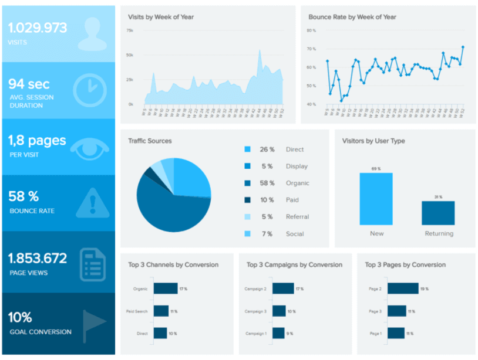

  
```{r setup, include=FALSE}
knitr::opts_chunk$set(echo = TRUE, fig.align = 'center')
```

# Learning Objectives<br>

* Know what constitutes a dashboard
* Understand good dashboard design decisions
* Be able to critique existing dashboards

**Duration - 45 mins**<br>

For your second CodeClan project you will be asked to develop a dashboard. In this lesson we discuss what exactly a dashboard is, what is is used for, what works on dashboards and what doesn't. At the end of the lesson we get an opportunity to design our own dashboard.

# What is a dashboard?

<div class='emphasis'>
A dashboard is a **visual display** of the **most important information** needed to **achieve one or more objectives** that has been consolidated on a **single computer screen** so it can be **monitored at a glance**.

Stephen Few - March 2004
</div>
<br>

There are many differing views about what a dashboard is, but probably the best definition is given above. Let's break this up a bit more:

* **Visual display:** The information is a combination of text and graphics, with a focus on graphics so that the human brain can process it quickly.
* **Most important information:** Diverse sources of information are brought together. These are not necessarily KPIs, but it doesn't contain everything that is available.
* **Achieve specific objectives:** Each dashboard is designed for a specific purpose
* **Single computer screen:** Our brains struggle to retain information, or carry out comparisons if they need to shift between screens or scroll. Dashboards should always ensure that all required information is available within a single eye span.
* **Monitor at a glance:** Just like in a car where the dashboard got its name from, the viewer should be able to spot if something is amiss at a glance. If effort is required to understand what the dashboard is saying then its not a dashboard.

The purpose of a dashboard is to point out whether something requires attention. It should not necessarily provide all the information to work out what action is required.

Dashboards are generally found in three areas:

* Strategic - such as a balanced scorecard
* Operational - these are most common and are often focused on a specific process
* Analytical - these are often exploratory, with some filtering capability and are used to spot trends

# Attributes of a good dashboard

The most effective and impactful dashboards are designed to be simple and clean, so that the eye can pick up the key points without dealing with lots of lines, borders, grid lines or distracting graphics.

Here are some design tips for dashboards:

1. Emphasise the important stuff. Highlight/emphasise the parts of the dashboard/graphs hold data information, such as points, bars or lines. Look to de-emphasise bits of the graph, such as the title, axis labels, graphics, legends and grid backgrounds, which don't hold data information. Also look to remove any unnecessary non-data parts which can detract from the important bits!

2. Take care with colour. Treat colours as an encoding. Use neutral backgrounds.

3. De-lineate with white space rather than borders.

4. Avoid clutter with control buttons, instructions and non-changing text. Use a separate screen for instructions that will only be referred to very rarely.

5. Put the most important information in the top left-corner.

6. Don't highlight everything, or nothing will stand out.

7. Make sure to include context with metrics.

# Dashboard widgets

There is an enormous choice of graphical widgets that could be used to display information, but not all of them work well in a dashboard context, when you are trying to get across the information clearly and quickly. You have come across most of these already and you'll be able to create all of them within ggplot, or by using a ggplot extension. Take a look back at the ggplot lessons to revise appropriateness of graphs depending on the data. 

## Recommended dashboard widgets

Some display types work really well on dashboards. Some we have already covered in ggplot week:

* Bar graphs and dot plots
* Line graphs
* Box plots (will want to consider audience - will they understand a boxplot?)
* Scatter plots
* Spatial plots/maps (careful as often overused and a bar graph may often be better if the spatial information has no meaning)

Some others that are also options:

### Sparklines

<div class = "row">
<div class = "col-md-6">

Sparklines are useful to show time series data where the shape of the graph trend is more important than the scale. It is good practice to use a larger final dot with the actual value, as shown here so a feeling for scale can be given. These are very space-efficient and can used for a number of metrics.

Use `geom_line()` with facets and a minimal theme

</div>
<div class = "col-md-6">

```{r, echo=FALSE, fig.cap="A simple sparkline", out.width = '100%'}
knitr::include_graphics("images/Sparkline_chart_example.png")
```
</div>
</div>

### Bullet graphs

<div class = "row">
<div class = "col-md-6">

A bullet graph is a single bar, with inbuilt targets and thresholds. It is very space efficient and multiples can be used on dashboards to cover many different metrics.

Use `geom_bar()` or borrow the `bulletgraph()` function from [bulletgraph](https://github.com/mtorchiano/MTkR/wiki/Bullet-Graph) or the `bulletGraph()` function from [bulletGraph](https://github.com/sipemu/d3Dashboard)

</div>
<div class = "col-md-6">

```{r, echo=FALSE, fig.cap="A bullet graph", out.width = '100%'}

```
</div>
</div>

### Data tables

<div class = "row">
<div class = "col-md-6">

Don't forget that sometimes the raw data is often useful. This can be augmented with colours, directional trends and differential formatting to support highlighting.

The `formattable` or `kableExtra` packages can make your tables look really nice.

</div>
<div class = "col-md-6">

```{r, echo=FALSE, fig.cap="A data table", out.width = '100%'}

```
</div>
</div>

### Text Values 

<div class = "row">
<div class = "col-md-6">

Sometimes single raw values are necessary. If these are KPIs then they should be augmented with some context.

</div>
<div class = "col-md-6">

```{r, echo=FALSE, fig.cap="A value box", out.width = '100%'}

```
</div>
</div>

### Heat maps

<div class = "row">
<div class = "col-md-6">

Heat maps can be used in conjunction with spatial plots, or independently. Colour intensity is often useful to represent the information where precision is not too important.

Use `geom_tile()`

</div>
<div class = "col-md-6">

```{r, echo=FALSE, fig.cap="A heat map", out.width = '100%'}

```
</div>
</div>

### Tree maps

<div class = "row">
<div class = "col-md-6">

Tree maps encode information as relative sizes. A bar chart could also be used, but sometimes a tree map is more space efficient.

Use `treemapify::geom_treemap()`

</div>
<div class = "col-md-6">

```{r, echo=FALSE, fig.cap="A tree map", out.width = '100%'}

```
</div>
</div>

## Discouraged dashboard widgets

Some display types work very badly and should be avoided. They can almost always be replaced by one of the better display types. Some we have already covered in ggplot week:

* Pie charts and donuts
* Stacked area graphs
* Anything 3-D

Some others that are used:

### Gauges

<div class = "row">
<div class = "col-md-6">

Gauges hark back to the dashboard analogy, but often raw metrics with context are easier to read and more space-efficient. Angles are difficult for our brains to process, which is why in modern cars, we are starting to see raw figures on dashboards, rather than the circular dials.

</div>
<div class = "col-md-6">

```{r, echo=FALSE, fig.cap="A gauge", out.width = '100%'}

```

```{r, echo=FALSE, fig.cap="A vertical gauge", out.width = '100%'}

```
</div>
</div>

### Traffic lights

<div class = "row">
<div class = "col-md-6">

Traffic lights are both not good for those that are colour-blind or for any user to work out how near or far from the thresholds as these are normally not disclosed.

</div>
<div class = "col-md-6">

```{r, echo=FALSE, fig.cap="Traffic lights", out.width = '100%'}

```
</div>
</div>


### Bubble chart

<div class = "row">
<div class = "col-md-6">

Bubble charts use the bubble size to encode the information, however our brains aren't good at decoding relative areas. We are much better at lengths. Where the spatial aspect of the bubble also encodes some information, such as in Gartners Magic Quadrants, then they may be a valid choice.

Use `geom_point(..., size = "data_variable")`

</div>
<div class = "col-md-6">

```{r, echo=FALSE, fig.cap="A complex bubble chart", out.width = '100%'}

```
</div>
</div>


### Funnels

<div class = "row">
<div class = "col-md-6">

People like funnels as they like to see what drops out as a % of the whole. However, a horizontal bar would be cleaner and much easier to read.

</div>
<div class = "col-md-6">

```{r, echo=FALSE, fig.cap="A funnel", out.width = '100%'}

```
</div>
</div>

### Radar graphs

<div class = "row">
<div class = "col-md-6">

Radar graphs imply a relationship between different axes that doesn't really exist. A bar graph would be much easier to read.

Use the `ggradar` package if you must.

</div>
<div class = "col-md-6">

```{r, echo=FALSE, fig.cap="A radar graph", out.width = '100%'}

```
</div>
</div>

# Reviewing dashboards

Now we have an idea about what works and what doesn't. Let's have a look at a few good and bad examples.

## Good dashboards

Here are a few example of some okay but definitely not perfect dashboards.

```{r, echo=FALSE, fig.cap="A website analytics dashboard", out.width = '100%'}

```

This dashboard uses colour well, with a nice layout and the patterns are clean and easy to see. However, there are no targets attached to each KPI so it can't deliver any action. The pie chart could be replaced with a different graphics choice. We also don't have named pages for the Top Pages, so a casual user would find this difficult to understand what is working and what isn't at a glance. 

```{r, echo=FALSE, fig.cap="A social media overview", out.width = '100%'}

```

This dashboard uses a dark background, which is popular for screen displays. The metrics all have both a context and a direction and the colour choices are restrained. The graphics choices are pretty good, bullet graphs and sparklines used to show the LinkedIn metrics. However, there is the ability to choose the timespan being covered being makes this a little harder to understand meant by the "prev" period?

```{r, echo=FALSE, fig.cap="A feedback overview with drill down", out.width = '100%'}

```

This is in the "good" dashboard section, but you can decide whether you think it should be here. It claims to be a good example of a dashboard with drill-down functionality. It uses filters to drill down into the data, by either time period or location. However, its unclear how the filters are then reset. The metrics themselves don't have context as targets and have not been set for all combinations of period and location. The portrait aspect ratio may not work on most computer screens and scrolling may be required to see all the details. However, the colour choices limited and the information displayed is clear.

## Bad dashboards

Below are some examples not so great dashboards:


```{r, echo=FALSE, fig.cap="All a bit small", out.width = '100%'}
knitr::include_graphics("images/maxresdefault.jpg")
```

This example at first glance isn't too bad. It has a clear layout, it's on a single screen, but its impossible to read any of the information as the text is too small. The graphics choices alongside the colour choices could easily be improved, perhaps freeing up some real-estate to include additional information.


```{r, echo=FALSE, fig.cap="A second bad dashboard", out.width = '100%'}

```

This dashboard only contains two separate visualisations. The use of colour implies that they are related, but on closer inspection the top and bottom colours don't relate to the same things. On the top graph, the graphics choice could be changed. On the bottom graph it is impossible to extract any insight. Its not obvious what it is trying to show. By splitting this information up, it might be easier to identify any problems, although metrics and targets would need to be added to understand whether the student numbers are good or bad. Interestingly the dashboard name has "metrics" in it, without the use of a single actual metric.


# Recap

Why should a dashboard be limited to a single screen?
<details>
<summary>**Answer**</summary>
It ensures that the information can be consumed and compared without needing to retained by the brain.
</details>

Can you identify some valid situations where an operational dashboard would be useful in a call centre?
<details>
<summary>**Example answers**</summary>

* Call waiting times and average durations in the main call centre
* Real-time staffing levels for management to ensure that resources are aligned to demand
* Call reasons to enable spotting emerging issues
</details>

Why are pie charts or donut graphs not recommended?
<details>
<summary>**Answer**</summary>
Humans are intrinsically bad at reading angles. It makes it difficult to make comparisons between different sectors.
</details>

# More resources

* [An archive of the work of Stephen Few](https://www.perceptualedge.com)
* [Infogram - dashboard examples](https://infogram.com/examples/dashboards)
* [Klipfolio online learning](https://www.klipfolio.com/marketing-dashboard-course-sign-up)
* [Storytelling with Data](http://www.storytellingwithdata.com) - they have a monthly challenge where visitors are asked to use best practice to try out creating or improving a visualisation. They also have a podcast.
* [Data Stories podcast](https://datastori.es)
* [Data stories - post-truth environment](http://datastories.co.uk)