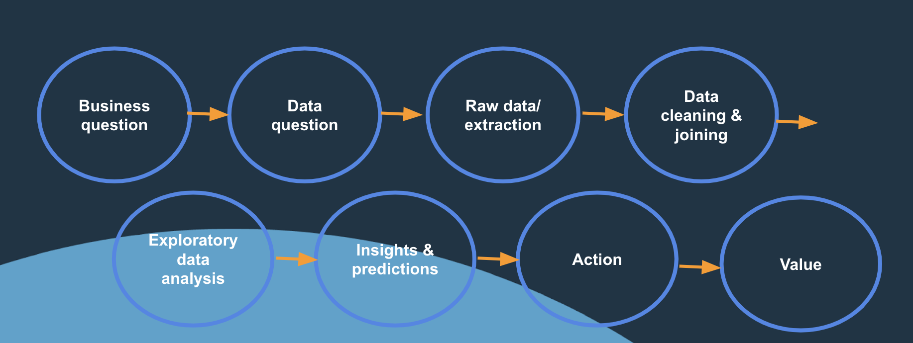
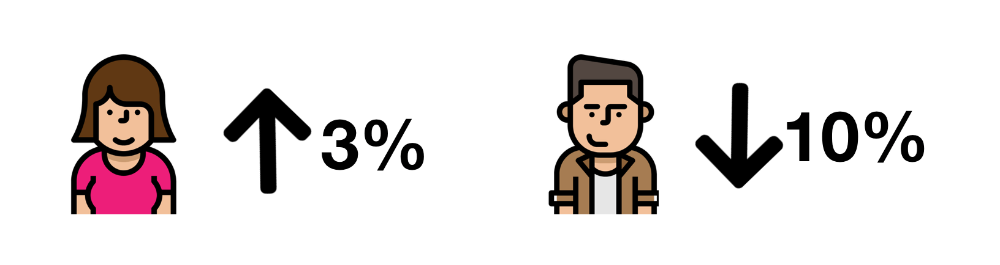
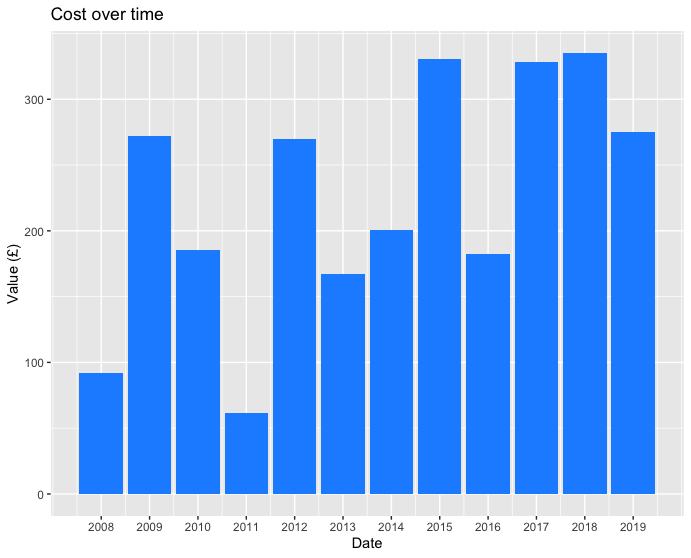
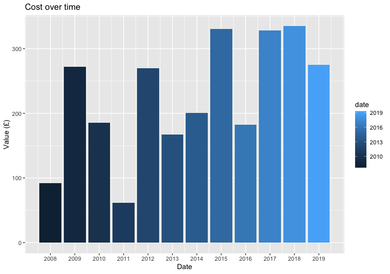
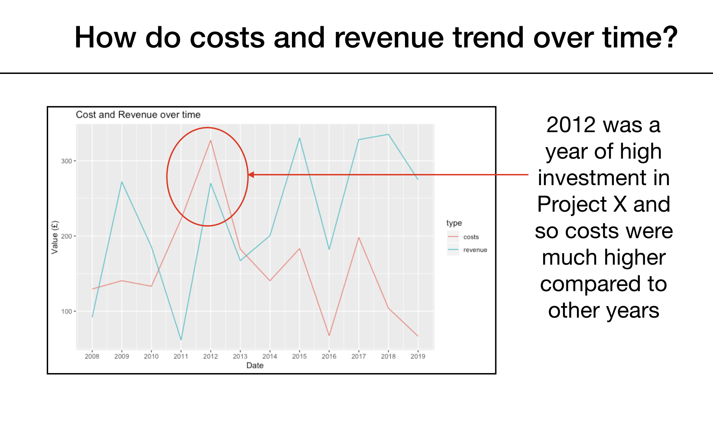

```{r setup, include=FALSE}
knitr::opts_chunk$set(echo = TRUE, fig.align = 'center')
```

We have collated some tips and things to think about in your project, and more generally when you are working on a data analysis projects! Not all may be applicable to the dashboard project (some points may relate more to presenting slides and/or your final projects) but all good to keep in mind. 

You can be the best analyst working with the most complete and tidy data set, but if you can’t communicate your findings efficiently, you may end up having little to no impact with your results. People often state this is where most data projects fail. 

```{r, echo=FALSE, out.width = '70%'}

```
<br>

# Before you begin

## Review the reproducibility and coding best practice lessons from week 1

In these lessons we covered best practises when it comes to data projects. We covered things like folder directory set up, style of code, commenting code, creating documentation, etc.   
Give these lessons a look over before diving into the project! We will be keeping an eye on your project repos to look out for best practice.  


## Make a plan (and stick to it)  

Making a plan before you begin is the most valuable thing you can do. Study your business brief or client request form. What is it they are asking for? What question(s) are they most interested in? 

Make a list of key questions the client is looking for. If you don't answer these, they probably won't pay you! 

*Note: This doesn't mean you should limit yourself to only these questions. As you work through the data, you might find intersesting information that you want to present. That's the key of data analysis. However, you must ensure you have addressed the questions asked by the business, alongside all of these*. 


## Understand the end users of the analysis and how it will be used 

Think about how the analysis will be used. Will the data be constantly updated and clients need to know whether meeting key KPIs? Then it's likely you need a dashboard. Is this an in depth analysis for end of year customer figures, that needs to be presented at a management meeting? Then a markdown presentation may be the best way to communicate the results. 

Think about implementation of results - if it’s a dashboard how will it be updated and how will users view it (for example if it is an R Shiny dashboard, do you have a server to run it on? If it's a lisenced visualisation tool, does it have the necessary security settings to keep the underlying data secure)? If it’s a set of slides will it be sent to the team who own the data and how you expect them to action/implement the findings. Will you be presenting the results or emailing the slides?

One trick sometimes used can be that because you don't want to overwhelm the slides with text (and want it to be clear and consice) is to make one version of the presentation that is used to present (with minimal text on the slides) and then another which has notes, which covers all the explinations and caveats you would say verbally as part of a presentation in case you are asked to email it forward. 

These are all good things to think of before you start going too far down the wrong path.   

***


# During analysis 


## Always come back to the question  

Following on from above, it's very easy to get yourself down a rabbit hole of analysis and you find hours have gone by and you haven't checked in to where you are heading and if what you are doing is actually useful. 

Try to periodically check in - am I answering what is being asked? Do I truly understand what I’m being asked? Do I understand how the answer to these questions/analysis will be implemented and affect the business? Do I know who the end user of my analysis is? It's ok if not but be sure to ask (specific) questions to the client to find out.


## Don't make assumptions that can be easily answered by the client.  

For example, you may not be sure about about a product launch date, and you see a peak in user engagement and say something like *'I think a product was launched around this time so it's probably down to that'*. Making assumptions like this can make you seem a little lazy and could affect the clients confidence in what other assumptions like this you have made. Make sure you have covered your bases and are asking questions. 


## Problem solving  

Try to think outside the box - a lot of time you need to problem solve and not to panic if you don't know the answer straight away. 

For example, you've been asked you to do some analysis but you don’t have the data to do the task. Is there any open source data? Could you use an API? Can you contact another business department to find out if this data is stored somewhere? Can you enquire into whether this data can be collected going forward? Even if the answer is ruling out whether analysis is not possible at this time is a finding in itself, but make sure you try different things before coming back to say *'it can't be done'*. If this is the answer try to offer how they could resolve this going forward, such as *'we don't have this data now, but if we started to track x and collect y then it's something we could do this is the future'*.


## Empathy   

Try to have empathy for your client/business user. What are their worries, priorities and pressures (financial/budgets/recource/management)? What have they asked you to look into, and why might this be important to them?

Try to take this onboard during communications and analysis, and plan your presentation and dashboard accordingly. 


## Use infographics  

You may have heard the phrase *'a picture is worth a thousand words'* - it works for techincal presentations too. A 30 slide presentation with no graphs or images is not the most engaging and people may have trouble retaining all the information.  

For example we could write *'females have increased by 3% and males have decreased by 10%'* or we could use icons such as:

```{r, echo=FALSE, out.width = '80%'}

```

One thing to remember: if you're going to add an infographic, you'll need to provide context. If you only presented the picture above, it might not give the audience everything you need.   


Websites such as Flaticon (https://www.flaticon.com/) are great for finding inforgraphics to use in presentations (and dashboards).

Also tricks such as using company logos, rather than just their names, in slides can also increase the visual aspects. 

Icons/pictures may not always be appropriate, depending on the audience and company 'standards' with presentations but when possible they can add something different to juse slides of text!


## Make clear axis labels and titles   

Make sure these are human readable! Try to avoid using variable names that don't have context, e.g. in the data you may have a location variable and these are numbered 'Location1', 'Location2', etc. Make sure these are changed so they make sense to someone with no knowledge of the business/data e.g. 'Edinburgh', 'Glasgow' etc. 


## Use of colour  

Don’t add different colours/colour scalings on graphs unless it adds a layer of information that isn't already seen from a single colour graph.

For example no more extra information is gained from adding a colour scale to the graph below, and so it causes unecessary complexity and diverts the users attention:

Single colour
```{r, echo=FALSE, out.width = '80%'}

```

With colour scale
```{r, echo=FALSE, out.width = '80%'}
  
```


## Have a purpose for each slide/visulaisation/figure

Don’t put in every plot you made/exploration you did (even though it can be tempting to show how much work you've done!). Every graph or figure you show should have a purpose and message. People get saturated with information and can only hold attention for so long so you don’t want to overload with stuff that is not useful. 


## Minimise over complicated terminology/acronyms 

Not everyone may be familiar with the business acronyms and either statistical or business specific buzzwords. It can be tempting to use 'fancy' terms to try to impress your audience but if they can't follow the message because they don't know a particular acronym then it's not very impressive!

If you really do have to explain a complex concept, use a metaphor or a real-life example to make the topic as easily understood as possible.


## User testing 
Can you test out your presentation or visuals on a similar auidence to your intended end users? If you test it out and it's not clear to them what the visuals show or what the message is through the analysis perhaps you need to reassess aspects of the presentation. It can be very hard to put yourself in the auidences shows because the analysis makes sense to you, so test it out on others first!

## Check (and double check your results) 
Do your numbers make sense?? It's easy to get so caught up in whether your code runs or not it can be easy to think your analysis 'works' if your code runs ... but have you taken a moment to think about whether your numbers are reasonable and make sense? It's likely that if you have any 'unusual' figures someone will call them out so be ready to back them up with an explination showing you looked into them. 

If you created a dashboard have you checked the user interactivity is working as you expect? Have you checked the figures produce reasonable numbers in a static graph, before you add in user interactivity. A pretty dashboard with lots of cool looking graphs showing incorrect numbers is so much worse than a less cool dashboard with correct figures!

*** 

# During your presentation...  


## Take a step back  

Remember that you have been immersed in the data and the project for a while and not everyone will understand it like you. 

Most importantly: always be sure to give a background to the problem and business area at the start of the presentation. Those in the audience won't know exactly what the client brief was, and if you don't explain this at the start you'll have a harder time getting them to follow along.   
Take a step right back: someone should be able to walk off the street and understand your presentation and it’s aim and purpose. Ensure you are explaining everything clearly, and do not to make any assumptions about people's knowledge of the business area or data . It's always better to 'over explain' than lose your audience right from the start! 


## Call out the insights  

Part of your job as an analyst is to make any insights (and limitations!) clear for your client/decision maker.   
 
For example if you have a slide with a graph, call out what it is you want the client to gain from this graph. If you can't think what that value/insight is, you may want to reconsider why you have it in! 

```{r, echo=FALSE, out.width = '80%'}

```

If there is to be a conclusion or action based on the data, then you can also call this out on the slide. You want each to be clear, concise and memorable. 


Another good rule: don't have 2 graphs when one will do. If you find yourself skimming over a graph, or simply adding it "for extra info" then it's usually best to lose it.     


## Don't force findings 

Don't force findings where there aren't any. If you do analysis to answer the question at hand and find there is, say, no relationship between the variables in question, the absence of a relationship is a finding - you just don't need to show every analysis/plot that you did to reach this conclusion. 


## Don't jump to conclusions without the data

Don’t jump to conclusions or make assumptions if don’t have the data to back it up. 

For example, if you see a jump in website traffic on a Monday don't say *"I think it's because of people getting fed up with work on a Monday so they view codeclan websites and sign up for courses. Therefore you could focus efforts on Marketing on a Sunday*. This on it's own is speculative and not backed up by any data.   

Instead, you could say something like *'Here is this trend, but we can only speculate why. If I had these additional data sources then this would be something I would like investigate further'*. 

It can be hard when you want to make it seem you have thought of reasons why certain things have happened but you want to ensure as a data analyst you are bringing evidence to back up your claims. 


