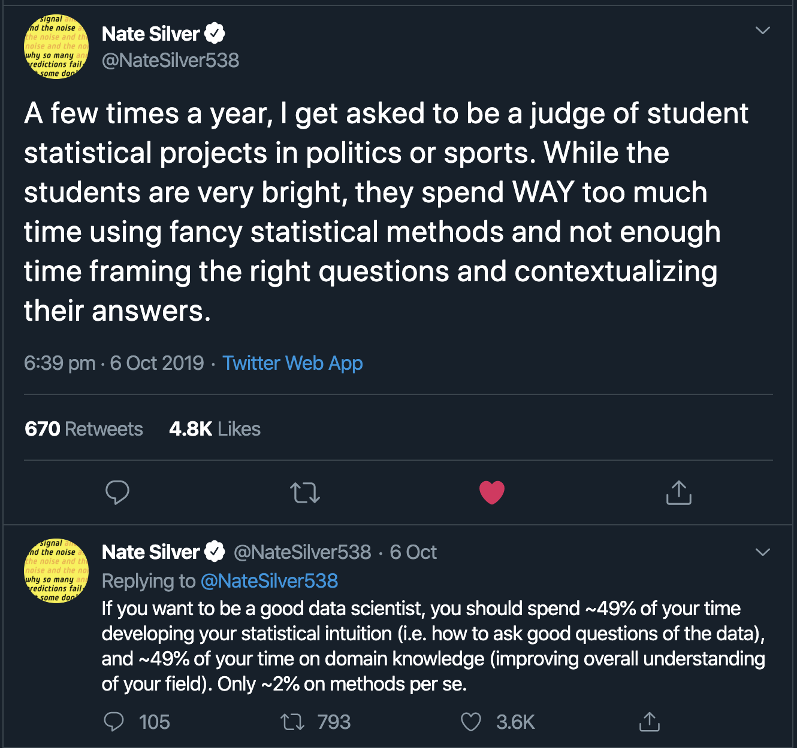
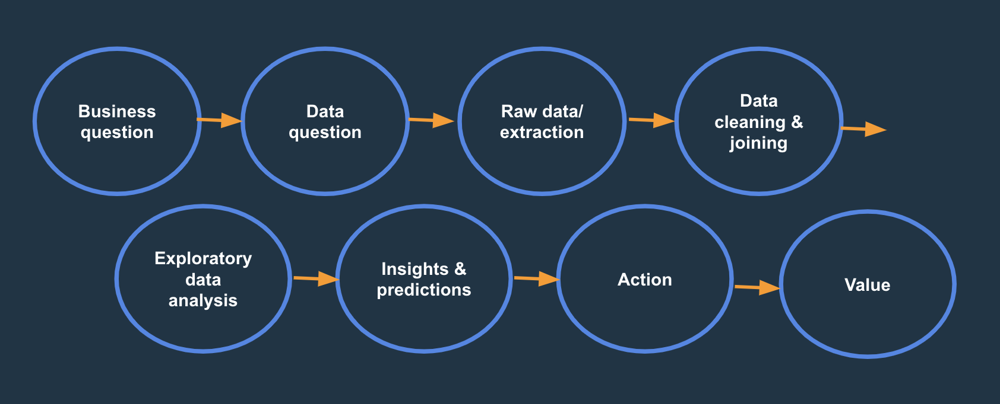

  
```{r setup, include=FALSE}
knitr::opts_chunk$set(echo = TRUE, fig.align = 'center')
```

# Learning Objectives<br>
* Know that data analysis needs to have business context
* Know that often no single right answer
* Know that need to focus on the action that comes from insights


**Duration - 45 minutes**<br>

# Defining the problem is key 

You may often hear that being a data analyst is more than just the technical abilities. In fact one of the industry speakers during DE1 stated that:

> I am much less interested in how much syntax you know, as you can go away and look it up. But knowing what to do with the data from start to finish and being able to problem solve is key. 

This is important: while technical skills are important, the ability to think critically about a question and be able to solve problems. Data analysis is a tool to aid decisions, not a single stand alone solution without context - the business understanding is needed to give the analysis purpose and value.

> Data Science is a constant collaboration with the business and a series of questions and answers that allow you to deliver the analysis/model/data product that the business has in their head. Questions are required to fully understand what the business wants and not find yourself making assumptions about what others are thinking....Asking the right questions is what separates Data Scientists that know ‘why’ from folks that only know what (tools and technologies).  

>For every business, making it's products or services better is the ultimate goal of a data science project. Your data team could feature the best coders and the best statisticians, but if they don’t know the actual business application of their data projects, the whole thing will be pointless. [1](https://www.kdnuggets.com/2019/02/asking-great-questions-data-scientist.html)


The author of The Signal and the Noise (a book on real-world uses on use of probability and statistics, such as baseball, elections, financial crash etc.), Nate Silver, posted the following tweet:   

<br>

```{r, echo=FALSE, out.width = '70%'}

```

<br>

There is a limit of how much this can be 'taught' because it will depend on the industry and area you go into, and is built through experience. But we want to get across that while the tools and techniques learnt through this course are important, they do not sit in isolation, and without context the value they will have may be limited.   

>The abilities to learn on the fly and to communicate well in order to answer business questions is key, as is the ability to explain complex results to non-technical stakeholders. Aspiring data scientists, then, should focus less on techniques than on questions. New techniques come and go, but critical thinking and quantitative, domain-specific skills will remain in demand.[5](https://hbr.org/2019/01/data-science-and-the-art-of-persuasion)

Of course, you need technical techniques to do analysis (and what is learnt through this course is needed!), but try not too get too hung up on the latest machine learning models and terminology and more about how techniques will be applied and how the results will impact businesses to make decisions. Doing the group projects and open-ended labs allow practice of these skills, and of course all your previous work experience will be hugely valuable!   


# Plan 

> If I had an hour to solve a problem and my life depended on the solution, I would spend the first 55 minutes determining the proper question to ask… for once I know the proper question, I could solve the problem in less than five minutes. - Einstein 

It's really tempting to just fire into the analysis/coding but without proper planning it means there's a risk a lot of the work ends up being scrapped because down the line it becomes apparent that it doesn't fit the brief. By getting a plan signed off first will save a lot of extra work in the end!


# Context and area expertise 

As discussed in the ethics lessons, it's important to include business/area experts in a project from the start - they will be the ones who understand the impact of these results. 

## An example

This example is about a charity focused on increasing social interactions of people suffering from alcohol dependency. Funders wanted the charity to get service users to fill in a regular survey, or the volunteers to fill in on their behalf of the service user, on how different aspects - such as mental health, diet, emotional stability and level of alcohol intake - had changed over the week. The charity and their psychologist argued that due to the nature of the programme being a ‘person centred service', where the objective is solely to increase social interaction of the service users, this takes away from core of service, and the conversions become orchestrated and will turn users and volunteers off as become mistrusting of the programme. If you were their analyist you may not have the understanding and awareness of the impact of data collection in this way and the affect it may have, but through talking to the the programme workers and volunteers would allow you to gain some insight into the impact of this data collection on this group. 

# No single right answer

>Projects are best framed in terms of the outcome they wish to achieve, not the problem to be solved or the solution to be implemented.[4](https://www.linkedin.com/pulse/designing-outcomes-based-method-collaborative-eddie-copeland/)

In reality, not all questions have singular definitive answers and/or can directly answer in a robust and accurate way with the data that is available to them. Think about your dashboard projects - there are different approaches that another group may have taken to approach the same question, and not all of these are necessarily better or worse, just different. Also some of the questions in the brief you weren't able to answer with the data you have available. 

Sometimes the analysts job is to help explain questions more clearly or even help others ask better questions that are more aligned with the data that is available. For example, during your dashboard project you worked with the client to refine the original brief and worked to make the questions and expectations more specific. This is much more valuable than forcing a misleading results with limited data, and you need to feel confident to push back in cases like this.

# Action from insights

> Data analysis projects need a clear purpose. Questions need to be specific and actionable, what would be done differently as a result of the analysis? it’s important to define who will act, and where and when they will do so. [2](https://www.nesta.org.uk/blog/mind-gap-between-truth-and-data/)

This has been covered many times before but can never been repeated enough - always come back to how the business will **action** your insight. *That's great you've told me that 70% of my customers are teenagers - but what action are the business taking with this information? Do they plan to make their service/product niche to this market? Do they see gaps in market where they are not hitting - will they change advertising to try to increase their share of older audience. Which team will be using this information? Marketing? Product owners?*  

Always come back to the **action** because that leads to **value for the business**. 

```{r, echo=FALSE, out.width = '70%'}

```

# Tasks

Now we are going to try some tasks. Split up into groups and think about the following business questions. How might you approach these? Think about any further questions you may ask the client and any assumptions you may make. Think about what data you would need and any caveats?


## Task 1

<blockquote class='task'>
**Task - 10 mins** 

I own a shop selling handmade clothes in outskirts of Edinburgh and I hire a data analyst to analyse how successful my business has been since opening and provide me with any tips for improvement.

What data would you request and how would you analyse/present this? Note any assumptions or additional questions you would want to ask.

<details>
<summary>**Example Answer**</summary>

First I would want to understand what they mean by 'successful'. Is being successful making a certain level of profit or is it performance compared to competitors? Do they have other targets such as level of demand and supply? Need to refine these definitions. How they can be improved would follow on from this. 

Potential ways to answer (once discussed with client):

* Calculating revenue, costs and resulting profit - overall and then how changed over time. Would get this information from financial records (assuming calculate these month by month but may only have year by year if relying on end of year finances). 
* Units sold over time. Perhaps split by clothes type (top, jumper, skirt etc.) 
* Demand vs. supply - made too many or too few of certain product types at any certain time? IS there room here to make operationally more efficient?
* How do the finances compared to stores of similar size and location (financial data may be available on Companies House website).
* Customer profiling - do they have any information on types of customer and what products they purchase? If hold this data would need to have asked permission to do profiling on this data. Could you offer certain promotions based on the profiles to refine targeting?

</details>
</blockquote>


## Task 2

<blockquote class='task'>
**Task - 10 mins** 

I work for a large used car sales business. Most of my car sales come from the online site lovelycars.com. When you search for a car, the results come back in a certain order. I want to understand why cars are ranked in this order. I would then like to improve the rank of my cars on the site.

What data would you request and how would you analyse/present this? Note any assumptions or additional questions you would want to ask.

<details>
<summary>**Example Answer**</summary>

* You'd need a dataset of many different cars searches and the ranks of cars that come up. 
* You'd need to ensure you have data for each car that might be relevant to the ranking (age, distance, mileage, who is selling it etc.)
* You'd ideally have data over time.

Using a large dataset you'd look for associations between rank and the data you've collected. 

You'd want to understand everything lovelycar.com releases publicly about how the rank their cars. Does what they claim seem to hold true in the data?

You'd need to understand what the dealer has control over: he can use different words in this advertisements, but he can't really control the age of the cars he has to sell.

</details>
</blockquote>

## Task 3

<blockquote class='task'>
**Task - 10 mins** 

I work for a large regional supermarket, with about 50 stores. I've recently installed smart electricity meters in every store. I want to monitor electricity usage and understand when it's particularly high. I can then send a warning to the the store. I'm particularly concerned about appliances being left on overnight.

How would you begin to build this system? What would you need to understand and ask?

<details>
<summary>**Example Answer**</summary>

* You'd need historical data for each store: you can't understand if a store is behaving unusually until you know the baseline. 
* You'd need to know about opening hours, including unusual events coming up. For example you might see higher electricity usage in the run up to Christmas, but this isn't something we'd want to warn about since it's expected.
* Who will the warning get sent to? Is there a different system when the store is closed or open.
* What's an acceptable level of false positives and false negatives. Should we be sending a few warnings a year, or are they expecting several warnings a day?
You might need to check that the smart meter system is working. Do the measurements match up with the electricity bills.

</details>
</blockquote>


