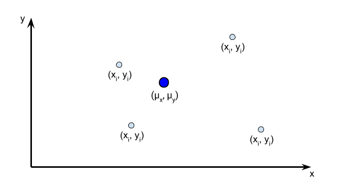
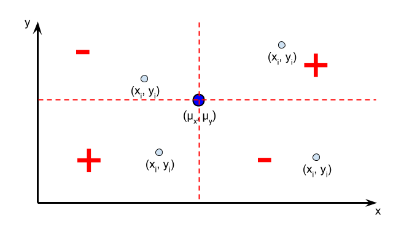

<div class="blame">
author: "Del Middlemiss"<br>
date: "30th April 2019 - rev. 19th July 2019"
</div>

```{r setup, include=FALSE}
knitr::opts_chunk$set(echo = TRUE, fig.align = 'center')
```
# Learning Objectives
* Understand the concept of two variables being correlated
* Be able to calculate the correlation coefficient $r$ from raw data
* Be able to describe a scatterplot using positive, negative, strong, perfect, weak and zero correlation
* Understand that correlation does not imply causation
* Be able to identify potential hidden variables

**Duration - 45 minutes**

<hr>

# Correlation

What does it mean for two variables, say $x$ and $y$, to be **correlated**? 

First, we should make clear that we are thinking about the $x$ and $y$ data being **ordered** in the following way:

* the first value in the $x$ data set corresponds to the first value in the $y$ data set: $(x_1,y_1)$
* the second in $x$ to the second in $y$: $(x_2, y_2)$ 
* continued all the way to $(x_n, y_n)$ for $n$ values in the data set

We encounter data with this structure all the time! For example, let's look at two variables from the `mtcars` data set, namely weight `wt` and miles per gallon `mpg`

```{r, message=FALSE}
library(tidyverse)
library(janitor)
```

```{r}
mtcars %>%
  select(wt, mpg) %>%
  glimpse()
```

We call this data **bivariate**! This is just a fancy way of saying that it has two variables we're interested in. Let's plot the data with `wt` on the $x$-axis, and `mpg` on the $y$-axis

```{r}
mtcars %>%
  ggplot(aes(x = wt, y = mpg)) +
  geom_point()
```

Back to correlation! If $x$ and $y$ are correlated, it means that there is some apparent relationship between the 'motion' of $x$ and the 'motion' of $y$. By motion, here, we really mean the distances of $x$ and $y$ from their respective means $\bar{x}$ and $\bar{y}$.

<br>
<div class='emphasis'>

* If $y$ is **positively correlated** with $x$ then $y-\bar{y}$ will *increase* as $x-\bar{x}$ *increases*, and *decrease* as $x-\bar{x}$ *decreases*.
* If $y$ is **negatively correlated** with $x$ then $y-\bar{y}$ will *decrease* as $x-\bar{x}$ *increases*, and *increase* as $x-\bar{x}$ *decreases*.
* Finally, if $y$ is **not correlated** with $x$ then $y-\bar{y}$ will neither *increase* nor *decrease* as $x-\bar{x}$ changes.

</div>
<br>

<blockquote class='task'>
**Task - 2 mins** Look again at the plot of `mpg` against `wt`. Do you think these variables are positively or negatively correlated, or effectively uncorrelated?
<details>
<summary>**Solution**</summary>
The variables are **negatively correlated**. Let's plot the mean values of the two variables as a single point (a point known as the **centroid** of the data)
```{r}
mtcars %>%
  ggplot(aes(x = wt, y = mpg)) +
  geom_point() +
  geom_point(aes(x = mean(wt), y = mean(mpg)), col = "red", size = 5)
```
Now we can see that as `wt` increases from its mean value at approx. $3.2$,  `mpg` generally decreases from its mean value at approx. $20.1$, and vice-versa, so the variables are negatively correlated.
</details>
</blockquote>

<hr>

# Maths details - optional

<br>
<details> 
<summary>**From covariance to correlation: maths details**</summary>

This is a mathematical description of the covariance and correlation coefficient of bivariate data. **You don't need to know any of this, we include it in case you are interested and want to know more**.

<hr>
**Covariance**

Statistics provides a quantitative measure of the correlation of two variables. To get to it, however, we need to define the **covariance** of variables $x$ and $y$. For a population of size $N$ elements, the covariance $\sigma_{xy}$ is defined as

$$\sigma_{xy} = \frac{\sum_i{(x_i-\mu_x) \times (y_i-\mu_y)}}{N}$$

Let's break this equation down and talk it through: 

* First we calculate the population means of the two variables: $\mu_x$ and $\mu_y$ (these are the coordinates of the **centroid**) 
* Each element of the population, labelled by index $i$, will have an $x$-value, $x_i$, and a $y$-value, $y_i$. We calculate the *signed distances* of each value from their respective means: $(x_i-\mu_x)$ and $(y_i-\mu_y)$. 
* We multiply the signed distances together (i.e. take the *product*) 
* We sum over all these products for each element in the population ($\sum_{i}$) and then divide by $N$. This gives us the mean of such products over the population. This is what we call the **population covariance**

<br>
<div class='emphasis'>
**Centroid**: the point $(\mu_x, \mu_y)$ in bivariate data; or the point $(\mu_x, \mu_y, \mu_z)$ in trivariate data; and so on...
</div>
<br>

<br>
<blockquote class='task'>
**Task - 5 mins** Let's stop to think what the sign of product $(x_i-\mu_x) \times (y_i-\mu_y)$ means. Mark the sign of this product on the four points on the diagram below. The population centroid $(\mu_x, \mu_y)$ is shown 
```{r, echo=FALSE, out.width = '70%'}

```
[**Hint:** $(+\textrm{ve} \times +\textrm{ve}) = (-\textrm{ve} \times -\textrm{ve}) = +\textrm{ve}$ and $(+\textrm{ve} \times -\textrm{ve}) = (-\textrm{ve} \times +\textrm{ve}) = -\textrm{ve}$]
<details>
<summary>**Solution**</summary>
We can divide the plot up into four sections around the position of the centroid point. The signs of the product for any point lying in each of the four sections is shown. The product will be zero for any point lying *exactly* on any of the dashed lines.<br>

```{r, echo=FALSE, out.width = '70%'}

```

<br>
So, as an example, the data point in the upper left section has a **negative** product because $(x_i-\mu_x)$ is negative and $(y_i-\mu_y)$ is positive. A positive times a negative number is negative.
</details>
</blockquote>

Similarly, the **sample covariance** $s_{xy}$ for a sample of size $n$ is defined

$$s_{xy} = \frac{\sum_i{(x_i-\bar{x}) \times (y_i-\bar{y})}}{n-1}$$

The `cov()` function in R calculates the **sample covariance** for us. Let's use it on the `mpg` and `wt` variables from `mtcars`:

```{r}
mtcars %>%
  summarise(cov = cov(mpg, wt))
```

The value is negative, indicating that the variables `mpg` and `wt` are negatively correlated, as we thought earlier.

The units of covariance will be $\textrm{units of x} \; \times \; \textrm{units of y}$: in this case $\textrm{miles per US gallon} \; \times \; \textrm{1000 lbs}$.

<hr>
**Correlation**

The **population correlation coefficient** $\rho_{xy}$ (often just written as $\rho$) is calculated from the population covariance as

$$\rho_{xy} = \frac{\sigma_{xy}}{\sigma_x \times \sigma_y} \; \; \textrm{where} \; \; -1 \leq \rho_{xy} \leq +1$$

and where $\sigma_x$ and $\sigma_y$ are the population standard deviations of variables $x$ and $y$.

Similarly, the **sample correlation coefficient** $r_{xy}$ (often just written as $r$) is calculated from the sample covariance as

$$r_{xy} = \frac{s_{xy}}{s_x \times s_y} \; \; \textrm{where} \; \; -1 \leq r_{xy} \leq +1$$

where $s_x$ and $s_y$ are the sample standard deviations of variables $x$ and $y$.

</details>

<hr>

# Correlation coefficient

<br>
<div class='emphasis'>
The **Pearson correlation coefficient** denoted by $r$ measures the **linear tendency** of two variables.

* It has no units (it's just a number)
* It takes bounded values:
  - approaching $r = 1$ when the variables are strongly positively linearly correlated
  - approaching $r = -1$ when the variables are strongly negatively linearly correlated
  - near $r = 0$ when the variables are not correlated

Values $r = +1$ or $r = -1$ indicate a **perfect linear relationship**. This just means that if we plotted the data, it would fall upon a perfect straight line. We will essentially never see this for real data sets due to random noise! 

</div>
<br>

<br>
<blockquote class='task'>
**Task - 10 mins**. Let's get to know the correlation coefficient a little better. I would say let's get to know Pearson better, but, like Galton and Fisher, he was a social Darwinist and eugenicist, so let's not! Unfortunately many early eminent statisticians held awful views...

* Play around with the following function (which generates a bivariate distribution with noise). Pass in the `noise` and `gradient` values in the table below. 
* Get a sense for the $r$ values of various distributions.

<br>
```{r}
# SLACK THIS OUT
noisy_bivariate <- function(noise = 1, gradient = 1){
  x <- runif(n = 200, min = 0, max = 10)
  y <- gradient * x + 10
  y_scatter <- noise * 4 * rnorm(n = 200)
  y <- y + y_scatter
  data = tibble(x, y)

  r <- round(cor(x, y), 4)
  title <- paste(
    "noise = ", noise,
    ", gradient = ", gradient,
    ", r = ", r
  )
  
  data %>%
    ggplot(aes(x = x, y = y)) +
    geom_point() +
    xlim(0, 10) +
    ylim(min(c(min(y), 0)), max(c(max(y), 10))) +
    ggtitle(title)
  
}
noisy_bivariate(noise = 0.1, gradient = 0)
```
<br>
Try the following combinations and a few more of your choosing <br><br>

| noise | gradient |
| --- | --- |
| 0 | 1 |
| 0 | 0.2 |
| 0.3 | 0.2 |
| 0.3 | 1 |
| 1 | 1 |
| 1 | 0 |
| 0 | -1 |
| 0.3 | -1 |
| 1 | -1 |

</blockquote>
<br>

We've seen that the sign of $r$ has a simple meaning, but what about its magnitude? J. D. Evans (1996) suggests the following scale

|  magnitude of $r_{xy}$  |  strength of correlation  |
|-------------------------|---------------------------|
| 0                       | none                      |
| 0.01 - 0.19             | very weak                 |
| 0.20 - 0.39             | weak                      |
| 0.40 - 0.59             | moderate                  |
| 0.60 - 0.79             | strong                    |
| 0.80 - 0.99             | very strong               |
| 1                       | perfect                   |

Finally, a word of warning! The correlation coefficient is a blunt instrument: we can run `cor()` on **any** bivariate dataset and **get a number out**, regardless of what the real trend (if any) is in the data. 

<br>
<center>We should always visualise data before trusting summary statistics like the correlation coefficient!</center>
<br>

It might be that our data has a definite non-linear trend: if so, we should try to quantify that trend rather than assuming a linear association.

<br>
<blockquote class='task'>
**Task - 10 mins** Let's calculate correlation coefficients for various variables in the `state.x77` dataset! 

* Examine the contents of this dataset (try accessing documentation via `?state.x77` or running `summary()` on it). 
* Choose a few combinations of variables to plot as $y$ versus $x$ and calculate the correlation coefficients for the same combinations. Do you find any strong correlations?<br>

<br>  
[**Hint** the dataset is a `matrix` so convert it to a `tibble` first via `tibble_states <- clean_names(as_tibble(state.x77))` to make manipulations easier].

<br>
<details>
<summary>**Solution**</summary>
```{r}
# Let's look at some interesting plots!
tibble_states <- clean_names(as_tibble(state.x77))

tibble_states %>%
  ggplot(aes(x = hs_grad, y = income)) +
  geom_point()
tibble_states %>%
  summarise(r = cor(hs_grad, income))

tibble_states %>%
  ggplot(aes(x = murder, y = life_exp)) +
  geom_point()
tibble_states %>%
  summarise(r = cor(murder, life_exp))

tibble_states %>%
  ggplot(aes(x = frost, y = illiteracy)) +
  geom_point()
tibble_states %>%
  summarise(r = cor(frost, illiteracy))

# Useful hint, you can pass the whole tibble into ggpairs() or ggcorr() from the GGally package 
# to get a cross plot of correlation coefficients.
# Be careful though, this starts to smell of 'fishing' data for interesting effects.
library(GGally)
tibble_states %>%
  ggscatmat()

# or
tibble_states %>%
  ggcorr()
```
</details>
</blockquote>

<hr>

# The most famous phrase in statistics!

What's the most famous pithy phrase in statistics? There's a good chance that many of you will have read or heard that<br><br>

<br>
<div class='emphasis'>
<center>***"Correlation is not causation."***</center><br>
</div>
<br>

Just because two variables are **correlated**, it does not mean that one of them **causes** the change in the other! 

Consider two variables: the number of pairs of `sunglasses_sold` and the amount of `ice_cream_sold` at a beach shop each week. 

There's a good chance that if we plot this data and calculate the correlation coefficient we'll find that the variables are **positively correlated**. 

Does this mean that an increase in the `sunglasses_sold` **causes** the amount of `ice_cream_sold` to increase? No way!! We don't have a strong enough basis to make this conclusion.

## The 'third variable' problem

The simplest realistic model might be that **both** these variables are themselves causally related with a third **'hidden variable'**, e.g. `number_of_sunny_days` each week. An increase in `number_of_sunny_days` in a given week **causes** increases in both `sunglasses_sold` and `ice_cream_sold`!  

<br>
<div class='emphasis'>
Sometimes this is also called a **confounding variable** - a variable you **didn't** include in your analysis that is causally related with variables that you **did** include. The presence of confounding variables makes it difficult to form conclusions about causal relationships.
</div>
<br>

<blockquote class='task'>
**Task - 2 mins** See if you can suggest any confounding variable(s) for the following associations:<br><br>
<center>"1. Sleeping with shoes on is strongly correlated with waking up with a headache. Therefore, sleeping with shoes on causes headaches."</center><br><br>
<center>"2. Atmospheric CO<sub>2</sub> level and obesity levels have both increased sharply since the 1950s. Therefore, atmospheric CO<sub>2</sub> causes obesity."</center><br><br>
<center>"3. The more bacon someone eats, the higher their blood pressure. Therefore bacon causes hypertension."</center><br><br>
<details>
<summary>**Solution**</summary>
1. Amount of alcohol consumed the day before<br>
2. GDP - rich populations eat more food and produce more CO<sub>2</sub><br>
3. Preference for salty food - more likely to eat bacon, more likely to have hypertension
</details>
</blockquote>

## The 'directionality' problem

Even if the two variables **are** causally related, there is nothing in the statistics to indicate the **directionality** of causation.

Imagine a marketing study on sales of confectionery with two variables: 

* `number_of_TV_ads_run` in a given week
* `amount_of_chocolate_sold` in a given week.

If we discover a positive correlation between these variables, common sense might suggest that it is an increase in the number of TV ads run that **causes** an increase in chocolate sales, and vice-versa, but, as described, the study provides **no statistical basis to indicate a direction of causation**! 

## How do we prove causation?

This sounds like a minefield! How do we **prove** causation between variables if strong correlation isn't enough? 

<br>
<div class='emphasis'>
Ideally with a **randomised controlled experiment**. 

In this experiment, we:

1. **Randomly** split our experimental sample into two groups: 'control' and 'treatment', and try to make sure sample elements with potentially confounding factors are spread as evenly as possible over both groups and/or restricted to a small range
    * e.g. if age is a potential confounder, limit the experiment to say 20-25 year old people 
2. Next, make some active intervention (i.e. **change** the variable we are testing the effect of) with the 'treatment' group, and do not intervene at all with the 'control' group.
3. Gather and analyse outcome data from both groups. 

This study gives us the basis to say whether or not our 'intervention' variable **causes** any change we find in the 'outcome' variable.
</div>
<br>

<br>
<div class='emphasis'>
**Hill's Criteria of Causality** are also a useful guide. The following summary of them comes from the excellent [Stats With Cats blog](https://statswithcats.wordpress.com/)!

* **Strength:** A relationship is more likely to be causal if the correlation coefficient is large and statistically significant.
* **Consistency:** A relationship is more likely to be causal if it can be replicated.
* **Specificity:** A relationship is more likely to be causal if there is no other likely explanation.
* **Temporality:** A relationship is more likely to be causal if the effect always occurs after the cause.
* **Gradient:** A relationship is more likely to be causal if a greater exposure to the suspected cause leads to a greater effect.
* **Plausibility:** A relationship is more likely to be causal if there is a plausible mechanism between the cause and the effect.
* **Coherence:** A relationship is more likely to be causal if it is compatible with related facts and theories.
* **Experiment:** A relationship is more likely to be causal if it can be verified experimentally.
* **Analogy:** A relationship is more likely to be causal if there are proven relationships between similar causes and effects.
</div>
<br>

<hr>

# Recap

<br>

* What does it mean for two variables $x$ and $y$ to be positively correlated or negatively correlated?
<br>
<details>
<summary>**Answer**</summary>
Positive correlation: as $x$ increases, $y$ tends to increase, and vice-versa<br>
Negative correlation: as $x$ increases, $y$ tends to decrease, and vice-versa
</details>
<br>


* What values of Pearson correlation coefficient do we expect for nearly perfect linear relationships? For variables which are uncorrelated?
<br>
<details>
<summary>**Answer**</summary>
Nearly perfect linear relationships: $r = +1$ or $r = -1$
Uncorrelated variables: $r = 0$
</details>
<br>

* What is a 'hidden' variable (AKA a 'confounding' variable)?

<br>
<details>
<summary>**Answer**</summary>
A variable not included in your analysis that is causally related with variables that are included in your analysis.
</details>
<br>

* How might we prove a causal relationship between two variables?

<br>
<details>
<summary>**Answer**</summary>
By performing a controlled statistical experiment, preferably with randomised assignment of units to 'control' and 'treatment' groups to minimise the effect of potential confounders.
</details>
<br>
