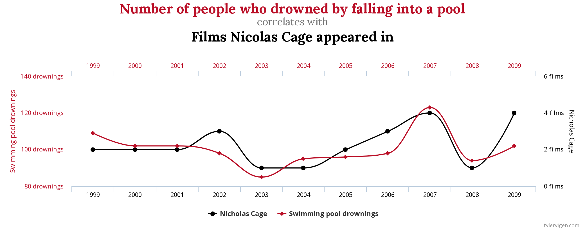
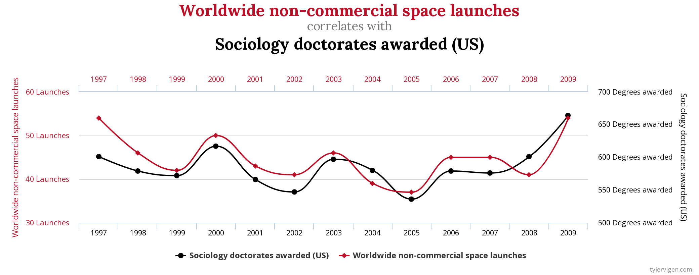
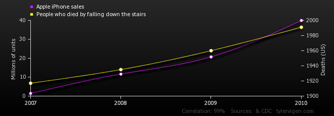
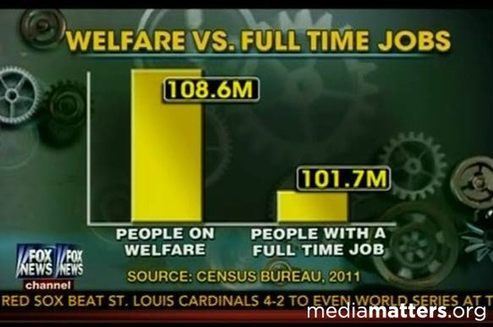
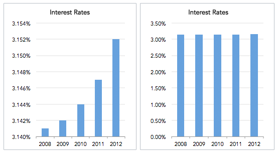
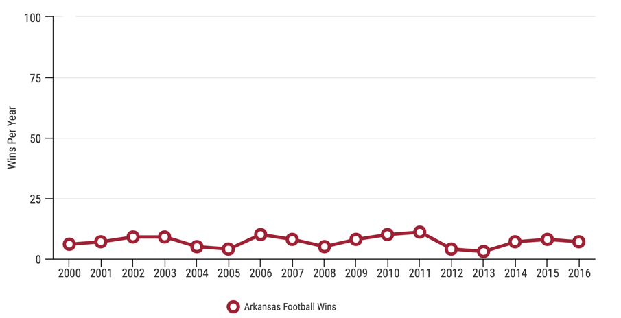
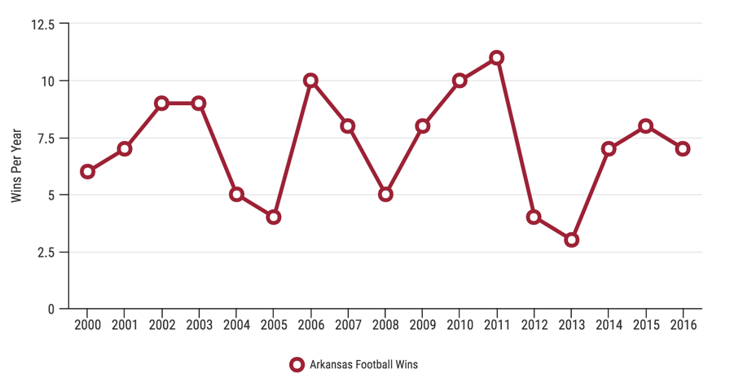
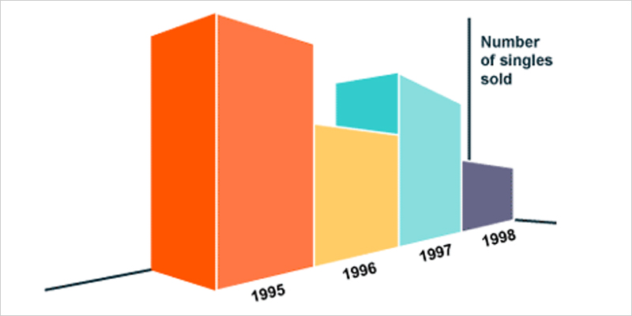
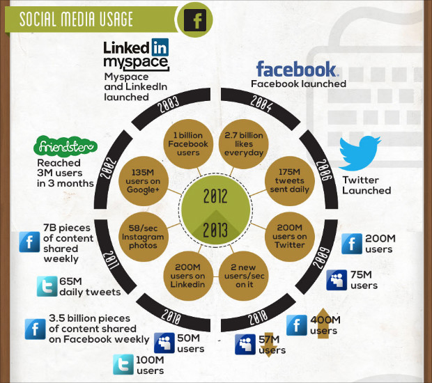

<div class="blame">
author: "Del Middlemiss"<br>
date: "3rd June 2019 - rev. 22nd July 2019"
</div>


```{r setup, include=FALSE}
knitr::opts_chunk$set(echo = TRUE, fig.align = 'center')
```
# Learning Objectives

* Be able to discuss some examples of spurious correlations or bad statistics
* Know the common pitfalls of bad statistics
* Know the common pitfalls of bad visualisations

**Duration - 30 minutes**

<hr>

# Spurious correlations

Let's say it once more, with feeling:<br>

<br>
<div class='emphasis'>
<center>**Correlation does not imply causation**</center>
</div>
<br>

We've seen that we really need to perform an experimental study to prove causation, it's much more difficult (and perhaps impossible) to convincingly prove causation from observational studies alone.

Here's the problem: our societies now amass vast amounts of data, much of which is freely available, and we have exceedingly powerful computers capable of exhaustively analysing it. So, *if we look hard enough, we are very likely find a significant correlation in a large multivariate data set*.

A niche brand of statistics-based humour has grown up around this phenomenon: the *spurious correlation*! Here are a few examples:
<br><br>

```{r, echo=FALSE, fig.cap="**Fig. 1** Does Nicholas Cage's appearance in films cause drownings? ($r = 0.666$)", out.width = '100%'}

```

<br><br>
Is Nicholas Cage's acting so compelling that people forget to watch where they are going, fall into pools and drown? Are you convinced?
<br><br>

```{r, echo=FALSE, fig.cap="**Fig. 2** Do global non-commercial space launches encourage US students to finish their sociology PhDs? ($r = 0.789$)", out.width = '100%'}

```

<br><br>
Do non-commercial space launches around the world cause such feelings of pride in US students that they are spurred on to get sociology PhDs? Is this credible?
<br><br>

Clearly, it is very likely that these correlations arise entirely by chance! We need to be more careful, however, where we can start to envisage a plausible causal relationship:
<br><br>

```{r, echo=FALSE, fig.cap="**Fig. 3** Do increased numbers of iPhones in circulation lead people in the US to take less care on stairs? ($r = 0.995$)", out.width = '100%'}

```

<br>

## Data fishing 

This process of 'dredging' large data sets for significant correlations is known as **data fishing**. Fishing expeditions often discover correlations that are novel, surprising and rapidly gather media attention, only for the same correlations to be refuted by later studies (which may or may not be sound themselves). Unfortunately, the end effect is to diminish public trust in statistics and the scientific method.  

<hr>

# Other statistical skullduggery

## Fickle averages

Beware of the term 'average' used without qualification in a report. As we've seen, the mean, mode and median can be quite different in skewed distributions and in the presence of outliers. An author intending to mislead can select any one of them as the 'average' to suit their purpose. 

## Faulty polling

[The perfect balanced sample](https://www.youtube.com/watch?v=5k6CoJ97IOA)

Poll questions can be phrased in a manner intended to sway participants towards a particular answer, particularly if the target demographic is known ahead of time:

* Do you think we should teach young people how to fight and give them access to weapons via the reintroduction of a period of compulsory National Service? *[Yes/No]*
* Do you think we should give young people a sense of purpose and duty via the reintroduction of a period of compulsory National Service? *[Yes/No]*

Poll questions should instead be phrased in a *neutral tone*:

* Do you agree with the reintroduction of a period of National Service *[Yes/No]*

## Misleading visualisations

**A classic: manipulating the y-axis**<br><br>

This is a time-honoured technique by which to mislead a viewer. Here's a particularly bad example from Fox News.

<br><br>
```{r, echo=FALSE, fig.cap="**Fig. 4** A particularly bad visualisation from Fox News.", out.width = '80%'}

```
<br><br>

* The y-axis is truncated: no meaningful zero point is shown.
* In fact, it's even worse: the y-axis doesn't even have a scale.<br><br>

<br><br>
```{r, echo=FALSE, fig.cap="**Fig. 5** Hey presto! Small changes to big changes! (source: www.datapine.com)", out.width = '100%'}

```
<br><br>

* The left-hand plot makes it look like interest rates have increased dramatically 

<br><br>
```{r, echo=FALSE, fig.cap="**Fig. 6** An Arkansas football team have been winning consistently, rock solid performance. (source: www.venngage.com)", out.width = '80%'}

```
<br><br>

* Blowing up the y-axis range makes changes look smaller

<br><br>
```{r, echo=FALSE, fig.cap="**Fig. 7** Arkansas team performance on a more representative scale. Now the data seem more realistically variable. (source: www.venngage.com)", out.width = '80%'}

```
<br><br>

* Here's the same data plotted on a more representative y-scale. Suddenly, the team's performance looks less consistent. 

<br><br>
**3D graphs - don't use them!**

<br><br>
```{r, echo=FALSE, fig.cap="**Fig. 8** Three-dimensional graphs are superficially appealing, but they can seriously mislead viewers (source: www.visme.co)", out.width = '80%'}

```
<br><br>

* This 3D graph makes 1995 sales look huge and 1998 sales tiny!

<br><br>
**Clutter - making conclusions harder to assess**

<br><br>
```{r, echo=FALSE, fig.cap="**Fig. 9** A cluttered and near useless infographic (source: www.visme.co)", out.width = '80%'}

```
<br><br>

* If all else fails, unscrupulous authors might just bury their statistics in meaningless graphical clutter. This gives the reports conclusions a false air of authority and makes it more difficult for a viewer to critically assess any claims.

## Purposeful bias

Sometimes, a study author might deliberately bias their sample so-as to sway the data gathered to the support of a particular outcome.

* e.g. in a poll to establish the proportion of people who know the correct age at which an individual may vote.
  - if the study authors wish to increase the proportion, they might try to include more young people in the sample, with the hope that young people will be more aware of when they may claim certain rights.
  - similarly, to decrease the proportion, the authors might seek to overrepresent older people in the sample, hoping that they innaccurately remember when they first had the right to vote. 

Look carefully for a description of sampling procedure in statistical reports.

## Percentages of small samples and percentage changes in small values

Another dubious practice is to report a change in a small value as a percentage of the value. Consider a club of $5$ people who recruit an additional member. The club president can accurately say that they have recently grown by $20\%$, but it would be a misleading statistic.

Percentages can also be used to conceal small sample sizes. Consider a poll of $10$ people in which $9$ people answer 'yes'. The rate of 'yes' responses is $90\%$, but should we give this the same weight as a poll of $1000$ people in which $900$ answer 'yes'? Clearly not.

If a percentage change in a value is reported, look for absolute values to be clearly stated as well. Sample sizes should always be clearly stated in any honest report. 
