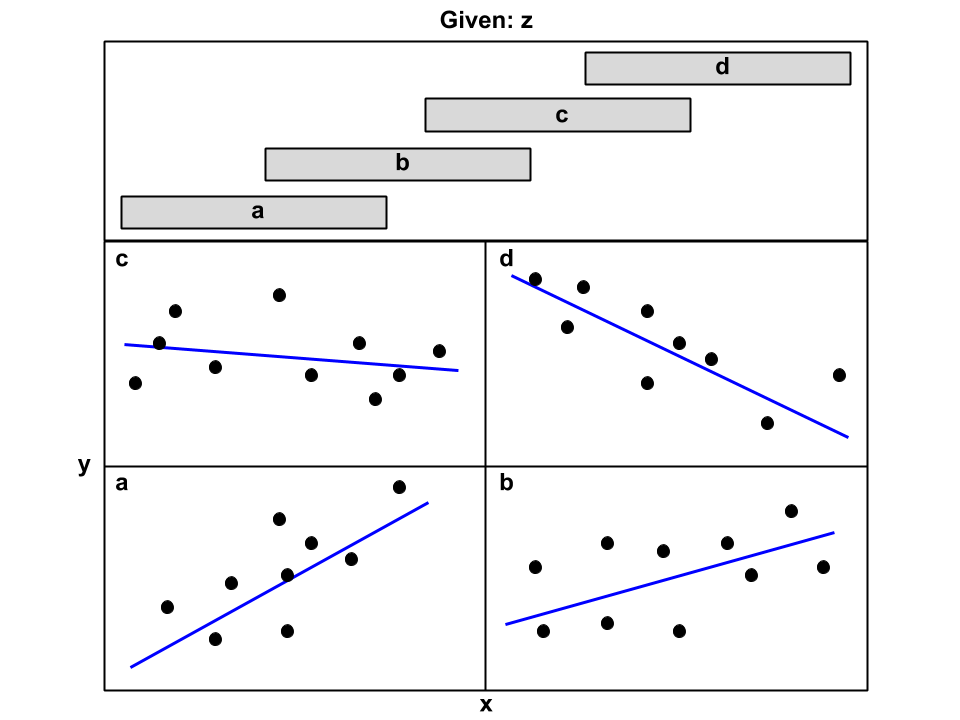

<div class="blame">
author: "Del Middlemiss"<br>
date: "15th August 2019"
</div>


```{r setup, include=FALSE}
knitr::opts_chunk$set(echo = TRUE, fig.align = 'center')
```

# Learning Objectives<br>

* Understand and be able to build upon simple linear regression by adding continuous and categorical predictors.
* Be able to investigate multiple predictor-predictor and predictor-response correlations
* Understand and be able to use the `+`, `*` and `:` operators in formula notations
* Have seen a parallel slopes model
* Be able to add interactions between predictors and interpret their effects
* Understand that multiple continuous predictors lead to 'planes of best fit'
* Be able to use conditional plots to investigate interactions between continuous predictors

New packages: `mosaicData`, `GGally`, `ggiraphExtra`

**Duration - 120 minutes**<br>

<hr>

# Starting point - simple linear regression

We're going to introduce the elements of multiple linear regression one-by-one to help you understand their use and effect. Our starting point will be simple linear regression with a response variable $y$ and a continuous predictor $x$. This is just the sort of linear regression scenario we looked at in module 2! We'll then look at adding:

* One or more additional categorical predictor(s)
* One or more additional continuous predictor(s)
* Interaction terms

## The `RailTrail` data

Let's have a look at a dataset with multiple predictors. The `RailTrail` data from the `mosaicData` package contains 90 daily observations of the `volume` of users on a 'railtrail' (i.e. a former rail line converted to a path) together with a number of other factors: the average daily temperature, whether that day was a weekday, precipitation and cloudcover etc... A laser counting station was used to gather the user volume values, coupled to a set of weather sensors for the other factors. 

We're going to build a regression model for user `volume` as a function of one or more predictor variables.

```{r, message=FALSE}
library(mosaicData)
library(tidyverse)
```
```{r}
glimpse(RailTrail)
```

<br>
<blockquote class='task'>
**Task - 3 mins**

Take a few minutes to acquaint yourself with the `RailTrail` data
    * perhaps try running `summary()`
    * plot `volume` against a few predictors that you think may be of interest  

<details>
<summary>**Solution**</summary>
```{r}
summary(RailTrail)

RailTrail %>%
  ggplot(aes(x = avgtemp, y = volume)) +
  geom_point()

RailTrail %>%
  ggplot(aes(x = weekday, y = volume)) +
  geom_boxplot()

RailTrail %>%
  ggplot(aes(x = precip, y = volume)) +
  geom_point()
```
</details>
</blockquote>
<br>

## `ggpairs()` in the `GGally` package

Some of the predictors look redundant, so let's trim them out. We'll only use a single measure of temperature (say `avgtemp`), and we can also remove `fall` and `dayType`, as they can be computed from other predictors (i.e. they are **aliases**).

```{r}
RailTrail_trim <- RailTrail %>%
  select(-c("hightemp", "lowtemp", "fall", "dayType"))
```

Now we can simply plot the trimmed dataframe to see a useful basic visualisation

```{r}
plot(RailTrail_trim)
```

or we can obtain an enhanced version of the same plot using the `ggpairs()` function in the `GGally` package!

```{r, message = FALSE}
library(GGally)
ggpairs(RailTrail_trim)
```

We should examine these plots to look for predictors that appear significantly associated with our response variable (`volume` in this case). We should also take a keen interest in **how the predictors correlate with each other**.

## Simple linear regression

Examining the pairs plots above, we see a reasonably strong association between the user `volume` each day and `avgtemp`, the average daily temperature (degrees Fahrenheit). Let's run simple linear regression as follows:

* The response will be `volume`
* The predictor will be `avgtemp`
* The simple linear regression equation is $\widehat{\textrm{volume}} = \textrm{intercept} + b_{\textrm{avgtemp}} \times \textrm{avgtemp}$

We're hypothesising that people are more likely to use the rail trail in warm weather.

```{r}
RailTrail_trim %>%
  ggplot(aes(x = avgtemp, y = volume)) +
  geom_point() +
  geom_smooth(method = "lm", se = FALSE)
```

<blockquote class='task'>
**Task - 5 mins**
  
Just to get back in the 'groove', run a simple linear regression on the `RailTrail` data, taking `volume` as response and `avgtemp` as predictor. Check the regression assumptions. How well does this simple model perform in predicting `volume`?<br><br>

[**Hint** - remember, we can check the regression assumptions by plotting the model object]

<details>
<summary>**Solution**</summary>
```{r}
model <- lm(volume ~ avgtemp, data = RailTrail_trim)
par(mfrow = c(2, 2))
plot(model)
summary(model)
```

The regression doesn't seem too bad, although there is some evidence of systematic variation not captured in the `Residuals vs Fitted` plot, some deviation from normality in the high quantile residuals in the `Normal Q-Q` plot, and evidence of rather mild heteroscedasticity in the `Scale-Location` plot. 

Alas, however, the model isn't very effective. The $r^2$ value is $0.18$, and the residual standard error is $115.9$. To put the latter in context, let's see the boxplot of `volume`.

```{r}
RailTrail_trim %>%
  ggplot(aes(y = volume)) + 
  geom_boxplot()
```

The median is just below $400$ users, and our estimated `volume` values are accurate to only $116$ users on average (we get this from the residual standard error)! So our estimates are out by around $25%$ of the typical user `volume`
</details>
</blockquote>

We can hopefully do better by **adding further predictors to the model**, taking us into the territory of multiple linear regression! Adding predictors might well also fix some of the rather mild breaches of the regression assumptions we have observed. Fingers crossed!

We'll start by adding a categorical predictor variable, yielding what's known as a **parallel slopes model**.

<hr>

# Parallel slopes model - adding a categorical predictor 

Let's hypothesise that `weekday` has an effect on usage of the rail trail. We could probably argue the effect in either direction: that weekdays increase `volume` due to use by people commuting to work, or perhaps that weekends are busier due to recreational use. We shall see...

<blockquote class='task'>
**Task - 2 mins**

Try plotting an appropriate visualisation to determine whether user `volume` is associated with the `weekday` predictor.

<details>
<summary>**Solution**</summary>

Two boxplots split by `weekday` are appropriate here.

```{r}
RailTrail_trim %>%
  ggplot(aes(x = weekday, y = volume)) + 
  geom_boxplot()
```

The boxplots are split, so we can conclude there is an association of the two variables. 

To be more specific, let's calculate the *point-biserial correlation coefficient* (this is just the normal Pearson correlation coefficient applied to the case of one continuous- and one dichotomous variable).

```{r}
RailTrail_trim %>%
  summarise(cor = cor(weekday, volume))
```

This confirms a weak negative correlation.
</details>
</blockquote>

<br>
<div class='emphasis'>
**Systematic model development**<br><br>

We are not really following a process of *systematic model development* here. We'll detail that process in the next lesson: for now, we are content just to discuss the 'ingredients' of multiple linear regression. 

If we wished to be systematic about adding a predictor to our model beyond `avgtemp`, we would need to see which predictor is most strongly associated with the response `volume` **after the systematic variation due to `avgtemp` has been subtracted**. We would do this iteratively: 

1. ...add the 'most significant' predictor to the model
2. get the residuals of the enlarged model: the residuals are the new 'unexplained' variation
3. find the next 'most significant' predictor of this 'unexplained' variation 
4. go back to step 1...

We would keep cycling in this way until we are satisfied with the model.

</div>
<br>

Let's add `weekday` into our regression model!

$$\widehat{\textrm{volume}} = \textrm{intercept} + b_{\textrm{avgtemp}} \times \textrm{avgtemp} + b_{\textrm{weekday}} \times \textrm{weekday}$$

In the `patsy` formula notation, this is just as simple as saying `volume ~ avgtemp + weekday`

```{r}
model2 <- lm(volume ~ avgtemp + weekday, data = RailTrail_trim)
```

<br>
<div class='emphasis'>
**The $+$ operator in `patsy` formula notation**<br><br>

Note that $+$ in this formula *doesn't mean* 'add the two variables together' here, i.e. the regression equation **is not** something like

$$\widehat{\textrm{volume}} = \textrm{intercept} + b \times (\textrm{avgtemp} + \textrm{weekday})$$
Instead, read the $+$ operator in a formula as meaning *'add predictor `weekday` into the model with its own coefficient'*. Similarly, the $*$ operator has a new meaning that we'll see below (along with a new one: the $:$ operator).
</div>
<br>

Let's see the `summary()` and diagnostics of the model

```{r}
summary(model2)
par(mfrow = c(2,2))
plot(model2)
```

* We see a mild improvement in $r^2$ from $0.18$ with the single predictor model, to $0.25$ here. 
* Both predictor variables are statistically significant: their p-values are below $0.05$ (or $0.01$ for precise work)
* Note how `R` has treated the `weekday` variable, it has split it into a single dummy variable `weekdayTRUE` with `weekdayFALSE` being absorbed into the `intercept`. So `weekdayFALSE` is being treated as the **reference level**. 

<blockquote class='task'>
**Task - 2 mins**

How should we interpret the value of the coefficient for `weekdayTRUE`? Have a think about this, and discuss it with the people around you.

<details>
<summary>**Solution**</summary>

In the following way: on average, there are approximately $70$ fewer users on the rail trail each weekday as compared with a Saturday or a Sunday (with `avgtemp` held constant: we'll discuss this more fully below).

</details>
</blockquote>

Why is this called a 'parallel slopes model'? The easiest way to answer this is by visualising the model. The `ggPredict()` function in the `ggiraphExtra` package can help with this!

```{r, message = FALSE}
library(ggiraphExtra)
```
```{r}
ggPredict(model2, interactive = TRUE)
```

So we see the model effectively has *two lines*: one for weekdays, and another for weekend days. The lines are **parallel** (their slopes are the same), so we call this a 'parallel slopes model'.

How do these two lines come about? Let's look again at the regression equation:

$$\widehat{\textrm{volume}} = \textrm{intercept} + b_{\textrm{avgtemp}} \times \textrm{avgtemp} + b_{\textrm{weekday}} \times \textrm{weekday}$$

The slope of the line with respect to `avgtemp` is $b_\textrm{weekday}$, and remember that `weekday` is **categorical**. So for `weekday = TRUE` values, the line is effectively

$$\widehat{\textrm{volume}} = (\textrm{intercept} + b_{\textrm{weekday}}) + b_{\textrm{avgtemp}} \times \textrm{avgtemp}$$

i.e. just a shift in the `intercept`, while for `weekday = FALSE` values, we get

$$\widehat{\textrm{volume}} = \textrm{intercept} + b_{\textrm{avgtemp}} \times \textrm{avgtemp}$$

The lines differ only in `intercept`; they are parallel.

<blockquote class = 'task'>
**Task - 5 mins**

Try adding the `summer` categorical predictor to the existing model with `avgtemp` and `weekday`.

$$\widehat{\textrm{volume}} = \textrm{intercept} + b_{\textrm{avgtemp}} \times \textrm{avgtemp} + b_{\textrm{weekday}} \times \textrm{weekday} + b_{\textrm{summer}} \times \textrm{summer}$$

* How many lines do you expect to see in this model?
* Is this a parallel slopes model? [**Hint** try `ggPredict()` on the model object]
* Is the addition of this predictor justified [**Hint** what is the p-value of $b_{\textrm{summer}}$]?

<details>
<summary>**Solution**</summary>

We expect four lines in this case, as each of `weekday` and `summer` can take $2$
values, so $2 \times 2 = 4$. We still have a parallel slopes model, as `summer` is also categorical, so the four lines will be parallel (only their intercepts will differ).

Now let's run the regression and diagnostics:

```{r}
model3 <- lm(volume ~ avgtemp + weekday + summer, data = RailTrail_trim)
summary(model3)
par(mfrow = c(2, 2))
plot(model3)
```

So, we find only a pretty small improvement in $r^2$ from $0.248$ to $0.266$, and the p-value of the `summer` coefficient indicates that the predictor is not significant! 

Next, let's plot the model.

```{r}
ggPredict(model3, interactive = TRUE)
```

We find four parallel lines, as expected! However, we'll leave `summer` out of the model, as the p-value of its coefficient indicates that it is not significant.

Why did `summer` turn out not to be a significant predictor of `volume`? Likely because `avgtemp` and `summer` are correlated:

```{r}
RailTrail_trim %>%
  summarise(cor = cor(summer, volume))
```

so it is possible that we gain little extra information in the model by including `summer` along with `avgtemp`. In other words, high average temperatures are likely already a strong enough basis to indicate a summer's day.

</details>
</blockquote>

<hr>

# Interactions - terms involving two or more predictors

Let's try to interpret the following plot:

```{r}
RailTrail_trim %>%
  ggplot(aes(x = avgtemp, y = volume, color = weekday)) +
  geom_point() +
  geom_smooth(method = "lm", se = FALSE)
```

What we see is equivalent to grouping the data by `weekday` and obtaining best-fit lines of `volume` versus `avgtemp` for each group of data independently. It's clear that **the slopes and intercepts of these best-fit lines vary depending on whether `weekday` is `TRUE` or `FALSE`**.

How can we add this behaviour into our model? By adding an **interaction** between `avgtemp` and `weekday`.

$$\widehat{\textrm{volume}} = \textrm{intercept} + b_{\textrm{avgtemp}} \times \textrm{avgtemp} + b_{\textrm{weekday}} \times \textrm{weekday} + b_{\textrm{avgtemp:weekday}} \times \textrm{avgtemp} \times \textrm{weekday}$$

The last term here is the interaction. Notice that it involves the **product** of the two predictors: $\textrm{avgtemp} \times \textrm{weekday}$.

We do this in `patsy` formula notation with the $:$ operator as follows:

```{r}
model4 <- lm(volume ~ avgtemp + weekday + avgtemp:weekday, data = RailTrail_trim)
```

We can read $:$ as *'...interacting with...'*, so `+ avgtemp:weekday` can be read as *'add `avgtemp` interacting with `weekday`'*. Let's visualise the model

```{r}
ggPredict(model4, interactive = TRUE)
```

This looks promising! It's identical to the graph we plotted earlier!

<br>

## Interactions via the $*$ operator

Alternatively, we could have equivalently specified `model4` as 

```{r}
alt_model4 <- lm(volume ~ avgtemp * weekday, data = RailTrail_trim)
ggPredict(alt_model4, interactive = TRUE)
```

We can read $*$ as *'these predictors and all possible interactions between them'*. For the moment, though, it's probably easier to stick to using $:$ explicitly to include interactions.

<blockquote class='task'>
**Task - 2 mins**<br><br>
Examine the summary of the model including the interaction between `avgtemp` and `weekday`. Is our inclusion of the interaction justified?

<details>
<summary>**Solution**</summary>

```{r}
summary(model4) # or summary(alt_model4)
par(mfrow = c(2, 2))
plot(model4)
```

Alas, including this interaction is not justified, the p-value of the coefficient at approximately $0.13$ is greater than our significance level of $0.05$.
</details>
</blockquote>

<br>
<details class='maths'>
<summary>**Why does the interaction term lead to different slopes and intercepts?**</summary>

Why does including the `avgtemp:weekday` interaction term lead to different slopes and intercepts for `weekday = TRUE` and `weekday = FALSE`?

To see this, let's rearrange the regression equation:

$$\widehat{\textrm{volume}} = (\textrm{intercept} + b_{\textrm{weekday}} \times \textrm{weekday}) + (b_{\textrm{avgtemp}} + b_{\textrm{avgtemp:weekday}} \times \textrm{weekday}) \times \textrm{avgtemp}$$

The first term in parentheses $()$ is the overall 'intercept', and the second term in parentheses is the overall 'slope', and we see now that these depend on `weekday`!

| case | 'intercept' | 'slope' |
|---|---|---|
| `weekday = FALSE (or 0)` | $\textrm{intercept}$ | $b_{\textrm{avgtemp}}$ |
| `weekday = TRUE (or 1)` | $\textrm{intercept} + b_{\textrm{weekday}}$ | $b_{\textrm{avgtemp}} + b_{\textrm{avgtemp:weekday}}$ |

The two different cases each lead to distinct slopes and intercepts. The other way to think about this is that we now have $4$ adjustable coefficients in the regression model. A line is completely determined once we decide on a slope and intercept, so the four coefficients give us enough freedom to fit two completely distinct lines.
</details>
<br>

<hr>

# Adding another continuous predictor

We're not having a lot of luck in model development so far (mainly because we are not being systematic), but let's keep doggedly trying to improve our model! This time, we'll add another continuous predictor, say `cloudcover`, which measures the cloud cover observed each day (apparently in 'oktas', or eigths of the sky, but the values seem more consistent with tenths of the sky).

```{r}
RailTrail_trim %>%
  summarise(min = min(cloudcover), max = max(cloudcover))
```

Let's first investigate whether `cloudcover` and `volume` are associated:

```{r}
RailTrail_trim %>%
  ggplot(aes(x = cloudcover, y = volume)) + 
  geom_point() +
  geom_smooth(method = "lm", se = FALSE)
```

We have a reasonable association, but bear in mind that we are still not being systematic, as we haven't subtracted off variation due to `avgtemp` and `weekday`. Nevertheless, let's go ahead and add `cloudcover` to the regression

```{r}
# add cloudcover before weekday for ggPredict() later
model5 <- lm(volume ~ avgtemp + cloudcover + weekday, data = RailTrail_trim)
summary(model5)
par(mfrow = c(2, 2))
plot(model5)
```

Yay, progress again! It looks like `cloudcover` is useful: $r^2$ increases from $0.25$ to $0.40$, and the `residual standard error` value drops by approximately $11$ users. The coefficient of `cloudcover` is statistically significant too. 

The regression equation is now

$$\widehat{\textrm{volume}} = \textrm{intercept} + b_{\textrm{avgtemp}} \times \textrm{avgtemp} + b_{\textrm{weekday}} \times \textrm{weekday} + b_{\textrm{cloudcover}} \times \textrm{cloudcover}$$

Unfortunately, we start to run into problems visualising models with two or more continuous predictors due to the number of dimensions involved. This is about as far as we can go, because humans can really only visualise $3$-dimensions, and here we have now one response dimension `volume`, plus two continuous predictor dimensions: `avgtemp` and `cloudcover`, together with a categorical predictor `weekday`.

A linear model involving two continuous predictors gives us a *plane of best-fit*. Here, with two continuous- and one categorical predictor, we go one step further and generate a **parallel planes model** similar in concept to the parallel slopes model we saw above. 

Let's see a $2$-dimensional representation of this model using facets (as generated automatically by `ggPredict()`)

```{r}
ggPredict(model5, colorn = 10, interactive = TRUE)
```

To interpret this plot, imagine in each facet that there is a `cloudcover` axis pointing into the plane of the screen, starting at $0$ closest to you, and reaching $10$ some distance behind the screen. The ten lines plotted show where the best fit plane lies at that value of `cloudcover`. So, in both cases, the plane would slope downwards 'into' the screen, i.e. increasing `cloudcover` leads to decreasing `volume` of use of the rail trail. We see the parallel planes model clearly, as we have **two distinct but parallel** planes (one in each facet) corresponding to `weekday = TRUE` and `weekday = FALSE`.

This is about as far as we can reasonably go; we'll stop trying to visualise models beyond this level of complexity.

<hr>

# Interpreting multiple regression coefficients

We will now think about how to interpret fitted coefficients in multiple linear regression. Let's look again at the regression model we used above:

$$\widehat{\textrm{volume}} = \textrm{intercept} + b_{\textrm{avgtemp}} \times \textrm{avgtemp} + b_{\textrm{weekday}} \times \textrm{weekday} + b_{\textrm{cloudcover}} \times \textrm{cloudcover}$$

Now, when `R` adds `weekday` into the model, it generates a dummy variable `weekdayTRUE` which is either $1$ or $0$. If $1$ for a row, then the fitted coefficient $-47.9480$ is added to that value of the estimated response $\widehat{\textrm{volume}}$. We would interpret this as 'on average, weekdays experience `volume` that is $48$ users lower than weekend days, for constant values of `avgtemp` and `cloudcover`'.

So, much for categorical predictors, but what about the two continuous predictors `avgtemp` and `cloudcover`. How do we interpret their fitted coefficients? In the following way:

<br>
<div class='emphasis'>
<center>The fitted coefficient of a continuous predictor in a multiple linear regression model equals the change in response variable for a $1$ unit increase in that predictor **with all other predictor variables held constant**.</center>
</div>
<br>

By 'constant' here we mean 'fixed'. So, for a specific example, the fitted coefficient $b_{\textrm{avgtemp}} = 5.2461$ can be interpreted as follows: 'a $1$ degree Fahrenheit increase in average temperature raises the rail trail user volume by $5.25$ users on average, with all other predictors held constant'.

<br>
<blockquote class='task'>
**Task - 5 mins**

Add `precip` (daily precipitation in inches) into the regression model. Perform diagnostics, and if you find that `precip` is a significant predictor, interpret its fitted coefficient.

<details>
<summary>**Solution**</summary>
```{r}
model6 <- lm(volume ~ avgtemp + cloudcover + weekday + precip, data = RailTrail_trim)
summary(model6)
par(mfrow = c(2, 2))
plot(model6)
```

Looks promising! All the coefficients are statistically significant at a significance level of $0.05$. We interpret the coefficient of `precip` as follows: 'a $1$ inch increase in daily precipitation lowers rail trail volume by approximately $118$ users on average, with all other predictors held constant'.
</details>
</blockquote>
<br>

<hr>

# Interaction of continuous predictors 

Imagine we come up with the idea that there should be an interaction between `avgtemp` and `precip`, i.e. we think something along the lines that "days that are both hot and wet should lead to particularly low usage of the rail trail". Frankly, that does sound like an unpleasant environment in which to run or cycle!

We can straightforwardly add this interaction in `patsy` notation as `avgtemp:precip`. 

```{r}
model7 <- lm(volume ~ avgtemp + cloudcover + weekday + precip + avgtemp:precip, data = RailTrail_trim)
summary(model7)
par(mfrow = c(2, 2))
plot(model7)
```

We see, however, that inclusion of the interaction is not justified, its own fitted coefficient is not statistically significant, and it also renders `precip` an insignificant predictor. Not good.

How could we have investigated this interaction **before** we added it to the model? The **conditional plot** is helpful! We can obtain a conditional plot in `R` using the `coplot()` function as follows:

```{r}
coplot(volume ~ avgtemp | precip,
       data = RailTrail_trim)
```

We tell the function to plot `volume` against `avgtemp`, **conditional** on the value of `precip` using the vertical bar `|` to mean 'conditional upon', as in the earlier lessons on probability theory.

Think of this plot as showing 

<br>
<center>
'`volume` versus `avgtemp` **given** `precip`'
</center>
<br>

You may also hear this called a 'shingles' or 'roof tile' plot, because the top graph resembles overlapping tiles on a roof (AKA shingles in some dialects). If we like we can add a best fit line to each panel using the `panel =` argument (this takes in a function, telling `coplot()` what to do in each panel). We can also control the degree of overlap of the shingles with the `overlap =` argument.

```{r}
coplot(volume ~ avgtemp | precip,
       panel = function(x, y, ...){
         points(x, y)
         abline(lm(y ~ x), col = "blue")
       },
       overlap = 0.2,
       data = RailTrail_trim)
```

How do we interpret the results of `coplot()`? First, realise that the three scatter plots in the bottom part of the graph correspond to the three shingles in the top plot in the following order:

* the bottom left scatter plot corresponds to the bottom shingle
* the bottom right scatter plot corresponds to the middle shingle
* the top left scatter plot corresponds to the top shingle

Coplots always go this way: in order, left to right in each row and then bottom to top in rows of scatter plots correspond to the shingles from bottom to top. Each scatter plot shows $x$ and $y$ data for the $z$ values in the corresponding shingle. So, for the plot above, we have

* the bottom left scatter plot corresponds to `volume` versus `avgtemp` for `precip` values in a narrow range from $0$ inches to approximately $0.01$ inches (i.e. essentially the days where it did not rain).
* the bottom right scatter plot corresponds to `volume` versus `avgtemp` for `precip` values in a broader range from $0$ inches to approximately $0.16$ inches.
* the top left scatter plot corresponds to `volume` versus `avgtemp` for `precip` values in a very broad range from approximately $0.14$ inches to approximately $1.5$ inches.

Why have the shingles ended up being the width that they are? `R` tries to arrange the shingles so that, as far as possible, they contain near equal numbers of data points.

<br>
<div class='emphasis'>
Now, here's the key point. If we examine the scatter points and find that the slope of the best fit line varies systematically as the shingle range varies, this indicates a potentially significant interaction between the $x$ predictor and the conditioning predictor! 

Here's a plot showing schematically what a `coplot()` for a significant interaction might look like

```{r, echo=FALSE, fig.cap="**Fig. 1** Coplot showing a clear interaction between x and conditioning variable z. The lines slopes vary systematically from positive to negative as the z-range varies.", out.width = '80%'}

```
</div>
<br>

Alas, we can see no clear systematic change in the slopes of the best fit lines in our `coplot(volume ~ avgtemp | precip,...)`, indicating that there is likely not a significant interaction between `avgtemp` and `precip`, as the regression diagnostics above confirmed for us.

<hr>

# Recap

* How do we add additional predictors to a linear regression model?
<details>
<summary>**Answer**</summary>
Using the `+` operator in formula notation.
</details>

<br>

* Under what circumstances would we expect multiple linear regression to yield *planes* of best fit?
<details>
<summary>**Answer**</summary>
We expect planes of best fit whenever we have two or more continuous predictors in a model.
</details>

<br>

* What is an interaction term in multiple regression? What operator do we use to add an interaction?
<details>
<summary>**Answer**</summary>
An interaction term involves a **product** of two or more predictors. We can add an interaction using the `:` operator. 
</details>

<br>

* What is the general principle for interpreting a regression coefficient in multiple linear regression?
<details>
<summary>**Answer**</summary>
The fitted coefficient of a predictor in a multiple linear regression model equals the change in response variable for a $1$ unit increase in that predictor (for a continuous predictor) or the difference in response relative to the reference level (for a categorical predictor) **with all other predictor variables held constant**. 
</details>

<br>

* What type of plot can we use to investigate an interaction between two continuous predictors? What `R` function do we use to obtain such a plot?
<details>
<summary>**Answer**</summary>
We can use a conditional plot to investigate an interaction between two continuous predictors. `R` provides the `coplot()` function for this purpose.
</details>

<hr>

# Additional resources

* Have a look at the ['StatQuest' video](https://www.youtube.com/watch?v=hokALdIst8k) on multiple linear regression in `R`!