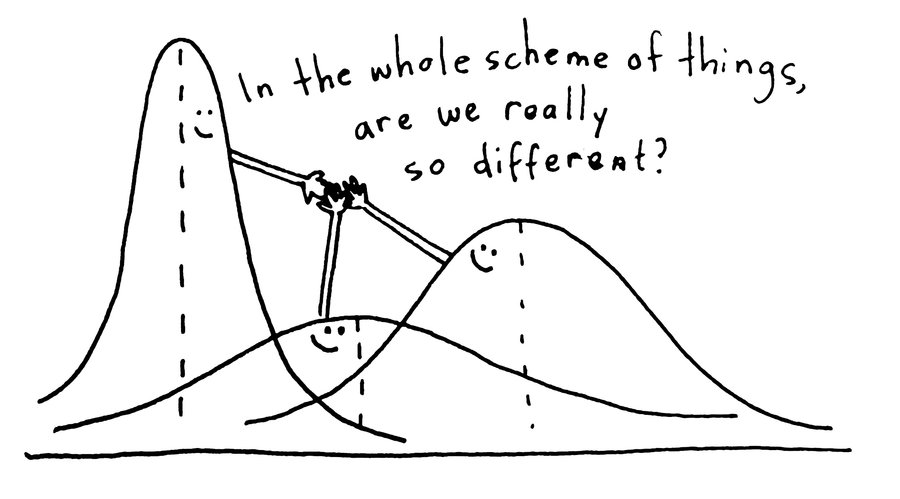

```{r setup, include=FALSE}
knitr::opts_chunk$set(echo = TRUE, fig.align = "center")
```


# Learning objectives

* Experience manual systematic regression model development for a reasonably complex dataset
* Understand the iterative process: 
    - choose the 'best' predictor and add it to the model
    - obtain a new set of residuals for the enlarged model
    - look for next 'best' predictor amongst these residuals
    - and so on...
* Understand and be able to calculate the relative importance of predictors

**Duration - 90 mins**

<hr>

# Introduction

It's time to combine the ingredients of mutliple regression into a useful model, this time working systematically through the process! We'll work manually, as it's important to understand the process and the types of choices that must be made. 

We'll use the dataset `Prestige` in the `car` package, which references a measure of the `prestige` of various Canadian occupations in the 1970s to various other variables typical of the occupations. 

```{r, message = FALSE}
library(car)
library(tidyverse)
library(modelr)

# visualisation packages
library(ggiraphExtra)
library(GGally)
```

Let's `head()` the data and also check the variable definitions held in the documentation. 


```{r}
head(Prestige)
?Prestige
```

It looks like we have a few `NA`s, so let's trim them out, along with the occupation `census` code (which we don't expect to be all that useful):

```{r}
prestige_trim <- Prestige %>%
  drop_na() %>%
  select(-census)

# check NA's came out
dim(prestige_trim)
dim(Prestige)
```

# The key rule

We're going to follow a systematic manual process of model development. Keep in mind the following key rules throughout:

<br>
<div class='emphasis'>
Model development is as much art as science, and there is a role in it for subject knowledge and educated common sense. If either or both suggest that one or more predictors should be in a model then try adding them! Take them out again only if there is good statistical evidence that they do not significantly predict the response.

Also keep in mind the following aphorism due to George Box:

<br>
<center>
*'All models are wrong, but some are useful'*
</center>
<br>

We are looking for *useful* models, not for *perfect* ones!

</div>
<br>

# First predictor

Now, our aim is to build a regression model for the `prestige` response variable in terms of the multiple potential predictors held in the data frame. Let's have a look at the associations of the predictors with `prestige` and with each other.

<br> 

```{r, message = FALSE}
prestige_trim %>%
  ggpairs(aes(colour = type, alpha = 0.5))
```

<br> 

<blockquote class="task">
**Task - 5 mins**

What do you see in this plot?

<details>
<summary>**Potential Answers**</summary>

Amongst the continuous predictors, it looks like `education` is strongly correlated with `prestige`, as is `income`. But we also see that the boxplots of `prestige` against `type` show some separation, which perhaps indicates significant association. 

</details>
</blockquote>
<br>


Now comes the manual model building part. Let's build seperate models and choose between them on the basis of $r^2$ and diagnostics.

Let's start with `education`. 

```{r}
# build a model which tries to predict prestige from education
mod1a <- lm(prestige ~ education, data = prestige_trim)
mod1a
```
<br>

If you just look at the standard model output, you can determine that the intercept is -10.841 and the coefficient for education is 5.388. 

Therefore the complete regression equation is : 

<center>
Prestige = -10.841 + 5.388*Education
</center> 
<br>
*In this case, education score is the 'Average education of occupational incumbents'*. 

This equation tells us that the predicted Prestige score will vary increase by 5.388 points for every one point increase in education score. 

We can then use the summary function to provide more information: 

```{r}
summary(mod1a)
```
<br>

So, what does this tell us? 

It tells us that our $r^2$ value is really high (0.75) and so we can explain 75% of the variance in prestige based on education. The predictor value is statistically significant, which suggests this is a good model. The residual standard error is 8.6, which tells us that our **average error in predicting the prestige is about 8**. So we're making a guess that it's out by about 8 points. So that's not the most perfect prediction out there.  

<br>
Now we can plot it: 

```{r}
# set our plotting parameter limits (2x2 graph)
par(mfrow = c(2, 2)) 

# plot
plot(mod1a)
```

Our residuals vs fitted plot seems to capture the systematic variation well, and the normal Q-Q plot shows a little deviation from normality. The Scale-Location plot shows some evidence of rather mild heteroscedasticity. 
Nothing too major here.

<br>

<blockquote class="task">
**Task - 10 mins**

Now create a model using `type` as a predictor of prestige. Summarise and plot the results. 

What are your interpretations?

Which of the two models explain the data more? Which predictor would you choose as your first predictor? 


<details>
<summary>**Potential Answers**</summary>

```{r}
# build the model and plot the data 
mod1b <- lm(prestige ~ type, data = prestige_trim)
summary(mod1b)
```


Both models show high $r^2$, and all coefficients are statistically significant, but the model with `education` is better. We'll choose `education` as our first predictor.
<br>

```{r}
par(mfrow = c(2, 2))
plot(mod1b)
```

In terms of plotting, because our predictors are group level variables, they are much harder to interpret. You are almost just comparing two distributions. You will have points in a vertical line for each category. Ideally, all of these will have mean zero and bell-shaped distributions with similar standard deviations. If you see different distributions for your categorical variables, that isn't great. 

</details>
</blockquote> 


# Second predictor

Now we move on to pick our next predictor. First, though, we need to subtract off the systematic variation in `prestige` due to the predictor we have selected. The easiest way to do this is just to focus on the **residuals** of the current model for the next round of predictor selection. 

> "Residuals are essentially the difference between the actual observed response values and the response values that the model predicted."

<br> 

Think of it this way: the residuals contain the variation in `prestige` not explained by our current 'best' model, and now we will search amongst **all the predictors not yet in the model** for the one that explains the most of this residual variation. In simple terms, we want to figure out which of the "leftover" predictors help make our model better, by explaining the most of the remaining variation.     

For this, we can use the `add_residuals()` function from the `modelr` package to add a `resid` column to the `prestige_trim` data. We'll also remove the `prestige` and `education` variables so we can focus just on associations between the residuals and the predictors not yet in the model:

<br>

```{r, message = FALSE}
prestige_remaining_resid <- prestige_trim %>%
  add_residuals(mod1a) %>%
  select(-c("prestige", "education"))

prestige_remaining_resid %>%
  ggpairs(aes(colour = type, alpha = 0.5))
```

<br>

<blockquote class="task">
**Task - 10 mins**  

Examine the associations between the remaining predictors and the residuals. What do you see? What would you do to figure out which predictor is worth adding in?

<details>
<summary>**Potential Answers**</summary>

Amongst the numeric predictors, it looks like `income` has the strongest correlation, but, again, the boxplots grouped by `type` also show some splitting. So, as before, we'll build two models and let the $r^2$ and diagnostics of each guide our choice:

```{r}

# make an income model 
mod2a <- lm(prestige ~ education + income, data = prestige_trim)
summary(mod2a)
par(mfrow = c(2, 2))
plot(mod2a)
```

```{r}
# make one with education and type to see if that's better
mod2b <- lm(prestige ~ education + type, data = prestige_trim)
summary(mod2b)
par(mfrow = c(2, 2))
plot(mod2b)
```

The model with `income` has higher $r^2$, so we keep that predictor and discard `type`.
</details>
</blockquote>


<br>

## Statistical significance of categorical predictors

We see something curious in the summary of the model with `type` above: the coefficient of the `typewc` dummy is significant (with a $p$-value of $0.0422$), but `typeprof` is not ($p$-value of $0.1871$). How should we interpret this?

First, understand that best practice is to **either include a categorial predictor entirely ('all levels in') or leave it out entirely ('all levels out')**: we shouldn't include only selected dummies of a categorical predictor (e.g. keep `typewc` and discard `typeprof`).

So, how do we decide if a categorical predictor is significant overall? We run an **ANOVA**. 

<br>

**ANOVA** stands for **analysis of variance**. It can (and most often) is used to test for the difference between more than two sample means. ANOVA's null hypothesis is that group mean values of the dependent variable are not significantly different from another, while an alternative hypothesis is just that at least one of the factor level forms a group of observations which mean value is different from overall mean. That is, an ANOVA is used to check if the means of two or more groups are significantly different from each other.  
<br>


```{r, echo=FALSE, fig.cap="", out.width = '90%'}

```
<br>

We can use this in combination with regression: whereas the regression analysis aims to quantify effect sizes in terms of "how much is the response expected to change when the predictor(s) change by a given amount?", the ANOVA tests as a tool to check how much the residual variance is reduced by predictors in (nested regression) models. 

The ANOVA calculations for multiple regression are nearly identical to the calculations for simple linear regression,  except that the degrees of freedom are adjusted to reflect the number of explanatory variables included in the model. ANOVA can be applied to any regression model (no matter if the model contains only continuous, only categorical, or both kinds of predictors).   

ANOVA is also a parametric test and has some assumptions.  ANOVA assumes that the data is normally distributed.  The ANOVA also assumes homogeneity of variance, which means that the variance among the groups should be approximately equal.  ANOVA also assumes that the observations are independent of each other.  

So, how do we do this? As usual in R, there is a function. In this case, it's called the `anova()` function, and we simply pass it in two models to compare: the model including the categorical predictor, and the model excluding it, and then look at the $p$-value of the test:

```{r}
# mod1a is our current best model, mod2b contains type
anova(mod1a, mod2b)
```

The null hypothesis here is that the models explain the same amount of response variance. The alternative is that they don't. In this case, we find a $p$-value less than $0.05$, and so we reject the null hypothesis and say that the model including `type` is **significantly better** than the model excluding it! 

However, the model including `income` is still better overall (with higher $r^2$), and so we choose `income` over `type` in this case. But perhaps we can include it as a third variable?  

<br>


# Third predictor

We move on to our next round of predictor selection:

```{r, message = FALSE}
prestige_remaining_resid <- prestige_trim %>%
  add_residuals(mod2a) %>%
  select(-c("prestige", "education", "income"))

prestige_remaining_resid %>%
  ggpairs(aes(colour = type, alpha = 0.5))
```

<br>
Hmm, nothing really leaps out this time in terms of strong association with the residuals. Given it tested quite well in our model above (with education), perhaps it's the turn of `type` to shine as our third predictor. 


```{r}
#create a model that also has type
mod3b <- lm(prestige ~ education + income + type, data = prestige_trim)
summary(mod3b)
```


Hmmm, our model with `type` has a high $r^2$, but the coefficients of the associated dummies seem to be insignificant (rows `typeprof` and `typewc`). 

As before, let's use an `anova()` test to check whether inclusion of `type` is justified at this stage. Compare this to your model which included only `income` and `education` (in these notes, thats `mod2a`)

<br>

<blockquote class="task">
**Task - 10 mins**

Run an `anova()` model to check which model to use. Interpret your findings, and make a choice about whether to include `type` or not.   


<details>
<summary>**Potential answers**</summary>

```{r}
anova(mod3b, mod2a)
```

Neat, the low $p$-value tells us that `type` is significant overall, so we'll go ahead and include it!

</details>
</blockquote> 


# Adding an interaction

Now we think about adding an interaction to our model. An interaction occurs when an independent variable has a different effect on the outcome depending on the values of another independent variable. So for example, there might be an interaction between `income` level and `type` of work you do, meaning that the level of prestige varies differently depending on income level for different types of work. Adding interaction terms to a regression model can greatly expand understanding of the relationships among the variables in the model and allows more hypotheses to be tested.

Our current 'best' model has three predictors: `education`, `income` and `type`, so let's look at adding one of the `education:income`, `education:type` and `income:type` interactions.  

<br>
<div class='emphasis'>
**Hierachical interactions and main effects**

Best practice is to include only interactions between predictors **that are already present in the model as single predictors**. We say such interactions are **'strongly hierarchical'**.

Predictors included in the model as single predictors are also given a special name: they are often called **'main effects'**.

So, for example, in our model with `education`, `income` and `type` single predictors, if we follow best practice, then only the `education:income`, `education:type` and `income:type` interactions should be considered for inclusion. We should not, for example, consider the `women:type` interaction, as `women` is not present in the model as a main effect.  
</div>
<br>


First, let's go back and take our residuals (minus prestige).   
<br>

```{r}
prestige_resid <- prestige_trim %>%
  add_residuals(mod3b) %>%
  select(-prestige)
```

Now let's visualise the potential interactions to get a sense of how they might be associated with the residuals. We'll use `coplot()` for the `education:income` interaction, and split scatter plots for the `education:type` and `income:type` interactions (although we could use `coplot()` for these too if we wished):

```{r}
# first look at a coplot, which just shows the income for a given education level
coplot(resid ~ income | education, data = prestige_resid, columns=6)

# can also add a trend line
coplot(resid ~ income | education,
       panel = function(x, y, ...){
         points(x, y)
         abline(lm(y ~ x), col = "blue")
       },
       data = prestige_resid, rows = 1)

```

So, what does this tell us? The grey bars at the top represent the different intervals of the variable that the function has split the data into. In this case, it has simply split the data into 6 separate education groups. 

For `education:income`, in the scatterplots we see a fairly systematic decreasing trend in slope (positive to zero to negative) reading from left to right. It can be ticky to interpret `coplot` output. In this case, we see that at low levels of education (left) prestige really goes up as you get more income. Then it flattens off at higher levels of education (4th plot), then levels off / decreases when you have a lot of education. This is a promising indication of a useful interaction. 

Now let's use a normal `geom_smooth` plot to plot our residuals for `education` and `income` separately by `type`. 

```{r}
# plot education
prestige_resid %>%
  ggplot(aes(x = education, y = resid, colour = type)) +
  geom_point() +
  geom_smooth(method = "lm", se = FALSE)
```

```{r}
# plot income
prestige_resid %>%
  ggplot(aes(x = income, y = resid, colour = type)) +
  geom_point() +
  geom_smooth(method = "lm", se = FALSE)
```

Similarly, the best fit lines split by `type` are very different in the `resid` vs. `education` and `resid` vs. `income` scatterplots, so these also look promising as potential interactions. 

<blockquote class="task">
**Task - 10 mins**

Test all three interactions in your model separately, and choose the best. To get you started, here is the model to check for an `education:income` interaction. 

<br>

```{r}
mod4a <- lm(prestige ~ education + income + type + education:income, data = prestige_trim)
summary(mod4a)
```

<details>
<summary>**Potential answers**</summary>

```{r}
# create an education:type interaction model
mod4b <- lm(prestige ~ education + income + type + education:type, data = prestige_trim)
summary(mod4b)
```

```{r}
# create an income:type interaction model
mod4c <- lm(prestige ~ education + income + type + income:type, data = prestige_trim)
summary(mod4c)
```

<br> 

The model with the highest $r^2$ adds the `income:type` interaction. Again, one of the new dummies from this model (`income:typewc`) has a $p$-value greater than $0.05$, so let's run an `anova()` testing this model against the previous best.

```{r}
anova(mod4c, mod3b)
```

The low $p$-value tells us that the new model is significantly better than the previous best, so we keep the `income:type` interaction.  

</details>
</blockquote>

<br>

  
# Relative importance

A common question you might be asked at the end of a regression analysis might go something like:

<br>
<center>
"Which of these factors is most important?"<br><br>
"If we can focus our efforts on only a small number of factors, which should they be?"
</center>
<br>

or variants of the same. **Relative importance analysis** provides an (approximate) way to answer these questions! It splits up the total $r^2$ of the model into a contribution from each predictor in the model. The higher a predictor's contribution, the more 'important' that predictor is in explaining variation in the response variable.

The method is 'approximate' because there really is no mathematically unique way to determine the relative importance of predictors. Unfortunately, the way in which the predictors are added to a model generally matters! 

The `relaimpo` package offers a method called `lmg`, which stands for "Lindemann, Merenda and Gold method". It assigns importance by averaging the contribution of each predictor over the multiple ways the predictor can be added. Argument `rela = TRUE` just tells the function to show relative importance (i.e. the importances are normalised to $1$).

```{r, message=FALSE}
library(relaimpo)
```

```{r}
calc.relimp(mod4c, type = "lmg", rela = TRUE)
```


So, we see by this measure that `type` is most important (accounting for $40\%$ of $r^2$), followed by `education` ($31\%$), then `income` ($25\%$), and finally the `income:type` interaction ($4\%$).

A less useful but still common used measure of the relative importance comes from the so-called 'beta coefficients', which are just the regression coefficients fitted after the predictors have been **standardised**. We can add the beta coefficients to a model in the following way:

```{r, message=FALSE}
library(lm.beta)
```

```{r}
mod4c_betas <- lm.beta(mod4c)
summary(mod4c_betas)
```

The values in the `Standardized` column provide a rough measure of predictor importance, but the `lmg` method of `calc.relimp()` is better!


# End of the line...

We've probably far enough to give you a sense of how you might manually develop a regression model. Again, you need to appreciate that model building is as much art as science. You should let yourself be guided by subject knowledge and common sense, and by the principle that we want a parsimonious but useful model. 

Why don't we just keep adding predictors to models? Why don't we just stick to using all available predictors, and perhaps add in all possible pairwise interactions as well? We've already had a hint of the sorts of problems this can cause, the most serious of which is **overfitting**. We'll see more on this topic shortly!


# Recap

<br>

* What is the iterative process of model development?
<details>
<summary>**Answer**</summary>
    - choose the 'best' predictor and add it to the model
    - obtain a new set of residuals for the enlarged model
    - look for next 'best' predictor amongst these residuals
    - and so on...
</details>

<br>
    
* What two measures of the relative importance of predictors have we seen?
<details>
<summary>**Answer**</summary>
We've seen the `lmg` method of `calc.relimp()` and the `lm.beta()` function.
</details>
