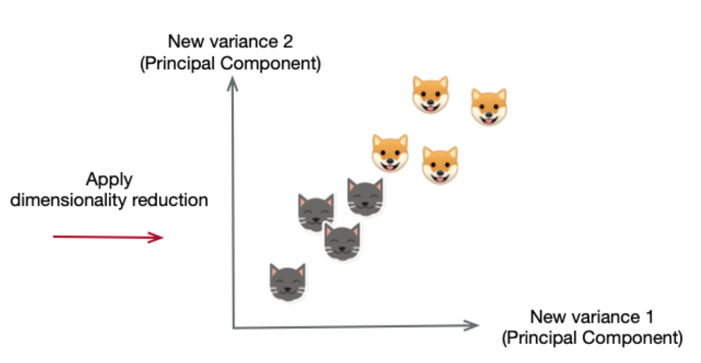

```{r setup, include=FALSE}
knitr::opts_chunk$set(echo = TRUE, fig.align = "center")
library(tidyverse)
```


# Learning Objectives

* Understand the importance of variable reduction (a.k.a. feature selection)
* Understand the difference between variable reduction and dimensionality reduction
* Know about filter and wrapper methods for variable reduction / feature selection, and understand the difference between the methods
* Know about dimensionality reduction techniques such as principal component analysis

**Lesson Duration: 2 hours**

<br>

# The Curse of Dimensionality   

In one of the previous lessons we looked at variable engineering and some of the ways in which we can prepare our data for machine learning. We've then learnt how to build models and add variables into them manually using a series of statistical testing. In both, you've seen a reccurring theme, which was a steady increase in the number of variables in our dataset, which then have the potential to be included in our model. 

But - despite what you might think - having more variables available isn't always a good thing. There's a phenomenon known in machine learning circles as [the curse of dimensionality](https://medium.com/diogo-menezes-borges/give-me-the-antidote-for-the-curse-of-dimensionality-b14bce4bf4d2). Put simply, it means that by adding more dimensions to our problem (ie. increasing the number of variables) we run into a few problems:  
<br>

1. **More data needed**: As the number of variables you have grows, the number of data points you need grows. Imagine if you were trying to get an accurate representation of all your dimensions (i.e. all your variables) in your data to train a model on. If you only had one variable, you might not need too much data (depending on your model). When you get two, that increases exponentially. And when you get three, it increases again... 

2. **Multiple comparisons** : When we increase the number of data points, you increase the number of comparisons required to capture all possible combinations of the data exponentially. This increases complexity. Having more data looks like a good thing on paper, but when it comes to modelling it we find that the opposite is true. Multiple comparisons arise when a statistical analysis involves multiple simultaneous statistical tests, each of which has a potential to produce a "discovery", of the same dataset or dependent datasets. The more inferences you make, the more likely erroneous inferences are to occur.

3. **Computational complexity** : Large amounts of data with large numbers of variables greatly increase computational complexity. This means you need larger computing power, more complex analysis techniques (and more skilled and experienced analysts), more data storage, and more time to run different models. In reality, depending on where you work, this might be unsustainable long term. Having less variables in your model also makes it easier and more interpretable for others to understand, increasing reproducibility.   

4. **Overfitting** : Having more variables also increases the chances of overfitting (which we will touch on later). By removing extraneous data, it allows your model to focus only on the important main features of the data, and not get hung up on features that don't matter. 

For example, if you were trying to classify dogs vs. cats, and you included too many variables in your model (e.g. every feature about a dog and cat that possibly exists) you'd end up with a model that perfectly separates your cats and dogs in your training dataset. But if you gave it new cats and dogs, it wouldn't be able to work so well. 

```{r, echo=FALSE, fig.cap="", out.width = '90%'}

```
<br>

Instead, if you simply your model to only include two separate features, you might get a few wrong classifications, but overall your model will be better.

```{r, echo=FALSE, fig.cap="", out.width = '90%'}

```

<br>

There are more problems associated with too many variables, but these are the main ones.  
<br>

## What do we do? 

Not preparing our data isn't an option, so we need another way of dealing with this. The best approach is to find the variables which have the greatest influence on the target variable and only include them in the model. 

Today, we will learn about two different processes to do this: **variable reduction** and **dimensionality reduction**. While both methods are used for reducing the number of features in a dataset, there is an important difference. Variable reduction is simply selecting and excluding given variables without changing them.  Dimensionality reduction is the process of reducing the number of random variables under consideration, by obtaining a set of principal variables. Overall, variable reduction (feature selection) and dimensionality reduction is key to being able to predict values with any amount of accuracy.


# Variable Reduction

The first option is **variable reduction** (often called feature selection). The name is a pretty accurate description of the process: we're reducing the number of variables in the dataset. We don't change variables in any way, we simply drop them from the model. The central premise when using a feature selection technique is that the data contains some features that are either redundant or irrelevant, and can thus be removed without incurring much loss of information. 

You might think that it's easy enough just to pick and choose which variables you need. For large datasets with many variables it will take a very long time. So far we've worked with datasets which have very small numbers of variables, and therefore it might seem easy to look at them all and think about which to include in a model. But what if you have say - 500 variables? [Take this dataset as an example](https://archive.ics.uci.edu/ml/datasets/Human+Activity+Recognition+Using+Smartphones):

<br>

```{r, echo=FALSE, fig.cap="", out.width = '100%'}

```

<br>
In this, you have 561 variables. If you want to start building a model, you'll need to go through them all, figure out what they represent, figure out if they're important, figure out if they are useful, figure out if they are correlated with one another, etc... This can be really time consuming and - if you don't really know what you're doing - very prone to errors.   

So, we don't just go at it randomly, there are different criteria and methods we can use. Broadly speaking there are three main categories of variable reduction methods:

**Filter Methods**: Filter methods involve ranking variables through useful descriptive measures. For example, you might use a statistical tests to assess each variable's correlation with the target variable. Or you might look at variation between variables. The most appropriate test for a given situation will depend on the nature of the variable being checked (continuous or categorical). It should also be noted that filtering will not detect collinearity between variables and so tests for that should happen first. The main benefits of these methods are that they have very low computation time and will not overfit the data. However, they are more time consuming, and you need to know the variables you are working with in depth.  

**Wrapper Methods**: Wrapper methods are a little more complex than filtering. Wrapper methods involve computing models with certain variable subsets (i.e. keeping some, leaving others) and then computing the “usefulness” of features based on the classifier performance. They continue this process until the optimal subset of your features and variables are reached. 
Essentially - you're computing models to decide whether to include variables or not. 

We can work in both directions: either we start with no features and keep adding them until we see no improvement, or we start with everything and remove them one by one. This means variable reduction is essentially reduced to a search problem, but as with all search problems it is very computationally expensive, and you can run into problems with multicollinearity (high coefficients due to the relationships between variables, rather than the relationship between predictor and response). The benefit of this approach is that they give you a good starting point if you have no intuition about the data and what variables might be important.   

**Embedded Methods**: Embedded methods are quite similar to wrapper methods since they also use modelling to optimize the performance of a machine learning algorithm. The difference to wrapper methods is that an intrinsic model building metric is used during learning. That is, whatever method you are choosing to reduce variables will be part of the learning algorithm itself. Embedded methods are a catch-all group of techniques which perform feature selection as part of the model construction process. These usually lead to a balance between filter and wrapper methods: feature selection/variable reduction is part of the model creation process, rather than separate. Therefore, you get a balance between computational expense and time. However, the drawback is these methods tend to be a bit more advanced, and so require more knowledge and expertise.  

<br>

Some methods within each of these broad categories that are often used to reduce variables include:

1. **Missing Values** -- In a previous lesson we spoke about techniques for replacing missing values in our datasets. For categorical variables this should always be possible, but when we use a mean value as a substitute for a continuous variable we are relying on there being enough data available to generate it. If we find ourselves with a low percentage of data points with values defined for a given variable it may be preferable to drop that variable from the model.

2. **Variance** -- Variance is an important metric for determining whether a variable does a good job of accounting for variation in your response variable. For example, if the variance *within* a predictor variable is greater than the variance between predictors, then the variable won't do a good job of accounting for the variation in the response variable either. On the flip side, if a variable has a low degree of variance, ie. the values are the same or within some small range for all or most of the data points, we can consider dropping it. In this scenario there is little to be gained from keeping the variable in our model, since it will affect the target variable in the same way for every data point. This is known as _variance thresholding_. 

3. **High Correlation** -- When we have two or more variables which are highly correlated we can usually remove one of them. In fact it's probably a good idea to. That's because it can easily lead to overfitting in our model, which is a Bad Thing that we'll discuss more later in the week. In terms of deciding which variable to drop, we generally want to keep the one which is more highly correlated to the target variable. That correlation could still be quite weak, just higher than the variable we want to drop.

4. **Univariate Variable Reduction** -- This method makes use of some of the pre-made tools available to us for variable reduction. We find the variables which have the highest correlation (or significant p-value) to the target variable and keep as many as we need, dropping the rest. We can combine this with other steps, so we could first remove missing data or variables highly correlated to each other _Forward Selection_ is a subset of this, where for each individual variable, a model is built and run, and the p-value for the statistical test (e.g. a t-test, F-test) is derived. The variable with the lowest p-value is selected and incorporated into the model. This is then included as your first predictor. Then it does the same for the second predictor, and repeats this process until all variables with significant p-values are added to the model. Any variables that don't have a significant p-value are excluded from the model. _Backward Selection_ works the same way, but starts with all variables in the dataset, and iteratively removes insignificant ones. 

5. **Recursive Elimination** -- Similar to univariate reduction, this works from the other end. We iteratively remove the most weakly correlated variables until we have as many left as we want. Like before, we can drop some before we start.

6. **Decision Tree** -- Decision trees feature in a range of machine learning algorithms and we can also use them in variable reduction. They get their name from their appearance: if we mapped one out on paper it would look like an upside down tree with new branches appearing at each node. The nodes represent a series of yes/no questions based on the variables present in the dataset. At each node the data is directed down one branch or the other, with the volume of traffic down the branch acting as an indicator of the importance of a variable. That is, The most important variables in predicting the response variable are used to make the splits near the 'roots' of the tree, and the more irrelevant ones end up near the tops / ends of the tree. The more equally split the data is, the more important the variable is.  

<br>

<blockquote class="task">
**Task - 10 mins**

Take a few minutes and try and group the methods above into the different categories (filtering, wrapping and embedding).

<details>
<summary>**Answers**</summary>

Missing values: could fall into filtering, but also can be thought of more as a data cleaning step. 

Filtering: variance methods (e.g. computing ANOVA tests) and correlation tests. 

Wrapper methods: univariate variable reduction and recursive elimiation. 

Embedded methods: decision trees

</details>

</blockquote>


# Dimensionality Reduction

Large datasets are more and more common in the modern day as data gathering techniques improve and it becomes easier to track many variables at once. Often, though, these variables are tracking similar data or variables derived from each other. Sometimes, most of these features are correlated, and hence redundant. For example, rainfall level and wind speed could both be used to predict how cloudy a certain day is,  but the two could potentially be collapsed into one underlying feature if they are highly correlated. This is where **dimensionality reduction** algorithms come into play. 
At its heart, dimensionality reduction is still variable reduction. However there is an important difference: Variable reduction (or feature selection) is simply selecting and excluding given features without changing them.  
Dimensionality reduction transforms features into a lower dimension.

Dimensionality reduction is typically choosing a basis or mathematical representation within which you can describe most but not all of the variance within your data, thereby retaining the relevant information, while reducing the amount of information necessary to represent it. There are a variety of techniques for doing this including but not limited to PCA (principle components analysis), ICA (Independent component analysis), and Linear Discriminant Analysis (LDA). Here we will look at one in more detail : PCA. 


# Principal Component Analysis

The goal of principal components analysis is to summarise multiple variables into fewer variables in the form of **components**. These components are generated from the original data by focusing on the variance between variables. Overall, the goal of PCA is to combine our input variables in a specific way, retaining the most valuable parts of all variables and dropping the least. PCA is commonly picked as a data reduction technique, but it is actually a data transformation technique... it just makes our data ameanable to reduction later.   

<br> 
<div class='emphasis'>
As a reminder, variance is the measure of the data’s spread. If I take a team of basketball players and measure their height, those measurements won’t have a lot of variance. They’ll all be grouped above six feet.

But if I throw the basketball team into a classroom of primary school children, then the combined group’s height measurements will have a lot of variance. Variance is the spread, or the amount of difference that data expresses.
</div>
<br>


## When should you PCA? 

PCA theoretically probably sounds like a good idea right? But it might not always be the best option. You should ask yourself the following questions before you start down this route:

  1. Do you want to reduce the number of variables you have, but aren't able to identify which to use manually?   

  2. Do you want to make sure your variables are independent from one another?  
  
  3. Are you ok with making your variables less interpretable? In that, PCA creates new variables from existing ones, and so you have to be aware of that when you are interpreting your results.  
  
If the answer to all three questions is "yes" then PCA is probably a good route.     


## How does it work?


Principal components analysis is essentially just a linear coordinate transformation. It attempts to draw straight, explanatory lines through data, just like linear regression. Each straight line represents a “principal component,” or a relationship between an independent and dependent variable. While there are as many principal components as there are dimensions in the data, PCA’s role is to prioritize them.  

Potentially the best starting point to think of what PCA analysis is doing is to visualise it:

```{r, echo=FALSE, fig.cap="", out.width = '70%'}

```


A PCA algorithm essentially follows the following set of steps: 

* A matrix is calculated that summarises how all your variables are related to one another.  

* This matrix is then broken down into separate components: direction and magnitude. The relationship between the direction and magnitude is the important bit to understand. In the figure below, the green and red are your directions.  

<br>
```{r, echo=FALSE, fig.cap="image from setosa.io", out.width = '70%'}

```

*This data is a bit sparse, and therefore the lines are short, and actually not capturing the variance very well. That's fine, it happens! But it shows what it is TRYING to do... it's trying to find different patterns of variation. In this case, our red component is predicting more of the variance in our data than the green one. So we could bet this would be our first component. It might account for 95% of the variance in the data. The green one will probably be our second component, and will only account for the remaining 5%*
<br>


* The next step is to transform your data to align with these important directions. In this case, you want your Y axis and X axis to be aligned with the two lines through the data. The data below are the exact same as the one above, but they are transformed so the components make up the axis. For two-dimensional data, PCA seeks to rotate these two axes so that the new axis X’ lies along the direction of maximum variation in the data. You obtain the transformed data by reading the x and y values off this new set of axes, X’ and Y’. For more than two dimensions, the first axis is in the direction of most variation; the second, in direction of the next-most variation; and so on.

<br>
```{r, echo=FALSE, fig.cap="image from setosa.io", out.width = '70%'}

```

<br> 

Our example above is two dimensional, but you can have as many dimensions as you have variables. 


<br>


## So, what is a principle component?

The mathematics underlying it are somewhat complex, but the basics of PCA are as follows: you take a dataset with many variables, and you simplify that dataset by turning your original variables into a smaller number of "Principal Components". 

In technical terms, a principal component is a **normalised linear combination** of the original predictors in a data set. They are the underlying structure in the data. They are the directions where there is the most variance in the data (i.e. the direction where the data is most spread out). This means that we try to find the straight line that best spreads the data out when it is projected along it. This is calculated via transforming your data along different axes, as shown above, and by assessing which variable accounts for the largest to smallest amount of variance. 

Your **first principal component** is the combination which captures the maximum variance in the data set. This will be the straight line that shows the most substantial variance in the data. This results in a line which is closest to the data i.e. it minimizes the sum of squared distance between a data point and the line.  Your **second principal component** is also a linear combination of your original predictors, but this time it captures the *remaining* variance in the dataset that isn't captured by your first component. This leaves you with a new set of values which encode the most important relationships between the points, despite reducing the data. 

<br>
<blockquote class="task">
**Task**  

Given that your second one captures the variance the first doesn't, do you think these two components will be highly correlated with each other?
<br>
<details>
<summary>**Answer**</summary>
No, the correlation between the first and second component should be zero, as the two capture different variance patterns. 
</details>
</blockquote>
<br>


You can keep going and going finding components, as long as they don't correlate with each other and explain the remaining variance. The aim is to identify the set of variables which are responsible for most of the data's variance (up to some defined threshold) and use them to train the model. In other words, we want the variables which varies among each samples, and don’t want the variable which is the same among the samples. 


## PCA examples

Let's take a theoretical example first. Suppose we are shown a picture and asked to classify it into either the category 'dog' or 'cat'. 

<br>
```{r, echo=FALSE, fig.cap="", out.width = '90%'}
knitr::include_graphics("images/dog-and-cat.jpg")
```

If we were tasked with doing this, we might consider features such as `height`, `weight`, `eye shape`, `fur type`, `fur_length`, `colour`, `shape`, etc. 

Now, as we've discussed before, some of these features will be more important in defining whether we are looking at a dog vs. a cat. For example, `fur_length` might not be the most defining feature to split up a dog and a cat; dogs and cats might both have the same length of fur a lot of the time. Instead, `height` and `weight` might be better in this situation: these vary quite a lot between cats and dogs. So the `fur_length` feature (or variable) might not be worth including, but the others are. But how to we pick which variables to chose? This is where PCA comes in. 
<br>


If we go back to our example of cats and dogs, we can theoretically imagine we have three main predictors in our data: `height`, `colour`, and `weight`. If we wanted to reduce the dimensionality of your data we could run a PCA algorithm to create different components, and might get something as follows:

<br>

```{r, echo=FALSE, fig.cap="", out.width = '100%'}

```

```{r, echo=FALSE, fig.cap="", out.width = '100%'}

```

<br>

In this case, we've applied dimensionality reduction and found that our data is perfectly split. In this case, we'd then check which variables are contributing most to each component, and only keep those. 

<br> 

In reality, life isn't all cats and dogs (unfortunately) and your PCA results might look something as follows. Let's imagine we're looking at the R inbuilt dataset `iris`.

<br>

```{r}
names(iris)
```


Within our data, we have variables which capture information about different types of flowers: petal and sepal lengths and widths, and the species the flower belongs to. This is a tiny dataset and in reality we don't need to reduce any variables for a model, but for the sake of it let's pretend we're going to. 

If we ran PCA on this dataset, you'll get as follows:  
<br>

```{r, echo=FALSE, fig.cap="", out.width = '70%'}

```


This probably looks horrendous to you, but let's walk through it. 

Our x-axis represents our first dimension here (it's just missing x axis lines so looks a bit odd). That is our first component. It is telling us that our first component explains 73% of the variance in our data. The red arrows show there are two variables which are contributing a lot to the x axis variance (because in the simplest terms, they are pointing horizontally along the x axis). This means that overall, `petal.length` and `petal.width` are the variables contributing most to explaining the variance in the data for flowers. 

Our Y axis represents our second component. This explains 22.9% of our data. In this case, we're looking at the blue arrows which are pointing up the y axis. In this case, `sepal.length` and `sepal.width` are contributing to explaining the variance in different flowers a fair bit. 

So, what do we take from this? Overall, PCA is trying to identify which "directions" are important, so you can drop the "directions" that are the least important. Well, in our case, our first two components explain almost 100% of our variance (which, because it's a small dataset, makes sense). `Petal.width` and `Petal.Length` on their own explain 73%, so if we were building a model, we might then say we're only going to keep these two variables as we're happy enough with that much of variance explained. And that shows how through PCA, we can reduce the variables in our dataset, which reduces the dimensions of your data (hence, the idea of dimensionality reduction). The best part of it is that because we are using all our data each time, and transforming the data, we are keeping all the info contained in the original dataset, while reducing the amount of different variables needed. 


## PCA considerations

There are some important points to consider when doing PCA.

**Data types** : The first is that it will only work with numerical data. Although we should only have numerical values in our dataset (because we all paid attention to our variable engineering, right?) it's worth repeating here. If you have categorical variables, you can create dummy variables as we showed you in the variable engineering lesson.   

**Standardisation** : The second is that our data needs to be standardised (or normalised). Why? Well for starters, the original predictors may have different scales. For example, imagine someone had measured dogs all over the world, and their `weight` was recorded in kg, their `height` in inches, etc. You want the scale of the variance in your data to be the same across variables, in order to allow them to be reduced into different components.

**Weighting** : Third, we mentioned the potential issue with weighting that non-standardised data can introduce in the engineering lesson, and this is even more important here. Performing PCA on un-normalized variables will lead to insanely large loadings for variables with high variance. In turn, this will lead to dependence of a principal component on the variable with high variance. This is undesirable. The larger numbers involved before scaling will have an even greater impact because their variance will appear greater, and your model will be skewed.   


<br>


## Performing PCA

<br>
Let's work through an example of PCA using one R's in built datasets : the `mtcars` dataset. Load this in now, check variable names and dimensions. 


```{r}

# check the variables and types
names(mtcars)
head(mtcars,1)
```

Next, take only the numeric variables, as PCA won't run without these. 

```{r}
# take only the numeric variables (vs and am are categorical)
cars_numeric <- mtcars %>%
  select(- c(vs, am))
```


<br>

Now let's do some PCA. We have a function called `prcomp` which we can use for PCA. The first argument it takes is the dataset we're using, and at this point we can restrict the columns we want to include in the analysis. 
<br>

```{r}
# run PCA 
cars_pca <- prcomp(cars_numeric, center = TRUE, scale. = TRUE)
```

<br>
So what does this `prcomp` function do? It creates a covariance matrix, and then it's going to do singular value decomposition to find the eigenvectors and eigenvalues, and then it's going to find the things we actually want from PCA: the directions in the data that maximise the variance and minimise the error, and has projected/transformed our data into that space.  

We can check on the results using `summary()`.


```{r}
# check the summary
summary(cars_pca)
```

What does this summary tell us? 

So, what does this tell us? We have nine numerical components in our dataset, represented here as PC1-9. **At the moment, the dimensionality of our data is exactly the same as it was: no dimensionality reduction has happened yet.**   

The first row in our table is the standard deviation in the data. 

The second row is the most interesting: it tells us the percentage of the total variance in the dataset which is accounted for by each component. PC1 explains 63% of the total variance, which means that nearly two-thirds of the information in the dataset across all variables can be encapsulated by that first component. PC2 explains 23% of the variance. So, by knowing the position of a sample in relation to just PC1 and PC2, you can get a good idea of it's relationship to other samples in your data, as PC1 and PC2 can explain 86% of the variance. In this case, it might be enough to just include these two in a model.   

The third row tracks the total variance accounted for after each component is added. This isn't much use in terms of our analysis, but is a useful flag for any errors if the total is less than 100%.

<br> 

Before we go any further we'll pause and look at what happens when we don't scale our data. The function above automatically scales your data for you within it, as it's a completely necessary part of PCA so it is built in. We mentioned earlier that non-standardised data will appear to have greater variance and that will affect our results. If we set the `scale.` parameter to be false we can see what happens to our dataset:

```{r}
unscaled_pca = prcomp(cars_numeric, center = TRUE, scale. = FALSE)
summary(unscaled_pca)
```

This time we see much higher standard deviations, but that's not all. The proportion of variance is much higher for the earlier components now: PC1 accounts for over 90% of the variance and PC1 and 2 together for more then 93%. At the other end of the scale, PC7 now accounts for none of the total variance. Clearly standardising our data makes a big difference.

<br>
<div class="emphasis">
The important thing to look for with PCA is to see where you start to have almost 100% of the variance explained (cumulative proportion of variance explained). PC1 already explains 93% of the variance in our data. That is extremely impressive. When we get to PC2, we have 99% of the variance explained. Stopping at 99% is common in PCA, so that's a good rule of thumb. This means that we can explain 99% of the variance in our data with just 2 components. So we could decide to ditch the other 7.   

Any components you remove though is going to delete some of your data. But because they're ordered from the most useful to the least useful, it makes it easier. However, because PCA is now representing arbitrary axis through multidimensional space, it becomes hard to interpret. Without looking into the weightings above, you can't really make an accurate inference from your data.     
</div>
<br>

<br>


<div class="emphasis">
If we want to we can open up my_pca using `str(my_pca)` and take a look at what's inside. If we're using packages to do the heavy lifting for us this isn't necessary, but might make a good topic for further research!
</div>

<br> 

We can then use another package called `ggbiplot` to graph our PCA and visualise what it's telling us. You have to install the package with the following commands:

```{r message=FALSE, eval = FALSE}
library(devtools)
install_github("vqv/ggbiplot")
```

```{r, message = FALSE, warning= FALSE}
library(ggbiplot)
```


Now we can plot the data:

```{r}

ggbiplot(cars_pca, obs.scale = 1, var.scale = 1)

```


But what does this tell us? The axes are seen as arrows originating from the center point. Here, you see that the variables `mpg`, `cyl`,`disp`,`wt` and maybe even `hp` all contribute to PC1 quite strongly as these lie along our PC1 x axis. `gear`, `carb`, and `drat` probably contribute most to PC2. You can check this on your `summary(cars_pca)` output. 


This lets you see how the data points relate to the axes. You can also choose to see which point corresponds to which sample (car) by adding labels: 

<br> 

```{r}
ggbiplot(cars_pca, labels=rownames(mtcars), obs.scale = 1, var.scale = 1)
```

Adding labels helps us see which cars are similar to one another and which aren't. A good starting point. 


<br>
<div class="emphasis">
By default PC1 and PC2 will be the two components used, since they are responsible for the most variance. If necessary ggbiplot can be configured to use different components and this is done on a case-by-case basis.
</div>
<br>

There are many options which can be configured in ggbiplot to help us visualise our data further; see [this example](https://www.datacamp.com/community/tutorials/pca-analysis-r) of how to set some of them up.


<br>


## Using PCA in our modelling

While PCA is an incredibly useful tool, we must stress that **it's not an essential one**. We can still use the modelling techniques we've spoken about so far without going anywhere near PCA. 

If we do, then we will use the components identified by PCA as the predictors in our modelling going forward. Certainly PCA is not useful for every high-dimensional dataset, but it offers a straightforward and efficient path to gaining insight into high-dimensional data.


# Recap

* Why might we remove a variable from our dataset?
<details>
<summary>**Answer**</summary>
Low number of data points with defined values
</details>
* What is the "curse of dimesnionality"?
<details>
<summary>**Answer**</summary>
The problem of adding too many dimensions to our data, which makes computations exponentially more difficult 
</details>
* Will PCA work with non-numeric data?
<details>
<summary>**Answer**</summary>
No - we couldn't perform the necessary calculations if it was
</details>
* Should our data be scaled for PCA - yes or no?
<details>
<summary>**Answer**</summary>
Yes! Scaled data minimises the effect of outliers on the results
</details>

# Additional Resources

* [PCA explained: video](https://www.youtube.com/watch?v=TJdH6rPA-TI)  
* [A guide to Principal Component Analysis](https://www.analyticsvidhya.com/blog/2016/03/practical-guide-principal-component-analysis-python/)
* [PCA in R](https://www.datacamp.com/community/tutorials/pca-analysis-r)
* [Step-by-step PCA (Video)](https://www.youtube.com/watch?v=FgakZw6K1QQ)
* [Linear Discriminant Analysis](https://machinelearningmastery.com/linear-discriminant-analysis-for-machine-learning/)
* [Variable reduction methods](https://sebastianraschka.com/faq/docs/feature_sele_categories.html)
*[Curse of dimensionality]([https://www.visiondummy.com/2014/04/curse-dimensionality-affect-classification/)
* [Beginner's Guide to Eigenvectors, Eigenvalues, and PCA](https://pathmind.com/wiki/eigenvector)