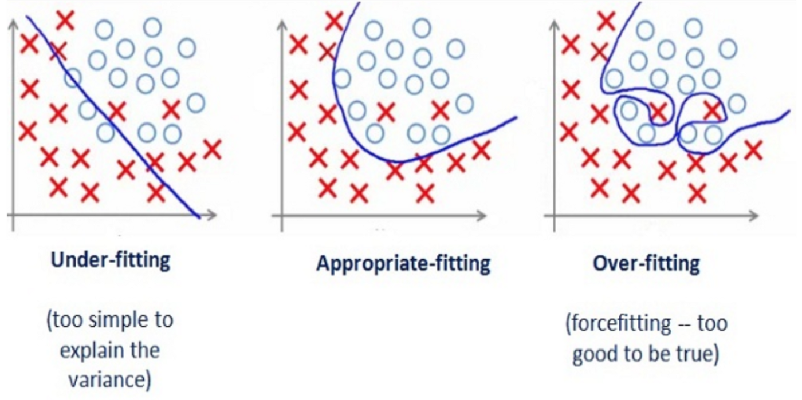
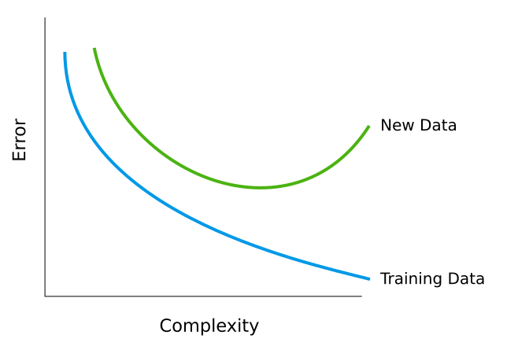
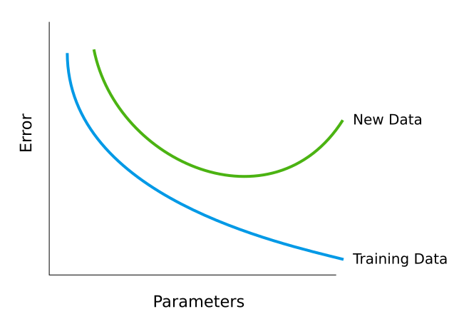
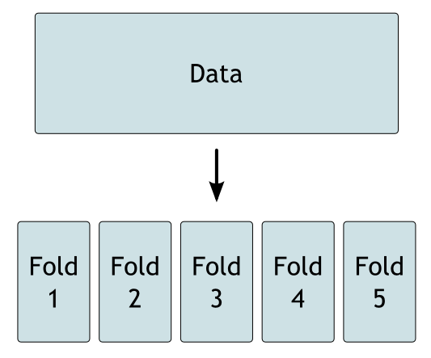
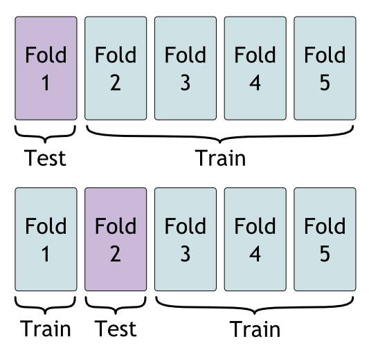

```{r setup, include=FALSE}
knitr::opts_chunk$set(echo = TRUE)
```

# Learning Objectives

* Know what over-fitting is.
* Understand how to use AIC scores, BIC scores and adjusted $r^2$.
* Know how to evaluate model performance using a test/train split.
* Know how to evaluate model performance using K-fold cross validation.
* Be familiar validation datasets.

**Duration - 1 hour 30 minutes**

# How can a model over-fit?

You learnt about over-fitting when you were fitting polynomials to data. Over-fitting isn't just about polynomials: any model can be over-fit. We're going to discuss over-fitting again because it's own of the most important concepts in statistics and machine learning.

So far you've been trying to find models which fit the data well. You might assume that the better a model fits to the data, the better the model. However, this isn't true. It's quite possible, and actually very common, for a model to fit the data too well. 

## Three examples of fit

To illustrate how a model can over fit, look at the three lines fitted to the data below. 

* Which line fits the data closest?
* But which line do you think is the best model for the data?

```{r, echo = FALSE, warning = FALSE, message = FALSE}
library(dplyr)
library(ggplot2)

set.seed(1)

fake_data <- tibble(
  x = runif(30, 1, 10),
  y = x + rnorm(30, 0, 1.5)
)

new_data <- tibble(
  x = runif(30, 1, 10),
  y = x + rnorm(30, 0, 1.5)
)

fake_data_plot <-
ggplot(fake_data) +
  aes(x = x, y = y) +
  geom_point() +
  coord_fixed() +
  theme_minimal(14) 


new_data_plot <- 
ggplot(fake_data) +
  aes(x = x, y = y) +
  geom_point(alpha = 0.2) +
  geom_point(data = new_data) +
  coord_fixed() +
  theme_minimal(14) 
```

```{r, echo = FALSE}
fake_data_plot +
  geom_abline(slope = 1, colour = "red", size = 1)
```

```{r, echo = FALSE}
fake_data_plot +
  geom_smooth(colour = "red", se = FALSE, formula = y ~ poly(x, 14), method = "lm")
```

```{r, echo = FALSE}
fake_data_plot +
  geom_line(colour = "red", size = 1)
```

Our last line defiantly fits the data best. It actually fits the data exactly; the residuals are zero. However, does that make it a good model for the data?

The answer is no! Even the second model is over-fitting. Only the first, very simple model is a good model for this data.

## Fit the pattern, not the noise

When modelling, we can think of of the data we see as coming from some underlying pattern, plus some random noise.

> Data = Pattern + Noise

When modelling we only want to model the pattern, and ignore the noise. If you make a model too complicated, you will start modelling the noise. This is what over-fitting is: when your model starts fitting random noise. A model should be a simplification of the data - if your model exactly describes the data what's the point of it? The trick is trying to find a simplification which is complicated enough to be accurate, but simple enough to be useful.

## New Data

The reason we are so interested in fitting the pattern and not the noise, is that when we get new data, the pattern should be the same but the noise will be completely different. 

Now let's look at our three fits, with a new dataset.

```{r, echo = FALSE}
new_data_plot + 
  geom_abline(slope = 1, colour = "red", size = 1)
```

```{r, echo = FALSE}
new_data_plot +
  geom_smooth(colour = "red", se = FALSE, formula = y ~ poly(x, 11), method = "lm")
```

```{r, echo = FALSE}
new_data_plot + 
  geom_line(colour = "red", size = 1)
```

You can see that the two over-fitting models don't fit the new data particularly well. The curves aren't near our new points. However, the simple model is just as accurate on the new data as on the old. 

Remember that we can still under-fit the data. Below is an example of under-fitting, a good fit, and over-fitting. This is a slightly different problem: drawing a line that splits two categories apart.



As the complexity of your model increases, you will always fit the training model better.

However, you will reach a point where the fit any new data *worse*.



<blockquote class = 'task'>
**Task - 5 minutes**

For each plot, discuss if each line is under-fitting, over-fitting or is a good fit.

```{r, echo = FALSE}
poly_fun <- function(x) {(x + 3)*((x - 2)**2)*((x + 1)**3)}

fake_data <- tibble(
  x = runif(30, 0, 2.5),
  y = poly_fun(x) + rnorm(30, 0, 2)
)

fake_data_plot <-
ggplot(fake_data) +
  aes(x = x, y = y) +
  geom_point() +
  theme_minimal(14) 
```


1.
```{r, echo = FALSE}
fake_data_plot +
  geom_smooth(colour = "red", se = FALSE,  method = "lm", size = 1)
```

2.
```{r, echo = FALSE}
fake_data_plot +
  stat_function(fun = poly_fun, colour = "red", size = 1)
```

3.
```{r, echo = FALSE}
fake_data_plot +
  geom_smooth(colour = "red", size = 1, method = "lm", formula = y ~poly(x, 14), se = FALSE)
```

<details>
<summary> **Solution** </summary>

1. Under-fitting
2. Good fit
3. Over-fitting

</details>
</blockquote>

# Over-fitting in multiple linear regression

Now that you've learnt about multiple linear regression, you need to be extra careful about over-fitting. 

It's very hard to over-fit when doing single linear regression, but the more variables you include in the model, the more complicated the model becomes and the more likely you are to over fit.



Look at this dataset - we're interested in predicting the amount of savings that someone has. 

```{r}
library(CodeClanData)
savings
```

What do you think will happen if we use all the variables including the name and surname?

```{r}
model_overfit <- lm(savings ~ ., data = savings)
```

We might get an accurate model, but will the name and surname actually help us predict the amount of savings someone has? It's unlikely. When you try this model on new data, what do you expect? Will this actually help us predict how much money someone has saved?

Here's a much simpler model that only uses three variables from the dataset. For just now, don't worry about how we selected the three variables: we'll cover that in the next lesson.

```{r}
model_wellfit <- lm(savings ~ salary + age + retired, data = savings)
```

Lastly, here's a model that only uses salary. How well do you think this will fit compared to the top two models? We're not including irrelevant predictors, but we are not including important ones too.

```{r}
model_underfit <- lm(savings ~ salary, data = savings)
```

# Parsimonious measures of goodness-of-fit

Should we always select the model with the highest $r^2$ value? From our discussion of over-fitting, you should know that the answer is no - increasing the number of parameters will always increase the $r^2$, but will lead to over-fitting. It would be nice to have a goodness-of-fit measure capable of detecting when over-fitting might be occurring.

Luckily, there are plenty goodness-of-fit measures beyond $r^2$ that tend to favour parsimonious models. There are three parsimonious measures in common use:

* Adjusted $r^2$
* Akaike information criterion (AIC)
* Bayes information criterion (BIC)

We won't go into mathematical details here, but each of these measures has a form something like:

$$\textrm{measure} = \textrm{normal goodness-of-fit} \pm \textrm{penalty depending on # predictors}$$

The penalties in each measure **always favour parsimony** more or less strongly, i.e. they tend to select **smaller models**. There is a tension built in to each measure between including a sufficient number of predictors to have a reasonable goodness-of-fit, but not so many as to produce over-fitting!

Here's how to interpret each of these measures:

* For adjusted $r^2$, *larger values are better* (as for normal $r^2$)
* For AIC and BIC *lower numbers are better*. 

BIC tends to be *more parsimonious* than other measures, i.e. it tends to select smaller models!

## Parsimonious measures of goodness-of-fit in R

The adjusted $r^2$ can be found in the summary of the model:

```{r}
summary(model_overfit)$adj.r.squared
```

And the functions `AIC` and `BIC` give you the AIC score and BIC score respectively.

```{r}
AIC(model_overfit)

BIC(model_overfit)
```

If you want to see all the scores in one go in a handy data-frame form, you can install the `broom` package and use the `glance` function.

```{r}
broom::glance(model_overfit)
```


<blockquote class = 'task'>
**Task - 10 minutes**

Find the R-squared, adjusted R-squared, AIC and BIC score for:

1. 
The over-fitted model

```{r}
model_overfit <- lm(savings ~ ., data = savings)
```

2.
The well fitted model

```{r}
model_wellfit <- lm(savings ~ salary + age + retired, data = savings)
```

3.
The under-fitted model

```{r}
model_underfit <- lm(savings ~ salary, data = savings)
```

Does the results you found match with your expectations?

<details>
<summary> **Solution** </summary>

1.
```{r}
broom::glance(model_overfit) %>%
   select(r.squared, adj.r.squared, AIC, BIC)
```

2.
```{r}
broom::glance(model_wellfit) %>%
   select(r.squared, adj.r.squared, AIC, BIC)
```

3.
```{r}
broom::glance(model_underfit) %>%
   select(r.squared, adj.r.squared, AIC, BIC)
```

The well fit model has a lower r-squared value than the over-fit model. However, it also has a higher adjusted r-squared and a lower AIC/BIC score. This makes sense because the second two measures penalise the use of many parameters: the first model clearly has useless parameters that don't add to  the predictions. This means that adjusted r-squared, AIC and BIC scores can detect over-fitting.

The under-fit model scores worse across all three measures.

</details>
</blockquote>

# Test and Training Sets

One way of avoiding over-fitting is to use penalised measures of model fit. However, we can avoid over-fitting in a more direct way. We want to avoid over-fitting so that our models will still work for future data. Since we don't have the future data yet, how can be sure that our models will work on that data? Well, we can "fake" future data by having a test set. A test set is simply a subset of our original data that we don't use to train models, but only use to test if our models work. 

It's very important that you never use the test set to train your models.

Generally, you want to use most of the data to train the models, and less to test. So about 90% of the data will be used to train and 10% to test. However, it you don't have a lot of data you might want need to have a larger test set; your test set needs to be big enough to accurately measure the model performance. So then you would use a 80%/20%, or a 70%/30% split. There's no hard and fast rules about how to split your data into a test, training set. It depends on how much data you have, and how accurate your model is. The less accurate your model, the harder it is to measure it's accuracy and so you need a larger training set. 

## Test and Train in R

Below is an example of splitting a dataset into a test and train set. First you use random sampling to get the indexes of the test data, then you can use `slice` to split the data

```{r}
n_data <- nrow(students_big)
test_index <- sample(1:n_data, size = n_data*0.1)

test  <- slice(students_big, test_index)
train <- slice(students_big, -test_index)
```

Now you can fit the model on the the train data:

```{r}
model <- lm(height ~ arm_span, data = train)
```

```{r}
predictions <- predict(model, newdata = test)
```

Now we can calculate the mean squared error, just by taking the the average of the squares of the differences between the predictions and the actual values.

```{r}
mean((predictions - test$height)**2)
```

<blockquote class = 'task'>
**Task - 5 minutes**

Find the mean squared error of the predictions on the training data.

Which is higher, then error on the test or the error on the training data? Is this what you would expect?

<details>
<summary> **Solution** </summary>

```{r}
predictions <- predict(model, newdata = train)
mean((predictions - train$height)**2)
```

The error is lower when predicting on the training data. This is what we'd expect, because it's easier to make predictions on data that's used for training.

</details>
</blockquote>

<blockquote class = 'task'>
**Task - 10 minutes**

1. Split the data frame `savings` into a `savings_train` and `savings_test`.

2.
Now refit the models on our training dataset. Calculate the error on the test data for

a. 
The over-fitted model

b.
The well fitted model

c.
The under-fitted model


<details>
<summary> **Solution** </summary>

1.
```{r, eval = FALSE}
n_data <- nrow(savings)
test_index <- sample(1:n_data, size = n_data*0.1)

savings_test  <- slice(savings, test_index)
savings_train <- slice(savings, -test_index)
```

2.
a.
```{r}
model_overfit <- lm(savings ~ ., data = savings_train)

predictions <- predict(model_overfit, newdata = savings_test)

mean((predictions - savings_test$savings)**2)
```


b.
```{r}
model_wellfit <- lm(savings ~ salary + age + retired, data = savings_train)

predictions <- predict(model_wellfit, newdata = savings_test)

mean((predictions - savings_test$savings)**2)
```

c.

```{r}
model_underfit <- lm(savings ~ salary, data = savings_train)

predictions <- predict(model_underfit, newdata = savings_test)

mean((predictions - savings_test$savings)**2)
```

The well fit model has the lowest error on the test set. This is because it's neither over-fitting or under-fitting.

</details>
</blockquote>

# K-fold cross-validation

Generally, it's better to use a test set, than it is to use a penalised measure of fit because we are directly measuring the outcome we are interested in: does this model fit new data well. However, if you have a limited amount of data then penalised measures of fit have the advantage of being able to use all the data for training.

Luckily, there's another technique available to you, that has all the advantages of a test data set, but uses all the data: k-fold cross validation.

When doing k-fold cross validation you pick a k. 10 is the usual normal value for k, but let's use 5 as an example here.

So for 5-fold cross validation we split our data into 5 parts.




We then make a model 5 times. Each time we hold out one of the 5 folds as the test set, and train the data on the other 4 folds.



For 10-fold cross validation we follow exactly the same process, but with 10 models, each trained on 9 folds and tested on 1. For 20-fold cross validation we train 20 models, training on 19 and testing on 1 each time.

Once the process is finished we can average the error across all the test folds. This gives us a very accurate measure of of the model performance. 

The major disadvantage of k-fold cross validation is that it can be slow to run. If you have very large data, or you are fitting a computationally intensive model then you may want to use a test-train split. It is also harder to interpret a model fitted across several folds. However, you can use k-fold cross validation to pick the model, and then fit the chosen model on the whole data to interpret. 

## K-fold cross validation in R

To do this in R, rather than manually program this process you can use the package `caret`. We need to set-up `caret` in a slightly unusual way, below is an example of doing 10-fold cross validation using our `savings` data and our over-fit model.

```{r, warning=FALSE, message=FALSE}
library(caret)

cv_10_fold <- trainControl(method = "cv", number = 10, savePredictions = TRUE)

model <- train(savings ~ .,
               data = savings,
               trControl = cv_10_fold,
               method = 'lm')
```

We can extract all of the predictions from the model object.

```{r}
model$pred
```

Here's a data frame with several measures of error across each fold.

```{r}
model$resample
```

To compare models we want to calculate the average error:

```{r}
mean(model$resample$RMSE)
```

Or the average r-squared value:

```{r}
mean(model$resample$Rsquared)
```

Note that this isn't adjusted r-squared, but rather the r-squared value as measured on the test set.

<blockquote class = 'task'>
**Task - 5 minutes**

Find the average error and the average r-squared value across each fold, after doing a 10-fold cross validation on the *well fitted model*.

Are these values as expected?

<details>
<summary> **Solution** </summary>

```{r, warning=FALSE, message=FALSE}
library(caret)

cv_10_fold <- trainControl(method = "cv", number = 10, savePredictions = TRUE)

model <- train(savings ~ salary + age + retired,
               data = savings,
               trControl = cv_10_fold,
               method = 'lm')

mean(model$resample$RMSE)

mean(model$resample$Rsquared)
```

Yes, this is what we expect - the well fitted model has a lower error and a higher r-squared value.

</details>
</blockquote>

# Test, Training and Validation sets

If you are carrying out a complex model building process, particularly if you are comparing several types of models, then you may want another hold out set: the validation set. This is a set of data used neither in training or to compare models against each other. It should give you a final estimate of the expected performance of the model. It should be used only once you are finished selecting the model.

This set is needed because you can end up over-fitting to the test set, by manually selecting options that work well on the test set. This is particularly common when fitting models that have *hyper parameters*. These are numbers that effect how the model works, and are generally chosen by comparing performance of the model on training data.

## Avoiding Leaks

When developing a model we will always split our dataset into at least two sections: a training set and a validation set. These work in the way their names suggest: we use the training set to develop our model and the validation set to test its effectiveness. We want to keep these two sets completely separate.

When we're not able to do that we can end up with data from our validation set being used in the model development process, an occurrence known as **data leakage**. (This is data leakage in the context of ML, outside of ML it also refers to when secure/personal data is released to the outside world). This is obviously a bad thing: it would be like studying for an exam with the solutions making up part of the reading list. The end result is usually **overfitting**, where a model is too closely coupled to its training set and so is of little use in evaluating anything else (we'll talk more about model fit later in the week).

Leakage can also occur when our predictor variables have some knowledge of the target variable. This can be a consequence of variable engineering if we're not careful about how we do it, or could be an indication that a predictor is somehow derived from the target.

There are a couple of ways in which we can try to prevent or minimise data leakage. One comes from the way in which we prepare our data, while the other involves creating an extra dataset for "final validation". We'll talk more about each of these and what they mean in terms of leakage as we come to them in the next couple of days

# Recap 

* Why is over-fitting bad?
<details>
<summary> **Solution** </summary>
Because the model is not fitted to the *noise*, not the *signal* and so will not work well on a new dataset.
</details>

* Why is multiple regression prone to over-fitting?
<details>
<summary> **Solution** </summary>
Because the more parameters you add to the model, the more likely you are to over-fit.
</details>

* Which is better: a low adjusted r-squared or a high adjusted r-squared?
<details>
<summary> **Solution** </summary>
A high adjusted r-squared
</details>

* Which is better: a low AIC score or a high AIC score?
<details>
<summary> **Solution** </summary>
A low AIC score
</details>

* How does a test-train split work?
<details>
<summary> **Solution** </summary>
Before fitting your model, you set some dataset aside to be the test set. Once the model is fitted on the rest of the data you measure performance on the test data.
</details>

* How does k-fold validation work?
<details>
<summary> **Solution** </summary>
You split your data in k "folds". For each fold, you fit on all the other data and test on that fold. Finally you measure average performance across all the folds.
</details>

* What is a validation set?
<details>
<summary> **Solution** </summary>
A set that is used neither to test or train your models. Used as a final measure of accuracy.
</details>


