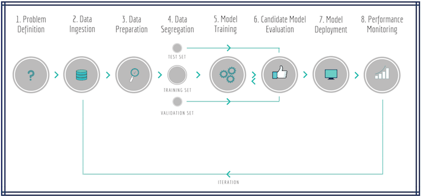
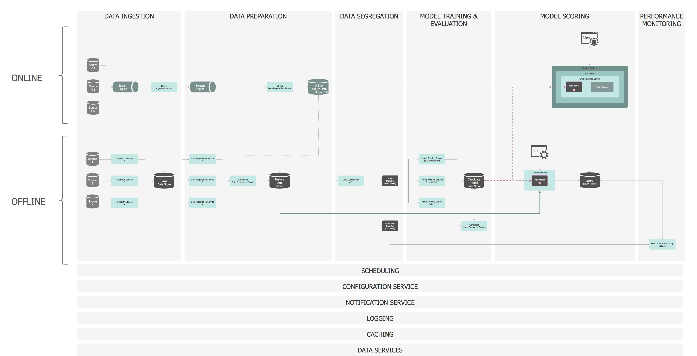
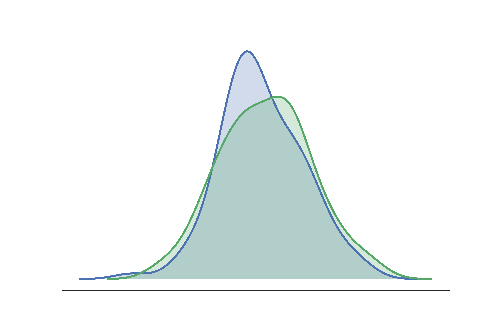
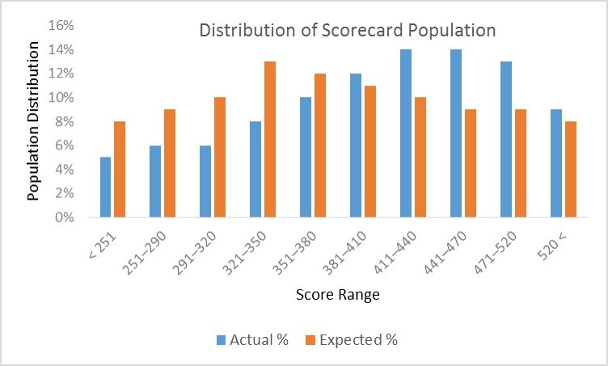
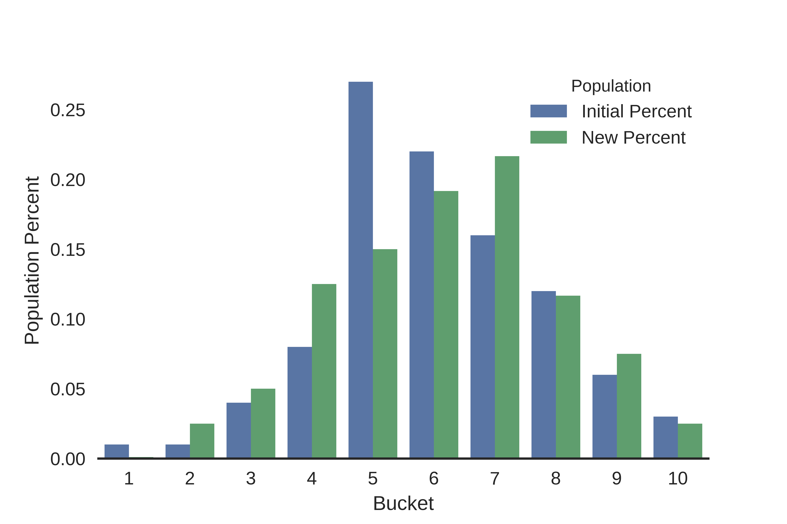
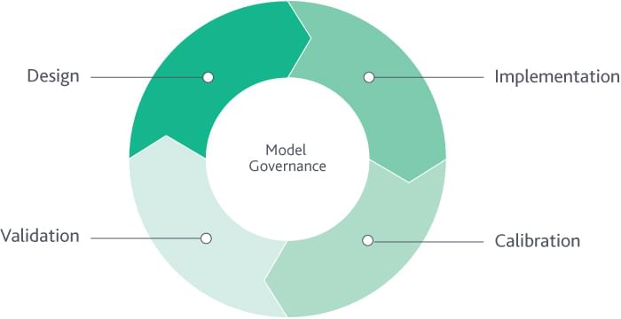

```{r setup, include=FALSE}
knitr::opts_chunk$set(echo = TRUE, fig.align = 'center')
```


# Learning Objectives

* Understand the different aspects you should take into account when building and implementing models.   
* Understand what model implementation is, and what it involves.  
* Understand how model performance is monitored after deployment
* Understand the importance of model governance  


When finishing up building a model, there are certain things you should take a step back and consider before you put it out "in the wild", and some things you should consider after it goes out there. In this lesson, we will give a brief overview of these things. 


# Model Implementation 

When we implement a model, what we mean is that we are deploying a model we have made to production. 

> Deployment is the method by which you integrate a machine learning model into an existing production environment in order to start using it to make practical business decisions based on data.

In short, we are taking a model that we have developed and putting it out there for others to use. It is only once models are deployed to production that they start adding value, making deployment a crucial step.


There are generally two approaches to implementing models:


**Single-train**  

This is when the model is built, validated and deployed in a linear fashion. Performance of the model is then monitored over time, and when it shows an unacceptable level of deterioration (i.e. when it stops predicting or explaining the data well), it is retrained or replaced.

Once the original model has shown deterioration, there are two options to update your model within single-train deployment.   

  1. You can recalibrate, in which case the variable choices stay the same.      
  2. You can totally retrain your model using different variable choices.      
<br>

```{r, echo=FALSE, fig.cap="Single-train ML Pipeline", out.width = '100%'}

```


This kind of model is easier to implement (computationally and time-wise) as you don't need to allow for continual updating of variables in real time. However, this means it can degrade quicker and need maintanence.   


**Real-time training**

This is when your model is built, assessed, and deployed but performance is assessed, scored, and parameters are updated in real-time. 
It can be seen from this graphic that there is significant complexity in this approach. The model is still retrained in an offline environment, but the input data is augmented with real-time data. The regularity of the retraining will be depend on the use-case, but is often as regular as daily.

<br>

```{r, echo=FALSE, fig.cap="", out.width = '100%'}

```

The benefit of this is that the model is able to adapt quickly to unseen situations. This is particularly important for fraud or cyber-crime scenarios. However this brings with it cost implications to be able to provide operational support, enhanced computing power and real-time monitoring.

## What to consider before implementation

Before you implement a model, you need to consider a number of things to help get round the issues above:


### Does the model make intuitive sense?

The first question you must ask yourself when designing a model is "Does this variable make sense or is allowed?". 

The sense-check is often overlooked, but all the variables in the model need to be there for a purpose. If it doesn't make sense to you why a particular variable is predictive of the outcome, then it certainly won't to the governance committee you need to convince to let you implement the model.


### Are there any disallowed variables?

In many situations certain variables are disallowed, normally by regulation. For example, in the credit risk or recruitment industries it is illegal to make a decision on the basis of gender. Therefore `gender` would be considered a disallowed variable. In some instances, `race` can be disallowed as it will lead to discrimination.  

By now, there have been many famous instances of machine learning models that appear to discriminate on the basis of a protected attribute, such as race or gender. For example, recently Amazon revealed that a model that they built to screen job applicants tended to favor men over women, leading them to scrap the model.

It's quite easy to remove `gender` from the modelling dataset, but more difficult to remove variables that are acting as **proxies** for the disallowed variable. A proxy variable is one which is :

  1. Sufficiently associatd with the protected or disallowed variable  
  2. Sufficiently influential on the final output of the model  


<blockquote class = 'task'>
**Task - 2 minutes**

What proxies of gender can you come up with that might affect your model predictions? 

How might you find out if a variable is a proxy for a disallowed variable?

Can you think of any cases where a protected variable (or a proxy) should be included in a model?


<details>
<summary>**Some potential answers**</summary>

Gender proxies: things like occupation can sometimes be tied to a certain gender. A common example is when certain products or purchases are more popular with one gender the other. 

Including protected/proxy variables: If the job requires heavy lifting, a model that is aware of this requirement will use the weightlifting ability of the applicant to help make its predictions. Although the weightlifting ability is likely to be a proxy for gender, this proxy is considered justified in this context because it is relevant for this specific prediction task.  

Finding out if a variable is a proxy: you can run a correlation analysis of all the variables with any disallowed ones. If you have a high correlation, it is likely a proxy. But two things might be a proxy and not correlated, so it is still critically important as part of the model finalisation phase to run the stats and do a manual check.   
</details>

</blockquote>


### Explainability of model variables  

Another aspect to look at is the power of the different variables in the model. From the model coefficients it is easy to identify the most powerful variables (i.e. the ones which explain most of the data). Ideally the model will be balanced across a number of different variables, rather than being reliant on a single one or two. Reliance on only a couple of variables could cause the model to be unstable.


<blockquote class = 'task'>
**Task - 2 minutes**

Why might models be unstable if they rely on a single variable?


<details>
<summary>**Potential answers**</summary>
<br>
The chosen model variables need to be stable over time. If the variables in the model are not stable, then the model itself will not be stable and will deteriorate quickly. All models deteriorate from the moment they are built, but to justify the implementation effort and cost, in a trade-off between model power and stability, you should always favour stability.
</details>

</blockquote>   


### Will it still work on the production data?

There are two aspects we need to demonstrate here:

* Is the production data identical to the development dataset?
* Does the production population look the same as the development population?

To check both of these, we compare score distributions between the development dataset and recent dataset extracted from the production system.

<br>
```{r, echo=FALSE, fig.cap="Score distributions", out.width = '70%'}

```

To do this we need to look at the Population Stability Index (PSI) and Characteristic Stability Index (CSI), which will be covered in more detail in the next lesson. 

In simple words, Population Stability Index (PSI) compares the distribution of a scoring variable (predicted probability) in scoring data set to a training data set that was used to develop the model. The idea is to check "How the current scoring is compared to the predicted probability from training data set". 

Characteristic Stability Index is a measure of the change in the distribution of a variable between the development and recent data. It detects shifts in the distributions of input variables that are submitted for scoring over time.  

By looking at both of these, you can see how similar your populations are, and how well your model fits the new data.   

<br>

### Is it valid for all situations?

The next check is to understand from a business perspective how the model is planned to be used. Obviously this should have been understood at the design stage, but there will always be additional considerations after design. For example if the model is to be used to make accept/decline financial loan decisions for a particular bank, what will the cut-off value be? This may not be clear at the design stage, but will need to be incorporated before model implementation. 

Equally as important is understanding when the model should not be used. Are there policy rules that override the model decision, or force a human decision to be made?

Sometimes businesses decide to use an existing model in a situation it wasn't designed for. Much care must be taken in this case, with a full validation exercise on the new population as compulsory to ensure it is appropriate for the population or situation it is now being used in.


### Can I implement it in production?

This could involve writing implementation instructions for the IT department to code up, or just flicking a switch to switch it on.

Traditionally, the deployment of a predictive solution could take months, since after building it, the data scientist team had to write a document describing the entire solution. This document was then passed to the IT engineering team, which would then recode it into the production environment to make the solution operational. Nowadays, a number of interchange formats have been introduced to help: 

* pickle - an python library for saving scikit-learn models 
* ONNX - open neural network exchange format 
* PMML - predictive modelling markup language  

All of these formats allow a predictive solution to be easily moved among different tools and applications without the need for custom coding, as all the data, transformations, and predictive model is included in the file. 

If you use the R package `PMML` for example, you can write a bit of code which will export a PMML file (xml based) which is a file which follows a set of pre-defined elements and attributes which reflect the inner structure of a predictive workflow: data manipulations followed by one or more predictive models.

You could run the following and it would export a PMML object:


```{r}
library(CodeClanData)
library(pmml)

# character variables need to be set up as factors for export
savings_model <- lm(savings ~ salary + age + factor(retired), data = savings_train)

# create the pmml file
savings_pmml <- pmml(savings_model)

# have a look at the pmml object
print(savings_pmml)

# save it for import into your production system
save_pmml(savings_pmml, "savings_model_export.xml")
```


### Have I got enough documentation?

the full model development process needs to be carefully documented. This will form part of the model governance documentation.

As a minimum the following should be recorded:

* The business context of the model
* Model design decisions and rationale including choice of algorithm, build population and target variable.
* Modelling decisions including a full audit trail of variable choices, including any exclusions.
* Final model explainability
* Model validation on a recent dataset
* Implementation instructions including any restrictions

Although this is quite significant work, it will ensure that your model makes it into the 5% of projects that actually get implemented.

<br> 


# Model Performance Monitoring

Once you've deployed/implemented your model, you need to keep an eye on it. There is a basic assumption in any machine learning model that the future mimics the past, or that the unknown is similar to the known. Fortunately this turns out to be roughly true, which is why models can be predictive on previously unseen data. However, we do need to keep an eye on this and stop using the model when this assumption proves to be no longer the case. No matter what kind of machine learning system you are building, you need to monitor your models to make sure that they are still working the way that you think they are. 


The main reasons that models stop performing well are to do with either the underlying population changing or the variables no longer actually being good predictors of the thing we are trying to predict. This is called **concept drift**. 


There are many valid external reasons why a model might have deteriorated. For example:

* Audience preferences - peoples preferences change over time
* New marketing campaigns - a different audience may be attracted to your product
* Competitor moves - new products in the market may influence the way customers interact with yours
* The weather - buying preferences could be influenced by weather patterns
* The news - consumer perceptions can be changed by news stories
* Location-specific differences - what worked in one place may not work in another
* The time of day or year - seasonality, if not built into the model could produce unexpected results
* The device being used - as people move towards mobile devices the way they interact changes
* Question wording changes on application forms - if the question is asked in a different way, but feeds into the same data field, essentially this is actually new data from a modelling perspective.

If the model has been designed to account for some of these issues - for example taking a build dataset that covers a whole year, or a full set of geographical locations, you might be surprised how long the model remains performant. However, whether you take these into account or not, you will still need to monitor the model performance over time.


## How do we monitor performance?

Performance monitoring essentially reduces to checking that the underlying population hasn't changed and that the model remains a good predictor of the outcome.

We can do this by checking some of the following. 


### The score distribution

The distribution of the output score of a recent production population compared to the development distribution

Lots of models produce some sort of score or set of scores. Often these represent some kind of probability estimate. One of the simplest things we can use as a monitor is to look at the score distribution produced by the model. If that distribution changes surprisingly, there is a good chance that there is an important change to the input to the model reflecting some change in the outside world or that the systems that the model depends on, say, for feature extraction have changed in some way. In either case, finding out about the change is the first step in figuring out what is happening. A score distribution comparison plot shows volume vs model output score for the recent vs build populations. 

<br>

```{r, echo=FALSE, fig.cap="Banded score distribution", out.width = '70%'}

```

<blockquote class = 'task'>
**Task - 5 minutes**

Have a look at the example plot above. What do you see? Do you see any shifts in the distribution scores between the actual and expected predictions? If this was real data gathered from a model you deployed, what would you infer from this data? 

<details>
<summary>**Answers**</summary> 

Visually it is possible to see if there have been any shifts. In the above example the actual scores are higher than the expected scores. 

If an acceptable cut-off were in place, this would lead to a higher than expected accept rate. If this were caused by an intrinsically higher quality applicant population then that might be acceptable. It is also possible to compare basic distribution statistics such as mean, standard deviation, minimum, maximum and range.
</details>
</blockquote>  


### Population Stability Index (PSI)

Although a shift in mean is useful to observe, it still doesn't help us answer the question, has the population shifted too much for the model still to be valid? This is where the population stability index comes in.


In simple terms:

> "Population Stability Index (PSI) compares the distribution of a scoring variable (predicted probability) in scoring data set to a training data set that was used to develop the model. The idea is to check "How the current scoring is compared to the predicted probability from training data set"
- https://www.listendata.com/2015/05/population-stability-index.html
"

The advantage of using a statistic like this is that it creates a single number which leads to a easy interpretation:

* **PSI < 0.1:** no significant population shift, no changes required
* **0.1 < PSI < 0.2:** moderate population shift, change may be required
* **PSI > 0.2:** significant population shift, the model is probably no longer appropriate

These are just rules of thumb, but taken alongside all the other measures provide an insight into the model health. The statistic is sensitive to the number of score bands, so these cutoffs will be different depending on whether 5, 10 or 20 bands are used. The standard is normally around 10 (deciles).

```{r, echo=FALSE, fig.cap="Calculating the PSI", out.width = '70%'}

```

<br> 

The PSI can actually be used to calculate the relative changes in any distributions, not just model scores.


### Characteristic stability

If we identify an overall distribution change, we then need to find out what is driving this. It normally comes from a change in the distribution of an underlying model variable.

We use the Characteristic Stability Index (CSI) to identify the change in distribution of a single variable. This is very similar to the PSI but for individual characteristics rather than the full model score.


### Model discrimination

Model discrimination is the predictive power of a model. This is usually measured using a gini coefficient with a value of 0 to 1, or 0% to 100%. The gini coefficient is calculated for a recent production population and compared with the expected value from the build dataset. 100% is a totally accurate model and very unlikely in the real world, whereas 0% shows no predictive power at all.


### Model accuracy

Model accuracy is the number of correct predictions made by the model by the total number of records. The best accuracy is 100% indicating that all the predictions are correct. This is typically done by estimating accuracy using data that was not used to train the model such as a test set, or using cross validation, as we've seen performed before.   


## What to do if the performance deteriorates

Once you've carried out a monitoring activity, what should be done? Hopefully the deterioration of a model shouldn't take you by surprise, you may have been observing a gradual shift in the score distribution or a loss of discrimination and already have in place activities to rebuild or recalibrate the model. However, where it does take you by surprise, this can often mean that there has been a fundamental change in the population or a system implementation issue. In these cases, the root cause needs to be investigated before initiating any new model build project.

# Model Governance

Finally, we come on to model governance. As we've discussed already, when designing or implementing models, you have the power to do great harm if designed or implemented incorrectly: your model might lead an organisation to make a bad business decision, or it may have bias which affects individuals.  

We therefore need to put in place clear policies, controls and oversight (i.e. governance processes) to ensure that we are not only able to audit the decisions made by models, but the modelling process itself. This is called **Model Governance**. 


Model governance focuses on the risks associated with putting a model into production and ensuring it is still suitable to remain there. Model governance covers the whole modelling lifecycle from transparent model development, through accurate implementation to rigorous monitoring and finally retiral.

<br>
```{r, echo=FALSE, fig.cap=" ", out.width = '70%'}

```

<br>

The dynamic nature of ML models also means they require
more frequent performance monitoring, constant data review and benchmarking, better contextual model inventory understanding, and actionable contingency plans. In a large organisation there may already be a team and policies in place to ensure this happens. However, in a small organisation, where these may not yet exist, this doesn't mean you don't need to do it. It just means it's down to you to ensure this happens.


## Pre-implementation requirements

What it boils down to is the need for good documentation. 

The two main requirements (and largest part) for your documentation will be your **modelling approach rationale** and your **model inventory**. 

<br> 

**Modelling approach rationale**

This includes, the business context within which the model was developed, the selected technique and why it was chosen, the limitations of your model, and how your training and test dataset selection was made. 

<br> 

**Model inventory**

A Model Inventory is a database/MIS developed for the purpose of aggregating quantitative model related information that is in use by a firm or organization. The model inventory should include (but isn't limited to):  

| Area | Reason |
|--------------|-------------------------------------------|
| Model identifier | An individual code to ensure that each model can be uniquely identified |
| Model type | The type of model eg risk or churn |
| Product type | What product is it suitable to be used on eg House insurance, mortgages |
| Dependencies | Any critical forward or backward dependencies to enable the model process |
| Usage | Where in a product process should it be used |
| Adjustments | Anything that should be done to the model to make it fit for purpose |
| Materiality | A measure of how important the model is, this has a defined definition in Financial Services |
| Owner | Who is responsible for the model, including contact details |
| Developer(s) | Who built the model, including contact details |
| Approver | Who approved the model, could be the same as the owner, including contact details |
| User | Who is using the model, including contact details |
| Maintenance | Who is involved in ensuring the maintenance of the model, including contact details |
| Approval date | List of approval dates for each part of the model development process |
| Last validation date | Date of last model validation or recalibration |
| Last monitoring date | Date of last monitoring review |
| Documentation links | Links to all documentation. Ideally this should be a central repository with access for everyone listed above |
| Model status | The approval status of the model |
| Technology aspects | The technological implementation considerations and issues |
| Model risk rating | This links to the monitoring and gives a view of the model performance |

This is just a bare minimum of information that needs to be maintained and documented for a model in development or production. It demonstrates the variety of information that is required. It may vary within any organisation you work with depending on your internal processes. Establishing a comprehensive model inventory requires a sharp definition of what constitutes a model and this may be a non-trivial undertaking in organizations with large quantitative operations.  

Despite these two being the main parts of the documentation, you also still need to include: 

* The training and test datasets
* Model validation results
* Model versions
* Any metadata or additional artifacts required for a full audit trail
* Model approval records
* Model monitoring outputs


Once you have all of these, you can probably safely assume your documentation is up to scratch. 


## Post-implementation requirements

The governance that takes place post-implementation focuses on whether the model should remain in production, be removed, make more/less use of human overrides or be replaced.

* How often is monitoring taking place?
* Is the model health fully understood across the business?
* What are the model limitations and how could they be addressed with future builds?
* Are resources available to carry out a model rebuild/recalibration?
