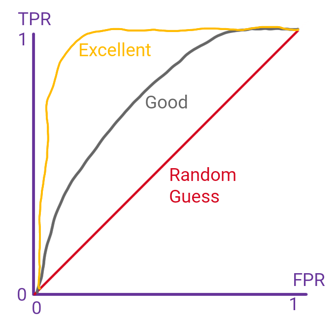

<div class="blame">
author: "Del Middlemiss"<br>
date: "15th May 2019 - rev. 29th July 2019"
</div>

```{r setup, include=FALSE}
knitr::opts_chunk$set(echo = TRUE, fig.align = 'center')
```
# Learning Objectives

* Be able to check for statistical significance of fitted coefficients via their p-values.
* Be able to calculate a confusion matrix to calculate accuracy, and true and false positive rates 
* Be able to plot and interpret a receiver operating characteristic (ROC) curve and calculate the area under the curve (AUC) and the Gini coefficient
* See cross validation applied to logistic regression
* Understand that expected value calculations can be used to set an optimal threshold

<hr>

# Logistic regression performance

How can we tell whether a logistic regression model is doing a good job of fitting data? Remember that the input data for logistic regression has binary values for the dependent variable, but we've seen that the model outputs **estimated probabilities**. How do we use these values?

It turns out we've nearly finished creating what data scientists call a **binary classifier**! Just one final ingredient is necessary: we have to set a **threshold probability** above which we say the model predicts `TRUE` or `1` for the binary outcome, and below which it predicts `FALSE` or `0`.

Let's see this in action to understand the process.

<blockquote class='task'>
**Task - 5 mins - Preparation**  

* Load and clean the names of `mortgage_applications.csv`.
* Re-run the logistic regression on the dataset, again treating the `tu_score`, `age` and `employed` variables as predictors and the `accepted` variable as the binary dependent. 
* Keep the model object (call it `mortgage_3pred_model`) and use it to predict estimated probabilities for the sample data using `add_predictions()` (call this `mortage_data_with_3pred`) 
* Look as the `head()` of the data with predicted probabilities.

<details>
<summary>**Solution**</summary>
```{r}
library(tidyverse)
library(modelr)
library(janitor)

mortgage_data <- read_csv(file = "mortgage_applications.csv")
mortgage_data <- clean_names(mortgage_data)

mortgage_3pred_model <- glm(accepted ~ tu_score + employed + age, data = mortgage_data, family = binomial(link = 'logit'))

mortgage_data_with_3pred <- mortgage_data %>%
  add_predictions(mortgage_3pred_model, type = "response")
head(mortgage_data_with_3pred)

summary(mortgage_3pred_model)
```
</details>
</blockquote>

<br>
<div class='emphasis'>
So here we see the problem clearly. The fitted values from the regression model are probabilities. To compare these with the sample data we need to choose a **theshold probability** above which we say a mortgage application is predicted to be **accepted**, and below which it's predicted to be **declined**.
</div>
<br>

Let's do this with a threshold probability say of $0.6$.

```{r}
threshold <- 0.6
mortgage_data_with_3pred <- mortgage_data_with_3pred %>%
  mutate(pred_thresh_0.6 = pred >= threshold)

head(mortgage_data_with_3pred, 10)
```

This looks reasonably promising, but now we'd like to count how often our classifier is correct (with reference to the sample `accepted` values), and how often it is incorrect. The simplest way to do this is by calculating and inspecting the **confusion matrix**

<hr>

# Confusion matrix.

Let's calculate and show the confusion matrix for this problem and then discuss its details.

```{r}
mortgage_data_with_3pred %>%
  tabyl(accepted, pred_thresh_0.6)
```

The table is pretty self-explanatory: 

* The 'correct' predictions, i.e. **true negatives** and **true positives** are on the *top left to bottom right diagonal*.
* The 'incorrect' predictions, i.e. **false negatives** and **false positives** are on the *bottom left to top right diagonal*. A perfect classifier would have zeroes on this diagonal.

'True', 'false', 'negative' and 'positive' can be confusing terms at first. It might help to think that 'negative' and 'positive' are the outcomes **predicted by the logistic regression** and 'true' and 'false' relate to whether the prediction was correct with reference to the sample data.

For example, in the sample data we have a single row with `tu_score = 631`. 

```{r}
mortgage_data_with_3pred %>%
  filter(tu_score == 631)
```

The classifier with threshold $0.6$ predicts `accepted = TRUE`, and this will be a **true positive**!

<blockquote class='task'>
**Task - 5 mins** Extract the rows in `mortgage_data` with `tu_score = 594`. Compare the sample data outcomes with the predicted outcomes of the threshold $0.6$ classifier and say which of the following four groups each outcome belongs to: (i) true positive, (ii) true negative, (iii) false positive or (iv) false negative.  
<details>
<summary>**Solution**</summary>
```{r}
mortgage_data_with_3pred %>%
  filter(tu_score == 594)
```
So, in order, we have two **false positives** and three **true positives**
</details>
</blockquote>

Let's discuss some performance measures for our binary classifier that are calculated from the values in the confusion matrix.

## Accuracy

The **accuracy** is straightforward to define: this is the answer to the question "How often is the classifier correct?"

This is the number of true positives $NTP$ plus the number of true negatives $NTN$, divided by the total number of outcomes in the sample data $N = NTP + NFP + NTN + NFN$, where $NFP$ is the number of false positives and $NFN$ the number of false negatives.

$$\textrm{accuracy} = \frac{NTP + NTN}{N}$$

So, in our case, the classifier is $\frac{679+179}{1000}=0.858$ or $85.8\%$ accurate! This sounds great, but it isn't enough. Accuracy has a **subtle weakness** that means we need to consider additional measures of performance for our classifier.

<blockquote class='task'>
**Task - 2 mins** 

The weakness of accuracy appears mainly when it is applied to **unbalanced datasets**. 

<center>Imagine getting a mortgage is really easy, and we have a sample dataset with 900 'accepted' and 100 'declined' applications. This dataset is unbalanced: the ratio of outcomes isn't approximately 1:1. Also imagine we apply a stupid classifier with a threshold probability of zero, an *'always accept'* classifier.</center> 

* What will the accuracy of this classifier be?
* What is the problem?

<details>
<summary>**Solution**</summary>
The 'always accept' classifier will deliver $NTP = 900$, $NTN = 0$, $NFP = 100$ and $NFN  = 0$, so the accuracy will be $90\%$!<br><br> 

The problem is that this classifier has **no predictive power**, and the fact that it still achieves $90\%$ accuracy means that accuracy isn't a useful performance metric for unbalanced data. 

Even worse, the 100 declined applications are arguably the more statistically 'interesting' cases, as they are rarer, and the model **consistently misclassifies them**.  

We have to consider other performance measures!  
</details>
</blockquote>

## Rates

In addition to accuracy, there are lots of performance measures in common use for classifiers. Most of these came originally from the field of biostatistics, where they are used to describe the performance of diagnostic tests e.g. for diseases or other conditions, but they are now widely used in machine learning. 
To be frank, it all gets a bit confusing! You'll see names like *precision*, *recall*, *sensitivity* and *specificity* being used. Here, we'll describe measures that are simple to use and understand. 

Note in all of the following that a **positive** classification usually corresponds to the more interesting, significant or rare outcome, e.g. patients with a disease, customers likely to churn, defective components, documents relevant to a particular query, etc. You've heard these terms before, but here is a recap of the four rates:

* The **true positive rate** $$TPR = \frac{NTP}{NTP + NFN}$$This can be thought of as *the proportion of actual positive cases that are correctly identified as positive by the classifier*. Also called the **sensitivity** or **recall**. Some examples: 
  - the percentage of people with a disease that are correctly diagnosed as having the disease by a diagnostic test.
  - the proportion of relevant documents in a database that are returned by a selection algorithm.<br><br>
  
* The **true negative rate** $$TNR = \frac{NTN}{NTN + NFP}$$This is *the proportion of actual negative cases that are correctly identified as negative by the classifier*. Also called the **specificity**. Some examples:
  - the percentage of healthy people correctly diagnosed as healthy by a diagnostic test.
  - the proportion of loyal customers correctly identified as loyal by a churn prediction algorithm. <br><br>
  
* The **false positive rate** $$FPR = \frac{NFP}{NFP + NTN}$$This corresponds to the *rate of false alarms*, i.e. *the proportion of actual negative cases that are incorrectly identified as positive by the classifier*. Also called the **fall-out**, or **type-I error rate** or **alpha** (both in hypothesis testing). Some examples:
  - the percentage of healthy people who are incorrectly diagnosed as having a disease by a diagnostic test.
  - the proportion of within-tolerance components that are deemed defective by an automatic inpection system.<br><br>
  
* The **false negative rate** $$FNR = \frac{NFN}{NFN + NTP}$$<br><br>Also called the **type-II error rate** or **beta** in hypothesis testing. Some examples:
  - the percentage of people with a disease who are incorrectly diagnosed as healthy by a diagnostic test.
  - the proportion of late project tasks deemed to be on-schedule by a scheduling audit.

The alternative names for the rates can be difficult to remember, so we recommend sticking to the terms $TPR$, $TNR$, $FPR$ and $FNR$. Their definitions are clear, and they are easy to interpret!

Let's calculate the rates for our threshold $0.6$ classifier.

```{r}
NTP <- 179
NTN <- 679
NFP <- 49
NFN <- 93

TPR <- NTP / (NTP + NFN)
TPR

TNR <- NTN / (NTN + NFP)
TNR

FPR <- NFP / (NFP + NTN)
FPR

FNR <- NFN / (NFN + NTP)
FNR
```

Our ideal classifier would have the $TPR$ and $TNR$ as high as possible and the $FPR$ and $FNR$ as low as possible! But, after fitting, the only control we have over the classifier comes by changing the threshold. What threshold should we use?

<br>
<div class='emphasis'>
The question of precisely which threshold to use **depends on the intended application of the classifier**! There is no one 'correct' threshold, we must consider a number of factors.  In particular:

* which of $FPR$ and $FNR$ is more important?
* how high an error rate can we tolerate?

</div>
<br>

Let's see a graphical tool to help us visualise the effect of choosing different thresholds.

# ROC curves, AUC and Gini coefficient

<br>
<div class='emphasis'>
* The **receiver operating characteristic (ROC) curve** is a single graphical summary of the effectiveness of a binary classification model. 
* We plot $TPR$ (or sensitivity) against $1 - TNR$ (or $1 - \textrm{specificity}$) as a function of threshold probability.
* ROC curves were developed in the Second World War by electrical engineers working on RADAR systems as a way to gauge the performance of RADAR operators to distinguish between true signals (i.e. aircraft) and noise (e.g. bird flocks) as a function of the receiver kit's 'gain' setting. 
* After the war ROC curves found use in a wide variety of fields including medical testing, psychology and signal processing, and are now widely used in machine learning.
</div>
<br>

The `roc()` and `ggroc()` functions from the `pROC` package let us draw ROC curves directly from data including actual and predicted classes. Function `roc()` outputs an object that we pass into `ggroc()` like so:

```{r}
library(pROC)
roc_obj_3pred <- mortgage_data_with_3pred %>%
  roc(response = accepted, predictor = pred)

roc_curve <- ggroc(data = roc_obj_3pred, legacy.axes = TRUE) +
  coord_fixed()

roc_curve
```

As a guide to how to interpret the plot, the closer the curve is to the top left corner, the more effective the classifier. Figure 1 shows schematic ROC curves for three classifiers of increasing effectiveness. Note that the diagonal on an ROC curve always corresponds to a 'random guessing' classifier, i.e. one for which $TPR = FPR$ (or, equivalently $\textrm{sensitivity} = 1-\textrm{specificity}$).

```{r, echo=FALSE, fig.cap="**Fig. 1** Schematic ROC curves for three classifiers", out.width = '40%'}

```

<br>
<blockquote class='task'>
**Task - 2 mins** Look at the figure above and try to answer the following questions: 

* Why are classifiers with ROC curves closer to the top-left corner said to be more effective?
* Which end of the curves corresponds to low threshold probability, and which to high?

[**Hint** - remember $1-\textrm{specificity} = FPR$]
  
<details>
<summary>**Solution**</summary>

* The 'perfect classifier' would have a $TPR$ of $1.0$ and an $FPR$ of $0.0$. This corresponds to the top-left point on the chart! It's possible for a classifier to have a curve 'below' the diagonal, in which case, it performs **more poorly** than random guessing. Quite an achievement!
* The upper right corner of the curves corresponds to **low threshold probability** (i.e. 'classify everything as positive). The lower left corner therefore corresponds to **high threshold probability**.

</details>
</blockquote>
<br>

`roc` objects also contain other useful data! We can get a list of the thresholds applied, and the sensitivities and specificities of the corresponding classifiers at each threshold level. This is useful when you want to do a more detailed analysis of which threshold to apply.

```{r}
classifier_data <- tibble(
  threshold = roc_obj_3pred$thresholds,
  sensitivity = roc_obj_3pred$sensitivities,
  specificity = roc_obj_3pred$specificities
)

head(classifier_data)
```

<br>
<blockquote class='task'>
**Task - 10 mins**

OK, let's fit another classifier and add its curve to the ROC plot from earlier!

* Fit a **single predictor** logistic regression model to the `mortgage_data`. We recommend `tu_score` as the predictor. Save the model as `mortgage_1pred_model`
* Add the predicted probabilities from this model to `mortgage_data`, and save the resulting data as `mortgage_data_with_1pred` 
* Use this data to generate an an object from `roc()`, save the object as `roc_obj_1pred` 
* Pass your old `roc_obj_3pred` and new `roc_obj_1pred` into `ggroc()` [**Hint** check the `ggroc()` docs to see how to pass in multiple `roc` objects].
* Given these ROC curves, which classifier is better?
* If you have time, try another single predictor, i.e. `age` or `employed`

<details>
<summary>**Solution**</summary>
```{r}
mortgage_1pred_model <- glm(accepted ~ tu_score, data = mortgage_data, family = binomial(link = 'logit'))

mortgage_data_with_1pred <- mortgage_data %>%
  add_predictions(mortgage_1pred_model, type = "response")

roc_obj_1pred <- mortgage_data_with_1pred %>%
  roc(response = accepted, predictor = pred)

roc_curve <- ggroc(data = list(pred3 = roc_obj_3pred, pred1 = roc_obj_1pred), legacy.axes = TRUE) +
  coord_fixed()

roc_curve
```
It looks like the 3-predictor classifier is better: it gets close to the top-left of the ROC curve, but this is quite a 'loose'definition of better.
</details>
</blockquote>
<br>

## AUC

The ROC curves give us a convenient way to compare the performance of various classifiers, we just plot them all on the same ROC plot. But it would be nice to have a single numerical measure of the effectiveness of a classifier.

In principle, if we calculate **the area under the curve** ($AUC$), we can use this as a measure of performance. Better classifiers have curves closer to the top left point, and so have **larger $AUC$ values**. The `pROC` package offers the `auc()` function to calculate the $AUC$ value for a passed in `roc()` object:

```{r}
auc(roc_obj_3pred, )
auc(roc_obj_1pred)
```

So we can see that out 3-predictor classifier `accepted ~ tu_score + age + employed` is marginally better than the single predictor classifier `accepted ~ tu_score` based upon their $AUC$ values. 

<br>
<blockquote class='task'>
**Task - 2 mins**

Remember that the random choice classifier would appear as an upwards sloping diagonal line on an ROC curve. What would the $AUC$ value be for such a classifier?

<details>
<summary>**Solution**</summary>
The area under an upwards sloping diagonal would fill **half the square**, so we would expect $AUC = 0.5$
</details>
</blockquote>
<br>

## Gini coefficient

The Gini coefficient normalises $AUC$ so that a random classifier has value $0$, and a perfect classifier has value $1$. You might see either the $AUC$ or the Gini coefficient presented as the performance measure for a classifier.

The relationship between $AUC$ and the Gini coefficient is

$\textrm{Gini} = 2 \times AUC - 1$

with a possible range of values

$-1 \le \textrm{Gini} \le 1$

Although, as for $AUC$, the practical range is

$0 \le \textrm{Gini} \le 1$

as we rarely do worse than a random choice classifier!

<hr>

# Cross validation

Let's see how to apply cross validation to the process of fitting a logistic regression model. This is an extremely useful technique: it gives us insight into the performance of our classifier on data not used for training, i.e. unseen data.  

As for last week, we will use the `caret` package for this.

```{r, message=FALSE}
library(caret)
```

Now, `caret` is rather fussy about the type of categorical variables. The most straightforward procedure is to convert categorical all to `factor` type in pre-processing data.

```{r}
mortgage_data <- mortgage_data %>%
  mutate(employed = as_factor(if_else(employed, "t", "f"))) %>%
  mutate(accepted = as_factor(if_else(accepted, "t", "f")))
```

First, we set up a `caret` `trainControl()` object. This controls the subsequent training of the classifier. Here we elect to do `repeatedcv` with `number = 5` and `repeats = 100`, i.e. break the data into five folds, use each fold for testing once and as part of the training set four times, gathering performance statistics each time, and repeat this splitting into folds 100 times. 

The `summaryFunction = twoClassSummary` argument tells the `train()` function to retain performance statistics for a binary classifier: in this case, $AUC$, $sensitivity$ and $specificity$ values, the latter two for a default threshold of $0.5$.

```{r}
train_control <- trainControl(method = "repeatedcv", 
                              number = 5,
                              repeats = 100,
                              savePredictions = TRUE, 
                              classProbs = TRUE, 
                              summaryFunction = twoClassSummary)
```

Now we `train()` the model (note, this may take half a minute or so to run!). We tell `train()` to fit a `glm` model, passing in the parameters to select logistic regression, i.e. `family = binomial(link = 'logit')`

```{r}
model <- train(accepted ~ tu_score + employed + age,
               data = mortgage_data,
               trControl = train_control,
               method = "glm",
               family = binomial(link = 'logit'))
```

```{r}
summary(model)
model$results
```

Again, bear in mind here that the `results` stored in the model object assume a threshold of $0.5$, and the $AUC$ values is, rather confusingly, labelled as `ROC`. Standard deviations of the performance values are also presented. 

# Expected value, cost-benefit analysis and optimal threshold

Here is a simplified analysis to help you understand how the **benefits** of true positive and true negative classifications and the **costs** of false positive and false negative classifications can be combined to set an **optimal threshold** for your classifier. The costs and benefits can be expressed in any resource of interest to an organisation: money, time and/or more abstract measures of reputation or prestige. 

To make progress, we have to understand the probability concept of **expected value**:

<br>
<div class='emphasis'>
The **expected value** of a random variable is the sum of the product of each value the variable can take with the probability of that value. For example, if we have a variable that can take three values $1$, $2$ and $3$ with probabilities $p_1$, $p_2$ and $p_3$, respectively, the expected value of the variable will be

$$\textrm{exp. value} = \sum_i \textrm{prob}_i \times v_i = 1 \times p_1 + 2 \times p_2 + 3 \times p_3$$

If all the values were equally likely (i.e. $p_1 = p_2 = p_3 = \frac{1}{3}$) then the expected value would be 

$$1 \times \frac{1}{3} + 2 \times \frac{1}{3} + 3 \times \frac{1}{3} = 2$$
</div>
<br>

We're going to use expected value to help us set an optimal threshold for a classifier. Let's stick with the mortgage application example from above. Now, say you work for a company that wish to target a referral campaign at potential mortgage applicants likely to have their applications accepted. Your company earns a modest referral fee from a client bank for each referred applicant who goes on to have their application accepted, but there are costs involved in making an approach to each potential applicant. 

Business analysis reveals the following costs and benefits:

* a **true positive** (a highly eligible applicant correctly identified as such) profits the company a referral fee of £25 from the client bank less £5 contact and administration costs. We'll call this the **true positive profit** $TPP$
* a **true negative** (a low eligibility applicant correctly identified as such) earns no profit, as no approach is made. We'll call this the **true negative profit** $TNP$
* a **false positive** (a low eligibility applicant misidentified as highly eligible) 'profits' the company -£5 due to contact and administration costs (note here, this is a **negative profit**). Let's call this the **false positive profit** $FPP$
* a **false negative** (a highly eligible applicant misidentified as low eligibility) earns no profit, as no approach is made. We'll call this the **false negative profit** $FNP$

Now, it turns out that the **expected profit per potential applicant** can be written as:

$$
\begin{aligned}
\textrm{exp. profit} = \textrm{prob}(\textrm{pos}) \times [TPR \times TPP + FNR \times FNP] \\ + \textrm{prob}(\textrm{neg}) \times [TNR \times TNP + FPR \times FPP]
\end{aligned}
$$

We can use the `classifier_data` object we calculated earlier from the `roc()` function to get the four rates we need

```{r}
classifier_data <- classifier_data %>%
  rename(
    tpr = sensitivity,
    tnr = specificity,
  ) %>%
  mutate(
    fpr = 1 - tnr,
    fnr = 1 - tpr
  )

classifier_data
```

But we need to get $\textrm{prob}(\textrm{pos})$ and $\textrm{prob}(\textrm{neg})$ from the original data.

```{r}
prob_pos = sum(mortgage_data$accepted == "t") / 1000
prob_pos
prob_neg = sum(mortgage_data$accepted == "f") / 1000
prob_neg
```


```{r}
# profits
tpp <- 20
tnp <- 0
fpp <- -5
fnp <- 0

classifier_data <- classifier_data %>%
  mutate(
    exp_profit_per_pot_applicant = 
      prob_pos * (tpr * tpp + fnr * fnp) + 
      prob_neg * (tnr * tnp + fpr * fpp)
  )

classifier_data %>%
  ggplot(aes(x = threshold, y = exp_profit_per_pot_applicant)) +
  geom_line()

classifier_data %>%
  filter(exp_profit_per_pot_applicant == max(exp_profit_per_pot_applicant))
```

So maximum expected profit per potential applicant is achieved with a classifier threshold of $0.196$. On average, we expect every potential applicant run through the classifier to earn the company £3.83.

# Recap

<br>

* How do we turn the output model from `glm()` into a binary classifier?
<details>
<summary>**Answer**</summary>
By setting a threshold probability, above which we say the classifier predicts outcome $1$, and below which, outcome $0$.
</details>

<br>

* What is a confusion matrix?
<details>
<summary>**Answer**</summary>
It is a $2 \times 2$ matrix with row labels "Actual negative, actual positive" and column labels "Predicted negative, predicted positive" and counts of corresponding cases in the matrix body.
</details>

<br>

* How is accuracy defined?
<details>
<summary>**Answer**</summary>
It is defined as $\textrm{accuracy} = \frac{NTP + NTN}{N}$ where $NTP$ is the number of true positives, $NTN$ is the number of true negatives, and $N$ is the sample size.
</details>

<br>

* Why is accuracy not a sufficient measure of the performance of a classifier?
<details>
<summary>**Answer**</summary>
Accuracy fails when applied to unbalanced datasets, i.e. datasets in which outcomes 'success' and 'failure' are not present in 1:1 ratio, it is not a useful performance metric in these cases. Unbalanced data can be quite common in practice.
</details>

<br>

* What four rate performance measures did we cover in the lesson?
<details>
<summary>**Answer**</summary>
  * The true positive rate (TPR): $TPR = \frac{NTP}{NTP + NFN}$<br>
  * The true negative rate (TNR): $TNR = \frac{NTN}{NTN + NFP}$<br>
  * The false positive rate (FPR): $FPR = \frac{NFP}{NFP + NTN}$<br>
  * The false negative rate (FNR): $FNR = \frac{NFN}{NFN + NTP}$<br>
</details>

<br>


* What is the ROC curve of a binary classifier? What would a 'random guess' classifier look like on this plot? What about a 'perfect' classifier?
<details>
<summary>**Answer**</summary>
  * The ROC curve is a plot of $TPR$ against $FPR$ as a function of threshold probability. 
  * A 'random guess' classifier would appear as a straight line along the rising diagonal. 
  * A 'perfect' classifier would appear as two straight lines pointing to the top left corner of the plot (i.e. $TPR = 1$ and $FPR = 0$
</details>

<br>

* What is the $AUC$ of a ROC curve? What would the $AUC$ value be for a 'random guess' classifier? What about a 'perfect' classifier?
<details>
<summary>**Answer**</summary>
  * The $AUC$ is the area under the curve of a ROC curve, literally, the area enclosed between the curve and the $FPR$ axis.  
  * A 'random guess' classifier would have an $AUC$ of $0.5$.
  * A 'perfect' classifier would have an $AUC$ of $1$.
</details>

<br>

* What is the Gini coefficient?
<details>
<summary>**Answer**</summary>
This is just a normalisation of the AUC so that a random classifier has value $0$, and a perfect classifier has value $1$. The definition in terms of $AUC$ is $\textrm{Gini} = 2 \times AUC - 1$ 
</details>

<br>

* What is expected value?
<details>
<summary>**Answer**</summary>
The expected value of a random variable is the sum of the product of each possible value $v_i$ of the variable with the probability $\textrm{prob}_i$ of that value.
$$\textrm{exp. value} = \sum_i \textrm{prob}_i \times v_i$$
</details>


<br>


