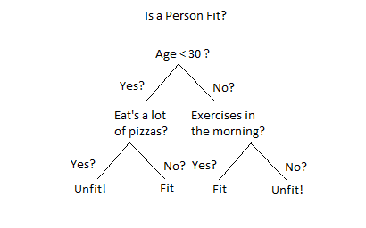
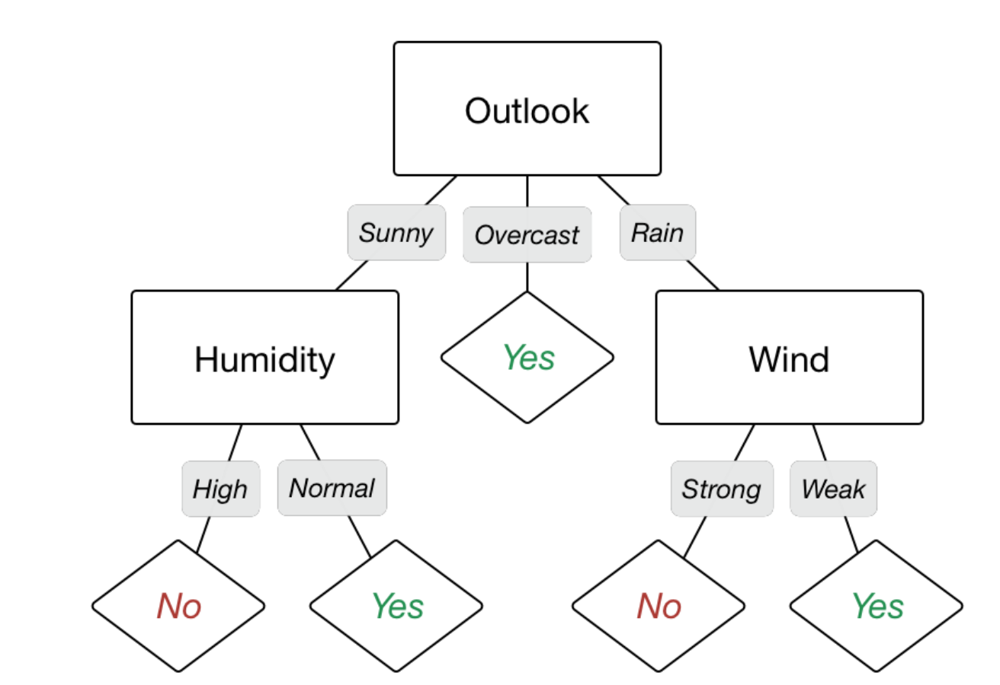

```{r setup, include=FALSE}
knitr::opts_chunk$set(echo = TRUE, fig.align = "center")
library(tidyverse)
```

# Learning Objectives: 

* Understand what a decision tree is
* Work through creating a decision tree in R


Following on from yesterday's lessons where we were predicting the probability of being in a certain binary class, which came under the 'classification algorithm' umbrella.

Today we're going to learn about another technique which comes under this **classification** umbrella: the decision tree.

<br>

# What is a decision tree?

You may have come across a decision tree before in some form in the past, outwith the context of data or machine learning. For example, here is a simple one grounded in no data or algorithms. 

<br>

```{r, echo=FALSE, out.width = '60%'}

```
<br>
While this is a simplistic tree (not grounded in reality or data), it shows the idea behind a decision tree: a decision tree is a map of the possible outcomes of a series of related choices. 

These handy tools have also inspired wide variety of algorithms in Machine Learning both classification and regression. 


# Decision tree structure  


Let's take a more realistic and theoretical example. Consider you would like to go out for a nice bike ride. Your decision will depend upon various factors such as time, weather, temperature, etc. We call these factors as features which will influence our decision. Let's focus on weather. If you recorded all the factors relating to weather conditions alongside the decision you took, you could get a table something like this.

<br>

| Day       | Outlook  | Temperature | Humidity | Wind   | Go for a bike ride? |
|-----------|----------|-------------|----------|--------|---------------------|
| Monday    | Sunny    | Mild        | Low      | Strong | No                  |
| Tuesday   | Sunny    | Mild        | Low      | Weak   | Yes                 |
| Wednesday | Overcast | Cool        | Low      | Weak   | Yes                 |
| Thursday  | Rain     | Warm        | Normal   | Strong | No                  |
| Friday    | Rain     | Warm        | Normal   | Weak   | Yes                 |

<br>

You could express this in the form of a decision tree, which might look something like this:

<br>

```{r, echo=FALSE, out.width = '80%'}

```

<br> 

Going forward, you (or others) might be able to use this table to make decisions based on the data you've collected about whether or not to go for a bike ride. 

Decision trees take their name from their appearance: they resemble an upside-down tree, with the route at the top and branches splitting off as we traverse downwards. Each branch point represents a predicate based on a variable which our data either will or will not satisfy. These variables can be either categorical or continuous; a predicate can be generated in both cases. At the bottom of the tree are the "leaf" points, with a probability assigned to each that represents the probability that a given data point will satisfy the correct combination of predicates to reach that leaf, or representing the various classes in which the data can be classified (in our example above, the two classes are Yes and No).  

<br>

# Creating Decision trees in R
<br>

To build our decision tree, we're going to revist the Game of Thrones dataset from earlier in the course. **We're going to use our dataset to build a decision tree predicting how likely it is that a character will die by the end of the (TV) series.** 

We're also going to use the following packages to help with building decision trees. Let's load these and the data now. 
<br>

```{r, message = FALSE}
library(rpart)
library(rpart.plot)
library(dplyr)
```


```{r, warning=FALSE, message = FALSE}
thrones <- read_csv("data/character_data_S01-S08.csv")
```
```{r}
head(thrones)
```

<br>

## Data cleaning 

Decision trees are slightly easier to prepare in one aspect: it's not necessary to scale the data. That's because a node of a tree partitions your data by comparing a feature (which splits dataset best), so it's not affected by different scales. 


We still need to remove any `NA`s from the dataset, plus do any necessary variable reduction. We also need to do some variable engineering, ensuring that all our columns are either a numeric type or factors and replacing any numeric values with string representations.

<div class="emphasis">
In this example we will do the variable reduction manually to save time. In normal circumstances this would be carried out using some of the techniques discussed earlier in the week.
</div>

<br>

As a reminder, we're going to use our dataset to **build a decision tree predicting how likely it is that a character will die by the end of the (TV) series**. As such, there are a few columns directly connected to character death which we'll remove, plus a few which are totally redundant and some such as name which are irrelevant here - so we will just keep those remaining. Then we'll replace the numeric values with strings (using info from the data dictionary within the classnotes folder) so the factor levels have meaning. Finally we remove any `NA` values. To save time, we have done this below:

<br>

```{r}

#### Instructor: SLACK THIS OUT 
library(tidyverse)

clean_thrones<- thrones %>% 
# Only keep variables of interest
  select(c(sex, religion, occupation, social_status, allegiance_last, allegiance_switched, dth_flag, featured_episode_count, prominence)) %>% 
# Convert to factor level
	mutate(sex = factor(sex, levels = c(1, 2, 9), labels = c("Male", "Female", "Unknown")),
	religion = factor(religion, levels = c(0, 1, 3, 4, 5, 6, 7, 9), labels = c("Great Stallion", "Lord of Light", "Faith of the Seven", "Old Gods", "Drowned God", "Many Faced God", "Other", "Unknown")),
	occupation = factor(occupation, levels = c(1, 2, 9), labels = c("Silk-collar", "Leather-collar", "Unknown")),
	social_status = factor(social_status, levels = c(1, 2, 9), labels = c("Highborn", "Lowborn", "Unknown")),
	allegiance_last = factor(allegiance_last, levels = c(1, 2, 3, 4, 5, 6, 7, 8, 9), labels = c("Stark", "Targaryen", "Night's Watch", "Lannister", "Greyjoy", "Bolton", "Frey", "Other", "Unknown")),
	allegiance_switched = factor(allegiance_switched, levels = c(1, 2, 9), labels = c("No", "Yes", "Unknown")),
	dth_flag = factor(dth_flag, levels = c(0, 1), labels = c("Survived", "Died"))) %>%
# Remove NAs 
 na.omit()
```
```{r}
glimpse(clean_thrones)
```

As we can see from the output of `glimpse()`, we now have 345 data points with 9 variables each.


## Train/test split
<br>

The next step is to create a training and testing data set. Let's have 80% of our data going into the training set, and the remaining 20% go in our test set.  

First, let's shuffle the data, which helps to ensure we are selecting random training and test sets. In this particular instance, we are going to do something called *set the seed*. 


```{r}
# set the random seed number: ONLY INSTRUCTORS
set.seed(19)
```
<br>

The main point of using the seed is to be able to reproduce a particular sequence of 'random' numbers. Generally speaking, if you don't need to be able to do that, you wouldn't set the seed. The seed number itself carries no inherent meaning except it's a way of telling the random number generator 'where to start'. You might think of it a bit like the relationship between a PIN number and your bank account. The PIN is associated with a long string of numbers (your account number), but it's not inherently an interpretable quantity (there is an interpretation, but in setting it, you ignore that).  
In short, setting the seed of R's random number generator is useful when running simulations so that the values can be reproduced. **You should not do this when creating real models - we are doing it here for teaching purposes.**  

<br>

Now we have the starting point for our random number generator, we can partition the data.  

```{r}
# get how many rows we have in total to work out the percentage
n_data <- nrow(thrones)

# create a test sample index
test_index <- sample(1:n_data, size = n_data*0.2)

# create test set
thrones_test  <- slice(clean_thrones, test_index)

# create training set
thrones_train <- slice(clean_thrones, -test_index)
```

<br>

We can check that our test and training sets have similar proportions of deceased characters. The package `janitor` has a handy function `tabyl()` for calculating tables (e.g. frquency, cross etc.). See [here](https://cran.r-project.org/web/packages/janitor/vignettes/tabyls.html) for the vignette for `tabyl()`. 

<br>

```{r}
thrones_test %>%
 janitor::tabyl(dth_flag)
```
```{r}
thrones_train %>%
 janitor::tabyl(dth_flag)
```
<br>

It's very unlikely that we'll get an exact match, but in general the gap between the two will be smaller with larger datasets. For now, this seems like a pretty even split.   


## Build tree model based on training dataset 

Next, we build the tree using the `rpart` library. `rpart` stands for `recursive partioning and regression trees`. 
First, we pass it the target variable (`dth_flag`) and the dataset to use (`thrones_train`). The third argument represents the type of variable we are looking for: `class` is used for classifying categorical variables while the alternative `anova` is used for a continuous target variable. We then plot the tree with `rpart.plot`.

```{r}
thrones_fit <- rpart(dth_flag ~ ., 
                     data = thrones_train, 
                     method = 'class')

rpart.plot(thrones_fit, yesno = 2)
```

We have a tree! Now, what on earth does this tell us? 

To start with, the variables it has picked are the ones that are deemed most informative for predicting whether someone will die (or not).  The rest have been discarded from our model. In our case it has picked `prominence`, `religion`, `allegiance_last`, and `featured_episode_count`.    

Next, each node has three pieces of information:

* The predicted result for a datapoint at the node (**Survived** or **Died** in this example) is on the top line.  
* The second line contains probability of a **`died`** result expressed as a decimal. So for example, if our character's `promience` is less than 0.48, then they have a 0.18 chance of dying. If their `promience` is not less than 0.48, they have a 0.79 chance of dying. The colouring of the nodes relates to this value, with dark blue nodes representing low probability and dark green high probability.   
* The percentage of datapoints which pass through this node. This will always be 100% at the root and the leaf nodes should always total 100%. The percentage on a given node should always be the sum of the percentages on its children.

<br>
We can see the rules it has used to make the tree if we type the following:

```{r}
rpart.rules(thrones_fit, cover = TRUE)
```
<br>

In the printing output of the rules, the left column gives the `survived` probability. The rules are sorted in this column. The rightmost column gives the percentage of observations in each rule (printed because we used the optional `cover = TRUE argument`). So for example, if our final rule stated:

<br>

> 0.12 when prominence < 0.48 &  
  allegiance_last is Stark or Targaryen or Night's Watch or Greyjoy or Frey or Other or Unknown & 
  featured_episode_count is <2 & 
  religion is Faith of the Seven or Old Gods,
  cover = 53%`
  
<br> 

this would mean that people who had a prominence score less than 0.49 and whose allegiance was to a Stark, Targaryen, Night's Watch, Greyjoy, Frey, Other, or Unknown, and who were featured in less than two episodes and whose religion was Faith of the Seven or Old Gods, had a death probability of 0.17. The cover column tells us that 53% of our data points fell into this category. 


<br>

<div class="emphasis">
Note that the leaf node and parent percentages _may_ not total 100%, usually by 1% over or under. This is because the percentages are rounded to the nearest whole number, and is not an error!
</div>
<br>

If we keep re-running our algorithm without the seed, we'll get a _slightly_ different tree every time. That's a consequence of randomly generating our training set, but one that we definitely want: a manually selected dataset would be open to all sorts of user bias!

<br>


## Use trained model to create predictions on test dataset 

Now we have a tree, we can use it to make some predictions. We can use the `add_predictions()` function (which is from the `modelr` package that provides functions for modelling that help integrate modelling into a pipeline of data manipulation and visualisation. This will add on the prediction for every observation in our dataset.
 
```{r, message = FALSE}
library(modelr)

# add the predictions
thrones_test_pred <- thrones_test %>%
                 add_predictions(thrones_fit, type = 'class')
```

<br>
Now we can look at our predictions. For the sake of keeping the variables reduced, let's choose the ones that our decision tree model showed as most informative.
<br>

```{r}
# look at the variables 
thrones_test_pred %>%
  select(prominence, religion, allegiance_last, featured_episode_count, pred)
```

Here we can have a look and see at a descriptive level if we think our model is predicting well. What do you think?

You can also ask `rpart` to show the rules it is using to make predictions by using the `rpart.predict` function. Here, let's use it to see why it is classing the first three rows of our test dataset the way it is.

```{r}
rpart.predict(thrones_fit, newdata=thrones_test[1:3,], rules=TRUE)
```
<br>

Here, this shows us the probabilities it is calculating for each observation, as well as the rule it is using to come to that classification.   


<br>

## Checking model performance   
<br>

You can then also check the accuracy of our predictions by making a **confusion matrix**. A confusion matrix is a table that is often used to describe the performance of a classification model (or "classifier") on a set of test data for which the true values are known.    

We can use the function `conf_mat()` from the `yardstick` package, which is a package producing model performance metics using tidy data principles (more on this package [here](https://tidymodels.github.io/yardstick/)). 

The values on the left are the predicted values (i.e. column `pred`) while the values at the top represent the actual values (i.e. column `dth_flag`). We tell `conf_mat()` which variable is the true value and prediected value using the arguments `truth` and `estimate`:

```{r, message = FALSE}
library(yardstick)

conf_mat <- thrones_test_pred %>%
              conf_mat(truth = dth_flag, estimate = pred)

conf_mat
```
<br>

The main diagonal represents correctly-predicted values, with the top right values showing false positives and the bottom left being false negatives. The more accurate the decision tree, the higher the main diagonal values will be. We can calulate that accuracy with a fairly simple calculation (summing the main diagional and diving by the total). The result represents the probability of our prediction being correct. We can use the function `accuracy()` from `yardstick` to calculate this. 
<br>

```{r}
accuracy <- thrones_test_pred %>%
 accuracy(truth = dth_flag, estimate = pred)

accuracy 
```

Your `.estimate` row in your ouput shows you the probability you have of correctly predicting whether people will died or not in game of thrones. 

<br>

**Note**: you may also become aware of the package `caret`(short for Classification And REgression Training) which is a set of functions that attempt to streamline the process for creating predictive models. `yardstick` contains many of the performance measurement methods in caret but in a format that is easier to use with dplyr syntax and functional programming. To calculate the confusion matrix and accuracy using `caret` would use the function `confusionMatrix()` which returns the confusion matrix and accuracy (as well as other performance metrics)

```{r, message=FALSE}
library(caret)

confusionMatrix(thrones_test_pred$pred, thrones_test_pred$dth_flag) #order is estimate and then truth 
```


And there you have it - you've created your first decision tree model in R. 
<br>


# Advantages and Disadvantages of Decision Trees

The major advantage of using decision trees is that they are intuitively very easy to explain. They closely mirror human decision-making compared to other regression and classification approaches. They can be displayed graphically, and they can easily handle qualitative predictors without the need to create dummy variables.  

However, decision trees generally do not have the same level of predictive accuracy as other approaches, since they aren't quite robust. A small change in the data can cause a large change in the final estimated tree.  


<br>

# Recap

* Is it necessary to scale data before generating a decision tree? 
<details>
<summary>**Answer**</summary>
No, we only need to remove any `NA` values
</details>
* What should be the total value of the percentages shown on a decision tree's leaf nodes?
<details>
<summary>**Answer**</summary>
100, although it may be off by 1 due to rounding errors
</details>


# Additional Resources

* [Decision trees in R](https://www.datacamp.com/community/tutorials/decision-trees-R)  

* [Interpreting rpart decision tree plots](http://www.milbo.org/doc/prp.pdf)