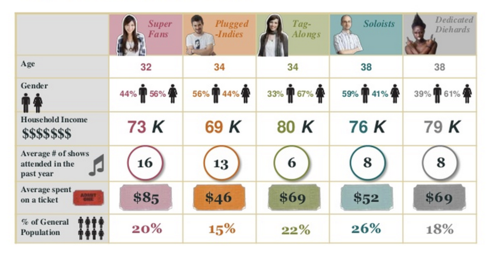
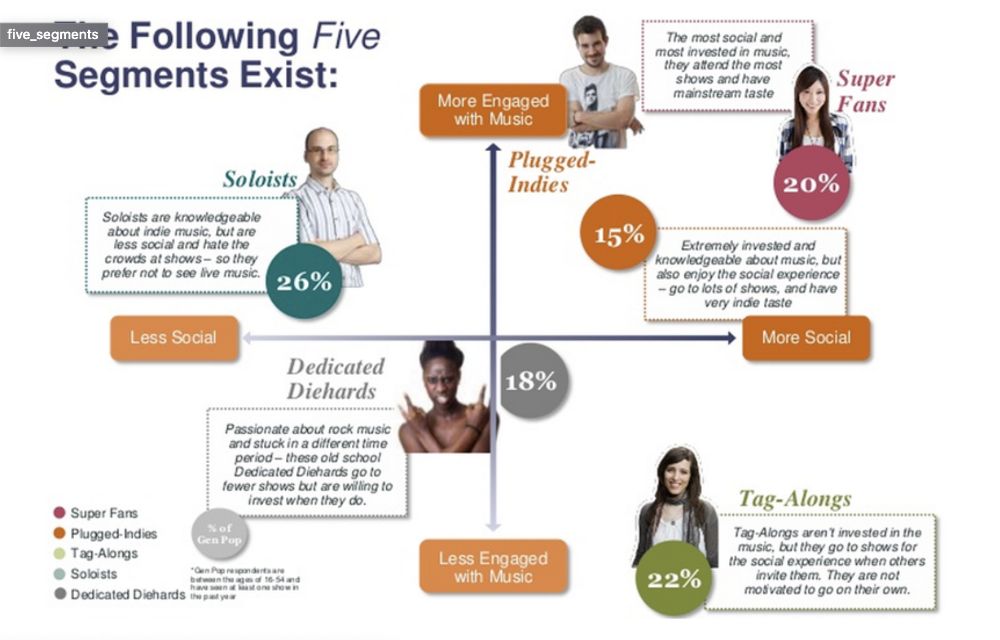

```{r setup, include=FALSE}
knitr::opts_chunk$set(echo = TRUE, fig.align = "center")
```

# Learning Outcomes

* Know what segmentation is
* Know what clustering is
* Know the differences and similarities between segmentation and clustering 
* Understand the different types of clustering algorithms and their use cases


# Segmentation & Clustering 

The overarching purpose of segmentation and clustering are similar - splitting up your data into subgroups which are 'similar'. But they differ in how we go about creating these groups. 

There are lots of real-world examples of these:

* **Marketing**: grouping people with the same willing power to buy a specific product based on their similarities. 
* **Insurance**: using clustering techniques to identify fraudulent insurance claims.
* **Geo-demographic**: splitting up the population based on geographical and demographic similarities. 
* **Education-planning**: identifying groups of universities based on their tuition, geographic location, quality of education, type of degree programs.
* **Finance**: grouping customers based on their credit history.

When introducing segmentation and clustering we shall consider the following dataset, which has information on customers of a particular shop. 

```{r, message = FALSE, echo = FALSE, warning = FALSE}
library(tidyverse)
```

```{r, echo = FALSE, message = FALSE}
customers <- read_csv("data/mall_customers.csv") %>% 
                  select(-Gender)

head(customers)
```


# Segmentation

Segmenting is the process of putting customers into groups based on similarities. So you know before starting how you want to split your groups. The user manually defines boundaries to split characteristics by e.g. for customer data may split the following:

* Age over and under 40 
* Earnings over or under $30k a year. 

So we end up with the following groups:

1. Under 40 & earns under $30k
2. Over 40 & earns under $30k
3. Under 40 & earns over $30k
4. Over 40 & earns over $30k 

So for segmentation we will have a business purpose before splitting to know which rules to apply (e.g. for this example our buisness may have 2 different products targeted to those who earn over and under $30k, and so this split makes sense for our business) and so would need business context and understanding for this. 

Segmentation can be straightforward when only have a few characteristics but may have many many more - and how do you know how many characteristics to split by. Is age and income enough or should you also split by spending score? It may not be feasible for you to go through hundreds of types of data, finding relationships between each. We would want to understand the relationships between all these characteristics - this is where clustering can come in. 


# Clustering

Clustering is a machine learning technique that involves grouping of data points. Given a set of data points, we can use a clustering algorithm to classify each data point into a specific group. In theory, data points that are in the same group should have similar properties and/or features, while data points in different groups should have highly dissimilar properties and/or features. We can use clustering analysis to gain some valuable insights from our data by seeing what groups the data points fall into when we apply a clustering algorithm.

For example, if you had the hypothetical data below, you may run cluster analysis on it and get back three clusters showing the following: 

<br>
```{r, echo=FALSE, fig.cap="", out.width = '60%'}
knitr::include_graphics("images/clustering_intro.jpg")
```
<br>

In this hypothetical case, we have three clusters showing how our data best clusters together. In reality, we may have some idea of the groups the algorithm will find, or it may find something unexpected. Unlike the classification algorithms above, clustering can find any number of groupings in the data. Deciding how many clusters we want is known as setting the algorithm's _granularity_.

For our customer data we may be interested in the type of people that come to our shop and if there are groups of similar type of people that we can target with particular marketing and campaigns depending on their attributes and behaviour. 

In our customer dataset we can treat our data as unlabelled and say that we aren't trying to predict a certain attribute (say income or spend score) but that we are interested in groups (clusters) of customers showing similarities - of which there are many different number ways of grouping. In this case, we could find that that 3 clusters define our full data pretty well, say those over 38 who have income of over \$45k, those over 38 who have an income of under $45k and those under 38.. **We haven't defined any inputs/rules other than potentially the number of groups we want** (in this case 3), the algorithm has defined these groups for us. This differs from segmentation where we defined the rules for splitting the groups. Clustering is often used when trying to profile customers or groups of people. 

The result is a segmented dataset, which is also the end result of segmenting, but the process to achieving it differs. 

For clustering we will still want some consideration which variables we want to include to some degree. We don’t want to just chuck in thousands of variables as some relationships may appear 'by chance' just because we have put in so many. Again, it will depend on purpose and context. For example we may hold people’s eye colour but the purpose of our analysis is to target for a campaign sales of jackets and we know these are unrelated. 

Note that not all data is ‘good’ for clustering. If there aren’t ‘clear/natural’ groupings of similar data then it may not appropriate. **Homogeneous** means that the consumers within each segment are relatively similar to each other, in terms of their characteristics. **Heterogeneous** means that the different segments should be quite distinct and different from each other. We will discuss this more later in the day. 


## Labelling clusters 

After clusters have been created often you will want to give them labels to give them meaning and context. This is common in marketing when have created groups of customers (and then may overlay their product purchases onto the clusters to see what type of products each group is buying) in order to create targeted advertising campaigns. For example the following groups may have been created via clustering and then via manual inspection can see what similarities are within the groups and can 'label' them (e.g. 'super fans') and often small 'bios' are written about each group:

```{r, echo=FALSE, out.width = '80%'}
  
```

```{r, echo=FALSE, out.width = '80%'}
  
```

Once have clusters/segments we may define a marketing strategy for each group and target appropriately. 

# Clustering Algorithms

Just like every other aspect of machine learning, there are many different clustering algorithms which we could use and they each have different specialities. There are more than 100 algorithms which we _could_ use, but only a few are in widespread use outside purely academic circles. They can be broadly grouped as follows:

1. **Connectivity Models** These are based on the idea that a data point on a graph will have more in common with a point which is close to it in space than one which is further away. They take one of two approaches to clustering: either all points are treated as individual clusters and then aggregated together, or or all start in one cluster which is then divided. **Hierarchical clustering**, is an example of this, which we will look at today. 

2. **Centroid Models** In these models we tell the algorithm how many clusters we are aiming to have then allow it to find the optimum centre-point on the graph for each of those clusters. These are arguably not as "unsupervised" as other algorithms, since we provide that information of how many clusters we want, but must also have some knowledge of the dataset in order to do so. A popular example is **K-Means clustering**, which we will also look at in-depth later today.

3. **Distribution Models** These are probability-based models where clustering is driven by the probability that all data points belong to the same distribution (eg. normal). These are less useful in general since they are prone to overfitting, but if this is managed properly they still have their niche.

4. **Density Models** These models simply search the space for points which are closely grouped and assign them to the same cluster. Like the centroid models these require a degree of user input to define how many clusters there should be, but since the algorithm isn't as dependent on the data we need less knowledge of it first. 

<br> 


```{r, echo=FALSE, eval = FALSE, fig.cap="A few of the many machine learning algorithms, sorted by use case", out.width = '100%'}
# steph: i think this is actually confusing, as it veers away from clustering again and actually introduces heaps of words and concepts we havent done - taking out for now
knitr::include_graphics("images/algorithms.png")
```


# Recap


* Do we need to provide a target number of clusters to centroid algorithms?
<details>
<summary>**Answer**</summary>
Yes, which means we need _some_ knowledge of the dataset
</details>
* Is the Euclidean distance measure classical or correlation-based?
<details>
<summary>**Answer**</summary>
Classical
</details>

# Additional Resources

* [A guide to selecting an algorithm](https://hackernoon.com/choosing-the-right-machine-learning-algorithm-68126944ce1f)
* [The maths behind some common distance measures](https://www.datanovia.com/en/lessons/clustering-distance-measures/#methods-for-measuring-distances)
* [5 popular clustering algorithms in data science](https://towardsdatascience.com/the-5-clustering-algorithms-data-scientists-need-to-know-a36d136ef68)