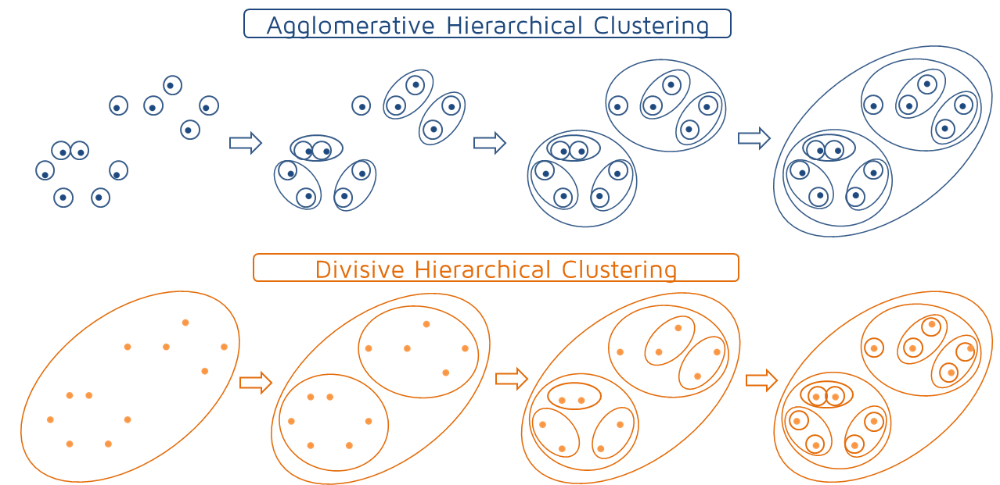
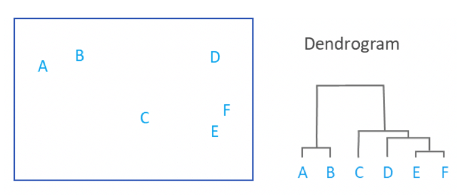
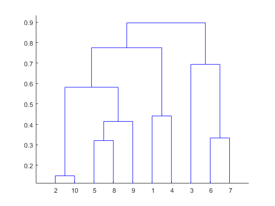
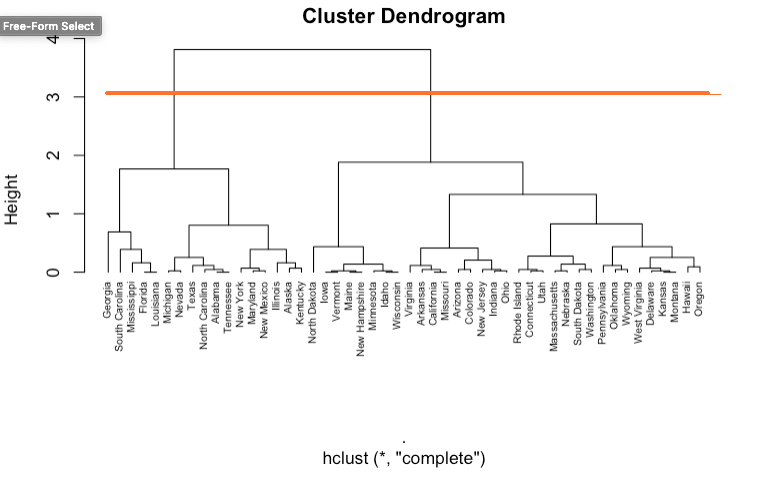

```{r setup, include=FALSE}
knitr::opts_chunk$set(echo = TRUE, fig.align = "center")
```

# Learning Objectives: 

* Understand what hierarchical clustering is 
* Know the use-cases
* Know what a dendrogram is
* Draw a dendrogram using R
* Use a dendrogram to estimate the optimum number of clusters


**Lesson duration: 60 mins**

<br>

As we said in the last lesson, although there are many different clustering algorithms available there are some which feature more than others. In the next couple of lessons we'll take a more in-depth look at some of them and see how we can use them to perform learning tasks in R.


# Hierarchical Clustering

Hierarchical clustering, also known as hierarchical cluster analysis, is an algorithm that groups similar objects into groups called clusters. 

**Hierarchical clustering** is an unsupervised technique which takes our starting point of many individual clusters and gradually groups them together until a user-defined end point is reached. The endpoint is a set of clusters, where each cluster is distinct from each other cluster, and the objects within each cluster are broadly similar to each other. The overall end goal is to group our data together to look for patterns. 

It's worth noting that we could do hierarchical clustering in reverse, ie. start with one cluster and split it until we reach our target number. This is known as _divisive_ hierarchical clustering (as opposed to the _agglomerative_ clustering we're looking at here) and is rarely done in practice.

<br>

```{r, echo=FALSE, out.width = '100%'}

```

<br>


<br>
Hierarchical clustering starts by treating each observation as a separate cluster. Then, it repeatedly executes the following two steps:  
 
  (1) identify the two clusters that are closest together       
  (2) merge the two most similar clusters  
  
This continues until all the clusters are merged together (see the diagram above).

The main output of hierarchical clustering is a **dendrogram**.  Let's look at a couple now. 
<br>


# Dendrograms

A dendrogram is a diagram which shows the hierarchical relationship between data points, where the height of the join between two clusters indicates how close they are together. Take a look at the following:

<br> 
```{r, echo=FALSE, fig.cap="An example of a dendrogram", out.width = '100%'}

```
<br>

Here this shows us the clusters on the left, and the dendrogram on the right. Imagine that underneath the letters (A,B,C..) are data points, that have been grouped into clusters by our algorithm. So, what does this dendrogram tell us? 

Well, first thing to note is that the horizontal lines joining letters together denote that two clusters are close in distance (and may indeed be part of the same cluster, depending on your cut offs). Next thing to note is that the distance of the line joining clusters relative to the x axis tell you something as well. The closer a horizontal joining line is to the x axis, the closer the clusters are. 

So in our case, our dendrogram tells us that clusters E and F are the closest together, as they have the shortest distance between the joining line and the x axis. Next, follows clusters A and B. Cluster D could be grouped with E and F and is the next closest relationship, and cluster C could be grouped with E, F and D, but has the most distance between clusters. 

<br>


<blockquote class="task">
**Task - 5 mins**

Take a look at the dendrogram below. What does it tell you about the clusters? 


```{r, echo=FALSE, fig.cap="An example of a dendrogram", out.width = '75%'}

```

<details>
<summary>**Answers**</summary>

Look at the clusters 2 and 10 on the left of the x-axis. The lines coming from them join at a lower point than any other pair, indicating that they are the two closest data points and make up the first cluster formed. The resulting cluster is then joined with another much higher up, after several other clusters have been joined. Every joining of clusters is represented on the diagram in this way. 

</details>
</blockquote>
<br>


# How do you define your clusters?

<br>
A critical part of the clustering process is the evaluation of **how similar different data points are**. This evaluation guides the size and shape of the clusters generated. The formulae used are known as **distance measures**, and just like the algorithms using them there are many. They can be broadly divided into two categories: _classical_ and _correlation_ measures. Classical measures are based on geometric distances between points on a graph, while correlation measures are based on (as the name suggests) the correlation between points. In day-to-day use it is important to know what they are and how they are arriving at their conclusions, but when we run clustering algorithms using R (or indeed other languages) they are usually included in that process. As such, we won't focus on the nuts and bolts of what's going on in each case. 

<br>
Let's take a look at our previous example again:
<br>
```{r, echo=FALSE, fig.cap="An example of a dendrogram", out.width = '100%'}

```

<br>
In this example, the distance between two clusters has been computed based on length of the straight line drawn from one cluster to another. This is commonly referred to as the *Euclidean distance*, and this would be a _classical_ method. 

<br>
<div class="emphasis">
*Note: The **Euclidean distance** between two points is the straight-line distance between them on the graph. If you remember Pythagoras Theorem from school then it uses that - so you can use this as an argument when people say they never use anything they learnt in high school maths!*

<details>
<summary> Maths here </summary> 

Although R is doing it for us, that distance is relatively easy to calculate. In 2-dimensions, if we have two points _p_ and _q_:
$$p = (p_1, p_2) \\q = (q_1, q_2)$$
Then the distance between them _d_:
$$d(p, q)$$
Can be calculated using the formula below:
$$d(p, q) = \sqrt{(q_1 - p_1)^2 + (q_2 - p_2)^2}$$
In a n-dimensional space the formula generalises to:
$$d(p, q) = \sqrt{\sum\limits_{i=1}^n (p_i - q_i)^2}$$

</div>
<br>

Your choice of distance metric will depend on many things like which field you work in, what the standard cut offs in your line of work are, and any other theoretical basis of your field. That is, a distance metric needs to define similarity in a way that is sensible for the field of study. For example, if clustering crime sites in a city, city block distance may be appropriate (or, better yet, the time taken to travel between each location).

On the other hand, if we want to identify clusters where presence of a variable is important rather than its magnitude (eg. shoppers buying a particular item, ignoring how many they bought) then we would use a correlation measure. This will still produce clusters in the same way as an algorithm using a classical measure, but there may be more overlap in the visual representation with a "messier" end result.  

Where there is no theoretical justification for an alternative, the Euclidean should generally be preferred, as it is usually the appropriate measure of distance in the physical world.


# Clustering and creating dendograms in R

Let's work through a clustering example in R. As usual, in R there are many packages to help us. The packages we'll need for this example are:

* tidyverse (for data manipulation)
* cluster (for clustering algorithms)
* factoextra (for clustering visualisation)
* dendextend (for comparing dendrograms)

You should already have tidyverse installed from week 6, but the rest will need to be added with `install.packages()`.

```{r, message = FALSE}
library(tidyverse)
library(cluster)
library(factoextra)
library(dendextend)
```

<br> 

## Data cleaning
<br>
Step one is, as always, loading our dataset. For this example we're going to use R's built-in dataset of US arrest statistics from 1973. Let's look at this now:

```{r}
head(USArrests)

dim(USArrests)

class(USArrests)
```

So we have a data frame, with 50 rows and 4 columns. Next we can check if we have any missing values to deal with. 

```{r}
any(is.na(USArrests))
```

<br>

Ok, no missing values so we don't need to worry about dealing with those. What we do want to do is **standarise** our data, as this is important for clustering. We touched on scaling during our **variable engineering** lesson already, but just as a recap remember that the magnitude of our data is important. If we have non-standardised data (such as heights or weights recorded in different units) then that will affect our distance measures between variables disproportionately. Ideally we want our data to be standardised to have a mean of 0 and standard deviation of 1.

We can standardise our data using the `scale` function in R. 
<br>

```{r}
arrests <- USArrests %>%
              janitor::clean_names() %>%
              rownames_to_column('state') %>%
              mutate_if(is.numeric, scale)

arrests
```

Our data should now be in the desired format, with standard deviation 1 and mean 0 for each variable. Let's check this is the case:

```{r}
summary(arrests)
```

<br>

Great. As an addition here, we can then check if any of our four variables are correlated with one another. 

```{r}
library(corrplot)

# create a correlation plot
corrplot(cor(USArrests), method = "number", type = "lower")
```
<br>

Looking at this, it tells us that 3 crime variables are correlated with each other, that is, Assault-Murder, Rape-Assault and Rape-Murder. This suggests we could probably drop some variables, but let's just continue for now. 


<br>

```{r, eval = FALSE, echo = FALSE}
arrests %>%
  as_tibble() %>%
  pivot_longer(-state, names_to = c("type")) %>% #convert data to long format
  group_by(type)%>%
  summarise(mean= mean(value), sd= sd(value))
```

Nice, we're ready to start building our dendrogram. 


## Calculating distances

Next, we need to calculate our distances. To do this, we build a **dissimilarity matrix** in R, which will contain our information about the distance between each point (ie. their dissimilarity) across our rows. It's square and symmetric. The diagonal members are defined as zero, meaning that zero is the measure of dissimilarity between an element and itself. 

We will stick with calculating our distance measures using Euclidean distance, but we could use one of the others if we wanted to. We do this using the `dist()` function (from the `factoextra` package) and input the `method` argument to specifcy which distance measure to use. 

To begin with, let's start by taking our `murder` information from our `arrests` matrix, and calculating how similar murder rates are across different states. 


```{r}
# take only murder
diss_matrix <- arrests %>%
              column_to_rownames("state") %>%
              select(murder) %>%
              dist(method = "euclidean") 
```

We can then visualise our dissimilarity matrix using the `fvis_dist` function:

<br>

```{r}
# create a dissimilarity matrix showing distances
fviz_dist(diss_matrix)
```

<br>
But what does this even show? On both our x and y axis we have our different states that have different murder rates recored. The colours represent our different distances : 0, 1, 2, 3 and 4. In the above graph the pink color shows the closest distance and blue color shows maximum distance. If values are 0 that means there is no dissimiliary/no distance. So in our case, we would expect the same state to have values of 0 (as they will be plotted on the same place for x and y). And that seems to check out : if you look at New Hampshire on both axis for example, and find the intercept (where it meets on the x and y axis), you will see that it is 0. This makes sense. However, if you look at where New Hamshire and Georgia intersect, you'll see these are far away in distance (colour blue). This suggests that the murder rate in New Hampshire is different from that in Georgia. 


## Building our dendrogram

Now we have our distances, the next step is building the clusters. At each stage the data points are matched using a **linkage method**. These methods are used to calculate which of the dissimilarities between two data points should be taken as the distance between them. Here we are using _complete linkage_, which takes the largest dissimilarity to be the distance. We use the `hclust()` function from base R to do this. We specify which linkage method we want to use via the `method` argument. 

A number of different clustering methods are provided within the function. The `hclust` function in R uses the **complete linkage method** for hierarchical clustering by default (`method = complete`). This particular clustering method defines the cluster distance between two clusters to be the maximum distance between their individual components. At every stage of the clustering process, the two nearest clusters are merged into a new cluster. The process is repeated until the whole data set is agglomerated into one single cluster. Let's use this one now:

<br>

```{r}
clusters <- diss_matrix %>%
                 hclust(method = "complete")
```
<br>

This will complete our hierarchical clustering and now we can plot it as a dendrogram. We can use base R's `plot` to view this (or alterinatively there is the `ggdendrogram()` function from the `ggdendro` package, which creates dendrogram plot using ggplot).

```{r, message = FALSE}
clusters %>%
  plot(cex = 0.5, hang = -5)
```


### Different distance calculation methods

If we use different linkage methods when building our dendrograms, we can reasonably expect there to be a difference in how they will look. That difference could be small or it could be huge, influenced by both the distance measure used and the quality of the dataset. 

For the sake of demonstrating differences, let's calculate our distances again using a different method. This time, we will use [Ward's minimum variance method](https://en.wikipedia.org/wiki/Ward%27s_method) (`ward.D2`), which aims at finding compact, spherical clusters in your data. It will still be largely similar to our earlier dendrogram, but the different measure used will lead to some differences.

```{r}
alt_clusters <- diss_matrix %>%
                    hclust(method = "ward.D2")
```

<br> 

Before we can compare the two dendrograms we must ensure that R definitely sees them as dendrograms. This might sound strange, but `clusters` and `alt_clusters` represent the data underpinning the dendrogram, not the graph itself. We can use `as.dendrogram()` function to make the conversion.


```{r}
clustering_dendrogram <- clusters %>%
                                  as.dendrogram() %>%
                                  dendextend::set("labels_cex", 0.6) 

clustering_dendrogram
```
<br>

*Note: We want to resize the labels on this dendogram otherwise it's a little hard to read. We do this using `set()` to customise the plot. There are lots of other customisable options dendograms (see [here](http://www.sthda.com/english/wiki/beautiful-dendrogram-visualizations-in-r-5-must-known-methods-unsupervised-machine-learning) for more on customisation - it gives details on customisation via base R, `ggdendro` package and `dendextend` package).*

<br>

We can do the same for our alternative cluster: 
<br>

```{r}
alt_clustering_dendrogram <- alt_clusters %>%
                              as.dendrogram() %>%
                                 dendextend::set("labels_cex", 0.6)

alt_clustering_dendrogram
```

Cool, we can see that both dendrograms have the same number of branches and members, but different heights thanks to the different measures used.

Comparing them is a matter of using the `dend_diff` function. Some branches will be the same indicating that the clusters still merge at the same point, although the distance between them may be recorded differently. Where branches differ they will be highlighted in red on the graph.

```{r}
dend_diff(clustering_dendrogram, alt_clustering_dendrogram) 
  
```
<br> 

<div class="emphasis">
Note the different scale on each dendrogram. The two appear quite similar, but by scaling them to fit the page R has masked some of the difference.
</div>
<br>

We see in this example that the `ward.D2` method leads to much greater distances between our clusters. Whether or not this is a good thing will depend on your specific situation. For now, let's pick the method which has fewer clusters and stick with our original `complete` method calculation.  

<br>


## Picking our clusters

After we've calculated our distances, and we have our dendrogram, we want to decide how many clusters we are going to define for our dataset. We are going to discuss some computational methods in the next lesson of ways to do this. 

There is not always definitive answer for how many clusters to pick from your data, since cluster analysis is essentially an exploratory approach; the interpretation of the resulting hierarchical structure is context-dependent and often several solutions are equally good from a theoretical point of view. Often times, it comes down to picking what you think is correct, or setting some kind of threshold that works for your data. For example, you might say you want clusters to be a certain distance apart, or contain a certain number of categories.

Your field will no doubt have it's own criteria. Take targeted advertising for example: they might want to use cluster analysis to group their customers into similar groups in order to create the targeted ads. If you choose too many cluster groups, this increases the amount of emails you have to create, which is costly and time consuming, but would be effective in terms of targeting the information contained in the email more specifically. However, if you choose two few clusters (i.e. lump people into too few groups), you'll spend less time and money writing fewer emails, but these won't be as specific to each individual in the group. Most of the time, a business will have it's own criteria and you can use your skills as an analyst to make a decision.  

One method that can be used if viewing via a dendrograms if don't have a specific number in mind is tu cut the dendrogram tree with a horizontal line at a height where the line can move the maximum distance up and down without intersecting the merging point.

Let's look at our dendrogram again: 
<br>

```{r}
plot(clusters, cex = 0.6, hang = -1)
```
<br>

So the line which would have the furtherest to move both up and down before hitting a merging point is:

```{r, echo=FALSE, fig.cap="An example of a dendrogram", out.width = '100%'}

```

Looking at our plot, it seems that three might be a decent number of clusters for this. Seems to capture a fair few differences, but isn't too granular. 

R's `rect.hclust()` function in base R that will annotate the dendogram for us and requires three pieces of information: the dataset, the number of clusters to highlight and a vector of matching length which will be used to select colours from. You call this alongside your plot function. 

<br>

```{r}
plot(clusters, cex = 0.6, hang = -1)
rect.hclust(clusters, k = 3, border = 2:5)
```

<br> 
This looks not too bad. Groups don't seem too big, or too small. In this case, I'd be tempted to stop here and say something along the following lines:

*We investigated murder rates across US States using cluster analysis. This showed that there were differences between different states in terms of murder rates in the US. States such as Georgia and Louisiana have similar murder rates to one another and therefore belong to one cluster. States such as Oregon and Hawaii also have similar murder rates to each other, and belong in another. This also tells us that states such as Georgia and Louisiana have different murder rates to states such as Oregon and Hawaii. Based on this analysis, we have defined four cluster groupings which we could use to predict future murder rate data in these states.*

<br>

And we can use the `cutree()` function to assign which cluster each data point is in to their resulting cluster 

```{r}
arrests_clustered_h5 <- arrests %>%
                          mutate(murder_cluster = cutree(clusters, 5))

head(arrests_clustered_h5)
```

And there you go, your first cluster analysis in R is complete. 


<blockquote class="task">
**Task - 20 mins**

Spend some time carrying out cluster analysis for your other variables `assault`, `urban_pop`, and `rape`. What do you find for each variable? How many clusters do you choose, and why? What are your interpretations from your analysis?

What happens if you include all your data related to crime (`murder`, `assualt` and `rape`) and perform clustering? (i.e. do not subset the data as we did in one of our first steps). For this, you have moved from predicting a specific variable to predicting something you might denoted as "overall crime rates". Do you get different results when the clustering takes into account all your data at once for each state? How would you interpret your results?

</blockquote>

<br>


## Labelling clusters 

After clusters have been created often you will want to give them labels to give them meaning and context (as discussed earlier today).

<div class="emphasis">
Remember, dendrograms are useful tools, but are far from perfect. Because of they way in which we only join the two closest clusters at each step, we may find that a data point is occasionaly placed in the "wrong" cluster. This is only generally a problem when dealing with points which are very close together, however. In general a mis-sorted cluster will be grouped back in with its "correct" cluster at a later point in the algorithm, so assuming we are looking for a sufficiently small number of clusters the problem should resolve itself.
</div>


# Recap

* What does the height of the join between two clusters indicate on a dendrogram?
<details>
<summary>**Answer**</summary>
The distance between them
</details>
* Is it necessary to scale data before generating a dendrogram? 
<details>
<summary>**Answer**</summary>
Yes!
</details>


# Additional Resources

* [Strengths and weaknesses of hierarchical clustering](https://www.displayr.com/strengths-weaknesses-hierarchical-clustering/)
* [What is a dendrogram?](https://www.displayr.com/what-is-dendrogram/)
