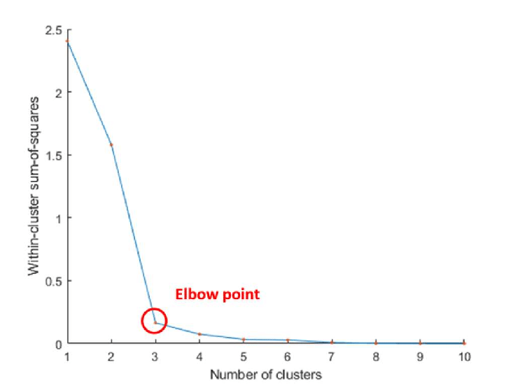

```{r setup, include=FALSE}
knitr::opts_chunk$set(echo = TRUE, fig.align = 'center')
library(tidyverse)
```

# Learning Objectives

* Understand the use cases and limitations
* Understand how it works
* Understand the the result is heavily dependent on the initial centroids chosen
* Draw an elbow diagram
* Find the optimal number of clusters

**Lesson duration: 60 mins**

The hierarchical clustering methods we looked at earlier are great at answering yes/no questions, but when we want to take a more granular look at our data they are less effective. In that instance we may want to take a look at **k-means clustering**.

# Use Cases

Dendrograms are great for showing us the similarities between datapoints, but aren't that easy to get a quick read from. We can see how datapoints are ultimately grouped together at whatever granularity we like, but without time and investigation we can't immediately tell that a given point should be grouped with any other. 

Enter k-means clustering. The graphs produced by this algorithm still show the clusters in the data, but instead of showing the clusters at such a granular level they instead show the final groupings. As such it is immediately obvious which cluster a data point belongs to. There is the added benefit that it _may_ be possible to immediately see which cluster any new data points belong to.

These groupings will most likely not be explicitly defined in the data. The corollary to this is that they represent patterns in the data which may not be obvious to the user. Let's take a look at what we mean by manually clustering some data:

```{r}
df <- data.frame(age = c(18, 21, 22, 24, 26, 26, 27, 30, 31, 35, 39, 40, 41, 42, 44, 46, 47, 48, 49, 54),
    spend = c(10, 11, 22, 15, 12, 13, 14, 33, 39, 37, 44, 27, 29, 20, 28, 21, 30, 31, 23, 24)
)
ggplot(df, aes(x = age, y = spend)) +
    geom_point()
```

Let's say we're running a shop and have a dataframe containing details of our customers' ages and the amount of money they spent in our shop. We're plotting age along the x-axis and spend on the y-axis. There are some fairly obvious groupings in the plotted points: one in the bottom left, one top-middle and one middle-right. Although **they weren't defined in our original data**, these groups are still present and can be used to inform future business decisions. In this case we have observed a pattern that:

* younger people are spending less (less financial security), 
* those in their thirties are spending more (job security and fewer commitments)
* middle-aged and older people are spending less again (other financial obligations)

Looking for patterns in customer data is one example business case, but there are of course others. Any scenario where we want to find patterns could be a candidate for k-means clustering, be it looking at financial data, environmental data or student performance. We can even use it in preparing our datasets, with it being particularly powerful in grouping variables for dimensionality reduction.

In order to find such groupings, however, they must be derived from variables which are present in our dataset in the first place. While this may seem obvious, it bears repeating here. As we'll see later, the clusters are also **constructed iteratively** in a similar way to our dendrograms. That means that a point _may_ end up in the "wrong" cluster, although this will likely be rectified as the algorithm continues. It's also worth remembering that our perception of "wrong" is based on our own inspection of the data; we may be wrong ourselves about where we feel a point should be clustered.

# K-means in R

Although there are quirks to the methods each language uses for k-menas clustering, the general process is the same regardless of setting:

1. Initial **centroids** which represent the "centre" points of each cluster are chosen. We declare as many as we need clusters.

2. Each data point is grouped with the centroid it is closest to. Often we use the Euclidean distance between the plot and the centroid, but other distance measures will work too.

3. For each group, the centroid is moved to the point representing the mean position of the points within the group. This may be a small movement, or it may be significant.

4. The data points are re-grouped among the centroids. It is possible that at this stage that points will move between groups, depending on where the centroids have been moved to.

Stages 3 and 4 are repeated until no observations change groups after moving the centroids, resulting in our final groups. It is not necessary for the groups to be of the same size.

The algorithms used to select our initial centroids ensure that they are chosen randomly, meaning that the clustering process _should_ give different results every time. This is not necessarily a bad thing; as we said earlier, where random selection is involved we want to see some variance in the final results. It does, however, mean that it is virtually impossible to recreate the results of a clustering unless working with a very small dataset.

The artist at R Studio has produced some fantastic illistrations on how it works [here](https://twitter.com/allison_horst/status/1250477975130140672?s=20)

## An Example

Let's start (as always) with a dataset. Today we're using information about PC sales from 1993-95 in the US:

```{r}
pc_sales <- read.csv("https://raw.githubusercontent.com/guru99-edu/R-Programming/master/computers.csv")
glimpse(pc_sales)
```

As the distance calculations require numerical inputs, we need to remove the factor variables from the dataset.We will talk more about other methods for clustering categorical data (or mixed categorical and numeric datasets) later but the k-means method is for numerical data.  

For this first example we are going to cluster based on 2 variables `hd` and `ram`. So let's only select these from the dataset. 

```{r}
pc_sales <- pc_sales %>% 
              select(c(hd, ram))

glimpse(pc_sales)
```


After selecting our variables, we may need to scale our data. 

As discussed during the feature engineering lesson that clustering is based on calculating distances, and these distances are affected by the scale of the variables in your data. So there are issues with data where each have very difference numerical values (e.g. shoe size and weight) and may have different units (lb, tons, m, kg ...). The distance will change dramatically if you change from, say, mm to km. By putting all variables into the same range, you weight the variables equally.

For anyone who is interested this [blog](https://community.alteryx.com/t5/Alteryx-Designer-Knowledge-Base/Standardization-in-Cluster-Analysis/ta-p/302296) gives a good visual example of what happens when cluster with and without scaling - that the large range variable is the driver of the clusters. 

Note that for attributes where the numbers have a well-defined meaning e.g. latitude and longitude, then you should not scale your data, because this will cause distortion to the meaning of the latitudes and longitutudes - there will be special clustering techniques for locational data.

So we will scale our data such that the mean is zero and the standard deviation one for each column. We can check if that is the case using `summary()`:

```{r}
summary(pc_sales)
```

Some very big numbers there! Let's do the scaling:

<blockquote class="task">
**Task - 5 mins**  
Scale the data! (via creating a new dataframe called `pc_sales_scale`)

<details>
<summary>**Answer**</summary>
```{r}
pc_sales_scale <- pc_sales %>%
                      mutate_all(scale)
```
</details>
</blockquote>

Then we visualise the data, even before clustering we can take a look and see - does our data look to have clusters? Or is all the data very close together?

```{r}
ggplot(pc_sales_scale, aes(hd, ram)) +
  geom_point()
```

If visualization reveals that your data has no amount of separation or distinct groups, then clustering may not be appropriate. It looks like there is potential to be groups of data here as there could be scope for heterogeneous clusters. But let's give it a go to see!

Unlike many algorithms, we don't actually need to bring in a package for k-means. Instead we can use base R's `kmeans()` function, which takes as it's arguments the dataset we are clustering and the desired number of clusters. We will chose 3 clusters, via the argument `centers`. 

The kmeans function also has an `n_start` argument that will generate n initial random centroids and choose the one with the lowest within cluster variation (which we will cover shortly). For example, adding nstart = 25 will generate 25 initial configurations. This approach is often recommended, not is not necessary if you have very clearly defined clusters (where this will increase computation unnecessarily and default of 1 can be used) but if clusters less stable/clearly defined then is recommended. 

<br>
<div class="emphasis">
We're using `set.seed()` in places throughout this lesson to ensure the results are reproducable so that they make sense in the context of these notes -- don't do this with your models!
</div>
<br>

```{r}
set.seed(123)
clustered_pc_sales <- kmeans(pc_sales_scale, centers = 3, nstart = 25)
clustered_pc_sales
```

So what information do we get here:

* the **sizes of our clusters**. These will almost certainly not be even, and there may be a big difference between them. 
* the **mean values of each variable** based on the points **in each cluster**. 
* breakdown of **which points landed in which cluster**
* the **sum of squares within each cluster** - which we will explain later in this lesson. 
* the available components in `clustered_pc_sales`.

The library `broom` takes the messy output of built-in functions in R, such as `lm` or `kmeans`, and turns them into tidy data frames (and so allows us to use it with 'tidy' principles). The functions `tidy()`, `augment()` and `glance()` functions pull out the information we will be interested from `kmeans` in but in a 'tidy' format:

The `tidy()` function gives information about each cluster, such as the mean and size, and `glance` gives us information about the full clustering - which we will explain later in this lesson.

```{r, message = FALSE}
library(broom)

tidy(clustered_pc_sales, 
     col.names = colnames(pc_sales_scale))
```

```{r}
glance(clustered_pc_sales)
```

And `augment()` gives us which cluster each observation in original data set has been assigned to (by feeding it both the clustered data and the original data):

```{r}
augment(clustered_pc_sales, pc_sales)
```


All this information is great, but not quite as nice as the visual example we had earlier. How can we see how these clusters look on a graph? We will look at 2 ways one which shows an animation of the clustering in action and the other is trusty ggplot!

First we will look at the `animation` package. This will allow us to build our clustering graphs, with (as the name suggests) the added bonus of showing each step along the way i.e. each **iteration** steps we discssed earlier (repeatedly moving the centroid and calculating distances). 

We use the `ani()` function and pass it both the columns we want to look at and the number of clusters we want. Here we'll compare RAM and hard drive size (`ram` and `hd`).

```{r, message = FALSE}
library(animation)

set.seed(123)

pc_sales_scale %>% 
  kmeans.ani(centers = 3) 
```

Observe how the clusters have been redrawn at each step as the centroids move. Also note the initial placement of the centroids: in this case they were grouped near the origin of the graph, resulting in one cluster being much larger than the others as its centroid was the nearest to any data points further along the x-axis. This is one of the risks with randomly selecting initial centroids, but it is still preferable to potential user bias being included with manually chose ones.

# Clustering metrics

As we saw from the using `glance` we get information about the full clustering,
```{r}
glance(clustered_pc_sales)
```

We get the following metrics:

* **totss**: total sum of squares.
* **withinss**: vector of **within-cluster** sum of squares, one component per cluster (not in this output but can extract from clusters) 
* **tot.withinss**: total within-cluster sum of squares, i.e. sum(withinss).
* **betweenss**: the **between-cluster** sum of squares, i.e. $totss-tot.withinss$.
* **iter**: number of iterations until stopped.  

We are looking to minimise the variation **within** the clusters (so in turn increasing the **between** cluster variation) when chosing our number of clusters. This within cluster variation measures how compact the clusters are and this is something we want. However there is a trade off - to get the lowest within cluster variation would be a single data point per cluster i.e. as many clusters as there is data points and there then would be zero varation within cluster! But this would be major overfitting, so we will discuss how we use this between cluster variation measure to chose the optimal number of clusters. 

The metric of interest is going to be the **total within-cluster sum of squares**. First we calculate the within-cluster sum of squares for each cluster. To do this:

* calculate the Euclidean distances between each data point in the cluster and the cluster centroid (like how we did for creating the clusters)
* square each of these distances (to avoid negatives and postives cancelling out)
* sum up all the squared differences

We then sum the within-cluster sum of squares for each cluster to get the total within-cluster sum of squares for our whole clustering. 

Let's discuss how we use the total within-cluster sum of squares to find to optimimum number of clusters. 

# Choosing the number of clusters

Our examples so far have all needed the desired number of clusters to be defined by us. We've had a couple of methods to choose from: first we plotted the data and eyeballed what seemed to be the best option, then we explicitly said "we want four clusters". As you may expect, manual intervention in this decision is generally a bad idea.

Instead we have methods to help us determine what the optimal number of clusters is. Similar to the technique we looked at with dendrograms in the last lesson, this gives us an algorithmic way of tailoring the number of clusters to each problem.

There are different different calculation methods used to choose k, we will touch on 3 of these.

## Method 1 - Elbow method 

The **elbow diagram** gets its name from their shape, which resembles an elbow. The point at which the gradient begins to level off indicates the optimum number of clusters for that dataset.

```{r, echo=FALSE, fig.cap="An example of an elbow diagram", out.width = '75%'}

```

The x-axis of the graph denotes the possible number of clusters, while the y-axis indicates the sum of squares within clusters. We are using this to measure the **heterogeneity** of clusters: the greater the **between** cluster variation, the lower the heterogeneity, i.e. adding a cluster does not improve the variablility of the data because there is not much left to explain. The "elbow point" of our graph is the point at which the rate of change of heterogeneity decreases.

To produce the elbow diagram we need to calculate the total sum within squares for different numbers of clusters, which is what is plotted on the y-axis. 

We will use the `kmeans()`, `tidy()` and `glance()` functions to run models for various values of `k`and save the model outputs into a tibble. This is a handy way of running many models and saving all the results and/or performance metrics into a single tibble for more steamlined manipulation and comparison using 'tidy' principles.  

```{r}
library(broom)

# Set min & max number of clusters want to look at 
max_k <- 20 

k_clusters <- tibble(k = 2:max_k) %>%
  mutate(
    kclust = map(k, ~ kmeans(pc_sales_scale, .x, nstart = 25)), 
    tidied = map(kclust, tidy),
    glanced = map(kclust, glance),
    augmented = map(kclust, augment, pc_sales_scale)
  )

k_clusters
```

If we want to view any of the outputs from `kmeans()`, `tidy()`,  `glance()` and `augmented()` for each value of `k` we can `unnest()` the outputs of interest, which will take the list-column and flattens it into a regular column. We are interested in the total within sum of squares (`tot.withinss`) within the `glanced` column. 

```{r}
clusterings <- k_clusters %>%
  unnest(glanced)

clusterings
```

We can see that the values of `tot.withinss` are decreasing as `k` increases. 

It's worth noting here that the value we provide for `max_k` is entirely up to us. With that in mind it could be argued that there is still potential for user bias affecting our results, but if we pick a large enough number we can offset that risk.

In theory we can provide any value up to the number of entries in the dataset. If we try to set `max_k` any higher we will run into an error, since that would mean having less than one data point per cluster. Using a high number of clusters has a downside though, as it drastically increases the risk of overfitting. 

Finally we use `ggplot` to visualise the results

```{r}
ggplot(clusterings, aes(x=k, y=tot.withinss)) +
  geom_point() +
    geom_line() +
    scale_x_continuous(breaks = seq(1, 20, by = 1))
```

In this data the elbow is not hugely defined (like as is in the picture). We will dicuss this later in the lesson - it is usually one of the signs the data may not be well suited to cluster.

We will also be using the `fviz_nbclust()` which gives us a shortcut to producing each of the 3 methods - by just giving the scaled data, the method of clustering and which optimisation method (in this case we are using **within sum of squares**. 

```{r}
library(factoextra)

fviz_nbclust(pc_sales_scale, kmeans, method = "wss")
```

In this example would say there is a slight change of rate in the graph around k=4, suggesting that the optimal number of clusters for this dataset is 4. 

## Method 2 - Silhouette coefficient

We can calculate the silhouette coefficient (or silhouette width) which looks at the separation distance between the resulting clusters and evaluates the goodness of our clustering.

In the dropdown is the formula to calculate the silhouette coefficient $S_i$. 

<details>
<summary>**Silhouette coefficient formula**</summary>

The silhouette coefficient is calcualted as 
$S_i = \frac{(c_i — d_i)}{max(d_i, c_i)}$

* $d_i$: the average dissimilarity between point $i$ and all the other points within the same cluster which $i$ belongs to (cohesion). 
* $c_i$: find the dissimilarity between point $i$ and all the other clusters and get the lowest value of them i.e. the cluster that is closest to $i$ (seperation). 
</details>
<br> 

* $S_i$ > 0 means that the observation is well clustered, $S_i$ near +1 indicate that the sample is far away from the neighboring clusters and so is best clustered.
* $S_i$ = 0 means that the observation is on or very close to the decision boundary between two neighboring clusters.
* $S_i$ < 0 means that the observation was placed in the wrong cluster.

An average silhouette cofficient for all your clusters over 0.5 is regarded as good but we are looking for whatever value of k which maximises the silhouette coefficient. 

An explanation of coding and interpreting the silhouette coefficient for a single value of k are in the drop down below:

<details>
<summary>**Silhouette coefficient**</summary>

```{r}
library(cluster)

cluster_list_k6 <-  clusterings %>% 
  unnest(cols = c(augmented)) %>%
  filter(k == 6) %>%
   select(.cluster) %>%
    pull()
  
 
sil <- silhouette(as.numeric(cluster_list_k6), dist(pc_sales_scale))
fviz_silhouette(sil)
```

So we see that on most of the clusters have a score above the average, which is great and that there there is some negative scoring denotes a few observations in cluster 2 that are perhaps not in the right cluster.

</details>
<br>

We can use `fviz_nbclust()` again and change the method to `silhouette`. 

```{r}
fviz_nbclust(pc_sales_scale, kmeans, method = "silhouette")
```

A value of k = 2 is the maximum but other values of k are close. 

## Method 3 - Gap statistic

The final method we will look at is the gap statistic. For this method a null reference distribution of the data is generated, i.e. a distribution with no obvious clustering. The total within intra-cluster variation for different values of k is calculated for our observed data and the null reference distribution data. The gap statistic is the difference between these two values. The estimate of the optimal clusters is the value of k with the largest gap statistic (i.e. the value of k for which our data is far away from the random uniform distribution of points) with the caveat that it is the smallest value of k such that the gap statistic is within one standard deviation of the gap at k+1

You can use the `clusGap()` function from the `cluster` library to produce the values but we can use `fviz_nbclust()` and change the method to `gap_stat` to jump to a visulation. 

```{r}
fviz_nbclust(pc_sales_scale, kmeans, method = "gap_stat")
```

We get that k = 3 is the optimal number of clusters using the gap statistic. 

If all 3 give quite different results it can be a sign that our data is not well suited for clustering - but we will go ahead for this lesson with k = 3 since this was chosen for the gap statistic and the silohutte was close to the optimal. 

Note each of these methods can also be used for hierarchical clustering you just replace the `kmeans` argument in `fviz_nbclust` with `FUN = hcut`. 

# Now we have chosen value of k

Another way to visualise the data is via ggplot. You can visualise for all the values of k (let's just take a look at 1 to 6):

```{r}
 clusterings %>% 
  unnest(cols = c(augmented)) %>%
  filter(k <= 6) %>%
 ggplot(aes(x = hd, y = ram)) +
  geom_point(aes(color = .cluster)) + 
  facet_wrap(~ k)
```

And we can extract the clusters and add to our initial data to do some descriptive statistics at the cluster level.

```{r}
 clusterings %>% 
  unnest(cols = c(augmented)) %>%
  filter(k == 3) %>%
  group_by(.cluster) %>%
  summarise(mean(hd), mean(ram))
```


# Considerations

## Clustering not always suitable 

After performing a clustering analysis, it is important to reflect on your results and examine the clusters. This allows you to assess whether or not the clusters provide any new insight into the data i.e. did the algorithm really find similar groups of observations? Whether the clustering is good enough is completely dependent upon why you need to cluster in the first place e.g. is it for a marketing campaign - are the attributes in each cluster similar enough that would allow you to produce a tailored advert that would target everyone in a single cluster?

Clustering is a way to explore the data (not predict) and as discussed in lesson 1 today not all data is ‘good’ for clustering. If there aren’t ‘clear/natural’ groupings of similar data then it may not appropriate but by running clusters it doesn't tell you explicitly when the data just does not cluster, it will just split your data into clusters whether they are clear clusters or not. You can use a combination of visualising the clusters (are they are very close together?), the elbow method (is there not really a defined elbow?), the silhouette coefficient (for all values of k are the coefficients much lower than 0.5?) and does the clustering groupings change a lot every time you rerun the code?

We saw in this lesson today some data that perhaps wasn't optimal for clustering but you will come across some clearer defined clustering data in the lab and weekend homework as a comparison. 


## Clustering on more than 2 variables 
You can cluster data with more than 2 variables, you follow all the same steps as above, the difficutly comes when visualising because unless we want to visual on a multi-dimensional way then we would need to only pick 2 variables to be on our x and y axes. 

The function `fviz_cluster()` from the `factoextra` package can be used to visualise multi-dimensional k-means clusters. It uses Principal Component Analysis (PCA) - that we looked at last week - and plots data points according to the first two principal components coordinates. We will take a look at using this function in the lab. 

## Clustering non-numeric data & data with outliers

As we've been saying all week, there is always a best tool for the job. While k-means clustering is a very powerful and very widely used algorithm, it's not going to be suitable for all scenarios. As we said earlier it needs numerical data to work with, so datasets with lots of factorial values are unlikely to be good candidates. It is susceptible to outliers due to the distance calculations. 

For both these scenarios an alternative is *K-medoids* clustering. Instead of the center of a cluster being the mean (as a mean hwouldn't make sense for categorical data and is heavily influenced in numerical data with outliers) of the cluster, the center is one of the actual observations in the cluster. So it's more like taking the median, which we know is better than the mean if we have outliers. The most common K-medoids algorithm is Partitioning Around Medoids (PAM). We won't be covering this today but if you use it in the future you will find the steps are not too far from what we have learnt with k-means. 

## Other

If we try clustering and find that the optimum value of `k` is particularly high that is also a warning sign, since it suggests that we would be tending towards overfitting as soon as we have built our model.

It is also worth re-iterating that the initial choice of centroid can hugely influence the final results,  This should ideally be picked completely at random, as they were in our example above, so you may choose different set of initial centers. This may lead to different clustering results on different runs of the algorithm.

## Which type of clustering?

There are many types of clustering algorithms (as introduced in lesson 1 today) and we have looked at two of these today - hierchical and k-means. The type of algorithm will depend on your data and what you are trying to do but some considerations between the two methods we looked at today:

* Hierarchical clustering can’t handle big data well, but k-means can. 
* As we start with random centroids each time k-means is run the results produced by running the algorithm multiple times might differ (particulraly if the clusters aren't particularly well defined) so the results may not be repeatable and lack consistency. However, with hierarchical clustering, you will get the same results. each time you run hierarchical clustering.
* k-Means is works well when the shape of the clusters is very spherical (i.e. circle in 2D, sphere in 3D).

# Recap

* What are the four steps of the k-means clustering algorithm?
<details>
<summary>**Answer**</summary>
Select initial centroids; group data points; reposition centroids; regroup data points.
</details>
* Does k-means work with unscaled data?
<details>
<summary>**Answer**</summary>
No!
</details>
* Which point on a elbow diagram represents the optimum number of clusters?
<details>
<summary>**Answer**</summary>
The point at which the rate of change of the sum of squares begins to decline.
</details>

# Additional Resources

* [An alternative explanation](https://www.datascience.com/blog/k-means-clustering)
* [10 Interesting Use Cases](https://dzone.com/articles/10-interesting-use-cases-for-the-k-means-algorithm)