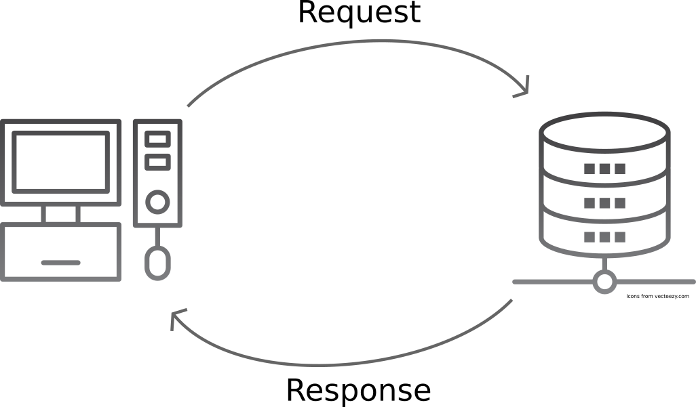

<div class="blame">
author: "Mhairi McNeill"<br>
date: "4/06/2019"
</div>

```{r setup, include=FALSE}
knitr::opts_chunk$set(echo = TRUE, fig.align = "center")
```

# Learning Objectives<br>

* Know what an API is
* Understand the basics of `HTTP`
* Be able to use an API through Python

**Duration - 1 hour**<br>

# What is an API?

```{r, echo = FALSE}
library(reticulate)
use_python("~/anaconda3/bin/python")
```

Basically an API (or 'application programming interface') is a way for one program to talk to another program. In this case we will be getting a program written by us, to get data from a program running the internet. This is called a *web API*.

You can think of web APIs as like websites for computers. While a website is designed for humans to use, APIs are designed for programs to use. You can do many of the same things you would do through a website, through writing code.

Most of the time when you are using APIs you will be using a web API.  However, you should be aware that other types of APIs exist. For example, if you want to write code that interacts aspects of your computer normally run by the operating system (shutting the computer down, checking the internal clock time). You need an API that talks to the operating system. Your operating system is just another type of computer program.

# What is HTTP?

To get data from APIs we'll be using `HTTP`. You will definitely be familiar with the letters 'HTTP': every web address starts with `http://` (or `https://` for secure connections). But what does 'HTTP' mean?

`HTTP` stands for HyperText Transfer Protocol, and is a *networking protocol*. Basically, `HTTP` is a set of conventions or rules for sending messages between computers. The rules of `HTTP` define the form that the messages can take. There are other networking protocols available, but HTTP is the one that powers the World Wide Web, and so is obviously quite popular. 

We won't go into a lot of detail about how `HTTP` works. But for now you need to understand that when you visit a website your computer sends a **request** to another computer that holds the website. In return, that other computer will send a **response** back to your computer. Taken together, we call this the **request-response cycle**.

The computer sending the request is called the **client** and the computer that returns the response is known as the **server**.



If this seems simple, that's because it is! One of the important principals of HTTP is that it's **stateless**: that is, the server doesn't retain any information about the state of the client between requests. 

## HTTP request types

There are several different types of request that you can send. By far the most common is a `GET` request. This simply asks for a piece of data in response and doesn't change anything on the server. Other types of request include `POST`, where you send some data to the server; or `DELETE` where you remove data from the server. For example if you wanted to be added to a mailing list, when you enter your email address a `POST` request will happen behind the scenes, i.e. your computer (the client) `POST`s the data (your email address) to the server. If you later want to be taken off the mailing list, your computer might send a `DELETE` request to the server. 

Taken together, you might hear the various request types being called `HTTP` **'verbs'**, because these are the **'actions'** the client can request the server to perform.

## HTTP status codes

Every `HTTP` response will have a status code associated with it. If your request worked correctly the code will be **200**. Other numbers mean other results:

* Any code starting with `4`, means that you made an error in sending your request. The most famous of these is a `404 error`, which I'm sure you'll have seen before.
* A code starting with `5` means there's a problem with the server, so it can't send you a response back. If you get a `5XX error`, there's probably not much you can do to fix it, aside from contact the administrator of the web service you are trying to use
* If the code starts with `3` that means you've been redirected.

# Insomnia

We're going to use a program called Insomnia to make `HTTP` requests and see what is returned.

To learn about APIs we'll be using the Star Wars API (https://swapi.dev/), which gives us information on Star Wars films and characters.

Try the first requests suggested on the documentation home page: send a `GET` request to https://swapi.dev/api/people/1/

You should see a result on the right hand side. Hopefully the response code is `200`. If the response is `200` then you'll see the JSON data returned.

Now try a different request: send a `GET` to https://swapi.dev/starships/9/

The response has different data, and a slightly different structure.

# The requests library

Now you now how `HTTP` requests work, let's learn how to make them in Python.

Here we are going to use the popular library `requests`. This lets us make HTTP requests from inside Python. Remember than in Python you install from the command line.

```
conda install requests
```

And use the keyword `import` to load the library. 

```{python}
import requests
```

We can start by sending a GET request using the function `requests.get`. When you run this function an HTTP request is made - so you'll need to be connected to the internet for this to work! 

We're going to make the first request that you can see on the Star Wars API website and ask for data about Luke Skywalker. 

```{python}
response = requests.get("https://swapi.dev/api/people/1/")
```

We can then check the status code of our response by 

```{python}
response.status_code
```

If we want to see the content of the response we can use the function `content()`. The API will send back JSON data, which `httr` automatically converts into a list for us.

```{python}
response.json()
```

Sometimes `httr` doesn't convert the data that is sent back correctly. In that case you can ask for the raw text data and figure out how to parse it yourself.

```{python}
response.text
```

<blockquote class='task'>
**Task - 5 mins** 

Request information on the 1st Star Wars film. Check the `HTTP` status of the response and look at the content of the response. 

<br>
<details>
<summary>**Answer**</summary>
```{python}
response = requests.get("https://swapi.dev/api/films/1")
response.status_code
```
```{python}
response.json()
```
</details>
</blockquote>

## Rate Limiting

Every API you use will have a **rate limit**. This is a limit on the number of requests you can make in a given time. Every time you make a request you are using the API's server, which costs the people running the API a very small amount of money. The Star Wars API has a very generous rate limit of 10,000 requests per day. **Be careful, though - it can be surprisingly easy to go over an APIs rate limit if you are automatically generating many requests**.

# Query strings

Fairly often API requests will look like this:

```
https://swapi.dev/api/people/?search=luke&format=wookiee
```

with a question mark, followed by key/value pairs separated by ampersands `&`. The part after the question mark is what is known as a **query string**. 

While it's totally fine to write query strings yourself and use them in requests:

```{python}
response = requests.get("https://swapi.dev/api/people/?search=luke&format=wookiee")

response.status_code
```

the `requests` library can handle generating query strings for you. You do this by passing a dictionary:

```{python}
response = requests.get("https://swapi.dev/api/people/",
  params = {"search":"luke", "format":"wookiee"}
)

response.status_code
```

It's generally a good idea to use `requests` query string builder for the following reasons: 

* It's easier to avoid mistakes.
* Query strings need to be valid URLs, which is hard to do manually if you want to use special characters or spaces.
* It's easier to write functions that call APIs using the query builder.


## API Keys and Git

Many APIs you work with will require an **API key**. This key is unique to you as a user, and helps the API track your usage. Usually you get your API key by filling out a form on the API site.

If you are using GitHub, then you must make sure to not save your API keys to your git repository. Particularly if you are then going to push your git repository to GitHub! Even for a free API, having your API keys online can mean that other people will use all your requests.

A common way of avoiding committing API keys is to keep them in a separate file, and add that file to `.gitignore`. You might have a file called `api_keys.py`, that looks like this:

```{python, eval = FALSE}
api_key_for_first_API = 'dCtXRjNnhm8qbXnY'
api_key_for_second_API = 'Gvmeywn2F8d8GxfX'
```

And in your main code you can use import to run the file at the start. 

```{python, eval = FALSE}
import api_keys
```

Now you can use the variables `api_key_for_first_API` and `api_key_for_second_API` in your code, without having their actual values revealed. 

This is a quick, low tech approach to the problem. However it is easy to get wrong - if you change the location of the your API keys, you need to remember to update the `.gitignore`. Also, anyone with access to your laptop can access your API keys. 

## Storing API credentials in `keyring` - preferred option

A better way to go is to store your API credentials in `keyring`. You've already seen how to do this for database credentials in R (back in week 2!), and the process is no different for API credentials. The code below saves your API keys to keyring. In this way, the credentials are never stored anywhere on your computer in plain text. 

```{python, eval = FALSE}
import keyring
keyring.set_password("api_keys", "first_api_key", "dCtXRjNnhm8qbXnY")
keyring.set_password("api_keys", "second_api_key", "Gvmeywn2F8d8GxfX")
```

Here's how you would access and use credentials. Again, this is very similar to what we did for databases

```{python, eval = FALSE}
keyring.get_password("api_keys", "first_api_key")
keyring.get_password("api_keys", "second_api_key")
```

# APIs in R

In this lesson you've learnt about using APIs from Python, however you can also use access APIs from many different languages, including R. To access APIs from R we recommend the httr library. It is strongly inspired by requests, so you should find the syntax and structure of the library familiar. 

<blockquote class='task'>
**Task - 15 mins** 

Use the Game of Thrones API (https://anapioficeandfire.com/). Answer the following questions.

1. How many requests can you make per day?
2. Return information about the 3rd book.
3. Return a list of living female characters.

<br>
<details>
<summary>**Answer**</summary>

1.
20,000 requests per day

2.
```{python, eval=FALSE}
response = requests.get("https://www.anapioficeandfire.com/api/books/3/")

response.json()
```
3.
```{python, eval=FALSE}
response = requests.get("https://www.anapioficeandfire.com/api/characters/",
  params = {"gender":"Female", "isAlive":True}
)

response.json()
```

</details>
</blockquote>
<hr>

# Recap

* What is an API?
<details>
<summary>**Answer**</summary>
How two programs talk to each other.
</details>

* What is HTTP?
<details>
<summary>**Answer**</summary>
The protocol which allows computers to communicate over the web
</details>

* What library do you use to make HTTP requests from Python?
<details>
<summary>**Answer**</summary>
requests
</details>


<hr>

# Additional Resources

More information on requests: https://requests.readthedocs.io/en/master/

More about HTTP:
https://www.jmarshall.com/easy/http/


